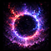

# Domain of Negation

<small>[TensuraMoreSkills](../../index.md) &rsaquo; [Abilities](../index.md) &rsaquo; [Unique Skills](index.md)</small>

| | |
|---|---|
| **Type** | Unique Skill |
| **ID** | `tensuramoreskills:domain_of_negation` |
| **Modes** | 2 |
| **Activation** | Press |

> A negation sphere that seals hostile abilities.

## Modes

| # | Mode |
|---|---|
| 1 | Domain: Negation Field |
| 2 | Burst: Divine Cancellation |

## Costs

| When | Magicule (MP) | Aura (AP) |
|---|---|---|
| Domain: Negation Field | *set by config (domain cost)* |  |
| Burst: Divine Cancellation | *set by config (burst cost)* |  |
| other modes | 0 |  |

## How it works

- Activated by pressing the skill key
- Has a continuous (per-tick) effect

## Related

- **Effects:** [Anti-Skill](../../../tensura-reincarnated/effects/anti-skill.md)

## In-game messages

Show 2 messages

- Domain of Negation unfolds.
- Domain of Negation collapses.

