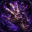

# Fungus Infection

<small>[TensuraMoreSkills](../../index.md) &rsaquo; [Abilities](../index.md) &rsaquo; [Unique Skills](index.md)</small>

| | |
|---|---|
| **Type** | Unique Skill |
| **ID** | `tensuramoreskills:fungus_infection` |
| **Modes** | 4 |
| **Activation** | Press |

> A unique skill that studies, stores and weaponizes hostile status effects.

## Modes

| # | Mode |
|---|---|
| 1 | Analyze |
| 2 | Workshop |
| 3 | Configure |
| 4 | Spread |

## How it works

- Activated by pressing the skill key
- Has a continuous (per-tick) effect

## Related

- **Related skills:** [Abhoth, Lord of Pestilence](../ultimate-skills/abhoth-lord-of-pestilence.md)
- **Effects:** [Paralysis](../../../tensura-reincarnated/effects/paralysis.md), [Infection](../../../tensura-reincarnated/effects/infection.md)

## In-game messages

Show 12 messages

- Skill is on cooldown.
- No valid target to analyze.
- That target has no effects to sample.
- Stored new effect: %s
- Sampled %s again. Total samples: %s
- Workshop already configured with %s entries.
- You have no stored effects.
- Workshop configured with %s effects.
- Workshop cleared.
- Workshop has no selected effects.
- No targets are close enough.
- Applied fungal spread %s times.

