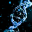

# Unique Skills

<small>[TensuraMoreSkills](../../index.md) &rsaquo; [Abilities](../index.md)</small>

Personal skills that shape a character. You usually start with one and can gain more through feats.

| | Ability | Description |
|---|---|---|
|  | [Adaptability](adaptability.md) | A unique skill that evolves through punishment. |
|  | [Albis Vina](albis-vina.md) | I'm waiting for you, Will. |
|  | [Authority of Greed](authority-of-greed.md) | A heart once claimed cannot escape desire. The king hoards his own fate, and greed denies even death its payment. |
|  | [Boogie Woogie](boogie-woogie.md) | Aoi Todo's technique. Swap positions with marked targets and manipulate the battlefield through instant exchange. |
|  | [Domain of Negation](domain-of-negation.md) | A negation sphere that seals hostile abilities. |
|  | [Exploiter](exploiter.md) | A Unique Skill that abuses loopholes in the world's rules. |
|  | [Fungus Infection](fungus-infection.md) | A unique skill that studies, stores and weaponizes hostile status effects. |
|  | [Gene Editor](gene-editor.md) | Copies genes into syringes, stores extracted skills and stats, and injects mobs with artificial combat data. |
|  | [Godly Scientist](godly-scientist.md) | A unique skill of absolute research. |
|  | [Godly Smithery](godly-smithery.md) | A unique skill of absolute forging. |
|  | [Green Thumb](green-thumb.md) | A unique skill blessed by harvest spirits. Plants ripen beneath your hand, blessing you with gifts. |
|  | [I Want to Be Just Like You!](i-want-to-be-just-like-you.md) | A unique skill that drags the dying soul into limbo. |
|  | [Mitama Faith](mitama-faith.md) | Will you make a contract with me? |
|  | [Nirvana](nirvana.md) | Within the endless wheel of Saṃsāra, each fallen life becomes a karmic echo, waiting to awaken under Nirvana’s violet grace. |
|  | [Parasite](parasite.md) | A unique skill that turns the user into a fragile parasite. |
|  | [Satella](satella.md) | Aishteru. |
|  | [Void Archive](void-archive.md) |  |
