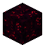
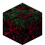
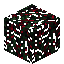

# Blocks

<small>[TensuraMoreSkills](../index.md)</small>

TensuraMoreSkills adds **6** blocks.

| | Name | ID |
|---|---|---|
|  | [Black Blood Mire](black-blood-mire.md) | `tensuramoreskills:black_blood_mire` |
|  | [Blood Altar](blood-altar.md) | `tensuramoreskills:blood_altar` |
|  | [Infected Dirt](infected-dirt.md) | `tensuramoreskills:infected_dirt` |
|  | [Infected Grass](infected-grass.md) | `tensuramoreskills:infected_grass` |
|  | [Infected Leaves](infected-leaves.md) | `tensuramoreskills:infected_leaves` |
|  | [Infected Wood](infected-wood.md) | `tensuramoreskills:infected_wood` |
