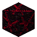

# Infected Dirt

<small>[TensuraMoreSkills](../index.md) &rsaquo; [Blocks](index.md)</small>

| | |
|---|---|
| **ID** | `tensuramoreskills:infected_dirt` |

## What it does

Ground and trees corrupted by a **Black Blood Domain**, the territory a [Crimson Progenitor](../races/crimson-progenitor.md) spreads with [Black Communion](../abilities/intrinsic-skills/black-communion.md). Grass, dirt, logs and leaves turn into their infected versions and everything else into Black Blood Mire. In a domain, Bloodfiends are healed and refilled with blood and magicules, while other creatures standing in it take damage.

**This whole system is turned off in this pack** (`blockInfectionEnabled = false` in `tensuramoreskills-races.toml`, which is also the mod's default), so these blocks never spread and do nothing special.
