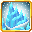

# Cryogenic Cessation

<small>[Tensura: Mysticism](../../index.md) &rsaquo; [Abilities](../index.md) &rsaquo; [Extra Skills](index.md)</small>

| | |
|---|---|
| **Type** | Extra Skill |
| **ID** | `mysticism:cryogenic_cessation` |
| **Modes** | 2 |
| **Cooldowns (s)** | 10 mastered, 20 otherwise |
| **Activation** | Toggle, Press, Hold |

> Command your absolute authority over Deceleration, allowing you to freeze all enemies with ice and spew superchilled ice. Additionally, freeze the surroundings into ice

## Modes

| # | Mode |
|---|---|
| 1 | Ice Breath |
| 2 | Freezing Point |

## Costs

| When | Magicule (MP) | Aura (AP) |
|---|---|---|
| Ice Breath | 500 |  |
| Freezing Point | 1,000 |  |
| other modes | 0 |  |

## How it works

- Can be toggled on and off
- Activated by pressing the skill key
- Charged or channelled by holding the skill key
- Triggers on melee contact

## Obtaining

- Listed in the `intrinsicSkills` config option (config/mysticism/race/wyrm_config.toml): The list of intrinsic skills that the race gets.
- Listed in the `intrinsicSkills` config option (config/mysticism/race/direwolf/special_direwolf_config.toml): The list of intrinsic skills that the race gets.

## Related

- **Effects:** [Chill](../../../tensura-reincarnated/effects/chill.md)
- **Summons / entities:** Mysticism, [Ice Breath](../../../tensura-reincarnated/abilities/intrinsic-skills/ice-breath.md)

## Stats (config defaults)

Set in [`config/mysticism/ability/skill/extra_config.toml`](../../configs/config-mysticism-ability-skill-extra-config.md).

| Option | Default | Description |
|---|---|---|
| `CryogenicCessation.iceBreathMPCost` | 500 | Magicule cost for Ice Breath. |
| `CryogenicCessation.damage` | 16 | The damage each second of the Ice Breath. |
| `CryogenicCessation.damageMastered` | 32 | The damage each second of the Ice Breath when mastered. |
| `CryogenicCessation.freezingPointMPCost` | 1,000 | Magicule cost for Freezing Point. |
| `CryogenicCessation.radius` | 8 | The radius of freezing point. |
| `CryogenicCessation.freezingPointCooldownMastered` | 10 | The cooldown of Freezing Point when it's mastered. |
| `CryogenicCessation.freezingPointCooldown` | 20 | The cooldown of Freezing Point. |
| `CryogenicCessation.cryogenicCessationBoost` | 1.5 | The Ice Damage Boost when Cryogenic Cessation is toggled. |
| `CryogenicCessation.duration` | 200 | The duration of the chill effect in ticks. (Multiply seconds by 20.) |
| `CryogenicCessation.level` | 1 | The level of the chill effect. |
| `CryogenicCessation.levelMastered` | 3 | The level of the chill effect when the skill is mastered. |

Set in [`config/tensura/ability/ability_config.toml`](../../../tensura-reincarnated/configs/config-tensura-ability-ability-config.md).

| Option | Default | Description |
|---|---|---|
| `Mastery.masteryActivateTime` | 10 | How many time the user need to activate some passive abilities (tick/on attack) to gain a mastery point for holding abilities. |
| `Mastery.masteryPoint` | 1 | The base value of how many mastery points the player gains when using an ability - Only applies for new players when changed cus this is an attribute. |
| `Mastery.masteryHitMultiplier` | 2 | The multiplier of mastery point the player gains when the ability hit a target. |
| `Mastery.masteryKillMultiplier` | 2 | The multiplier of mastery point the player gains when the ability kills a target. |
| `Mastery.masteryHoldTick` | 60 | How long in tick the user need to hold down an ability to gain a mastery point for holding abilities. |
| `Mastery.masteryActivateTime` | 10 | How many time the user need to activate some passive abilities (tick/on attack) to gain a mastery point for holding abilities. |

## Tags

`tensura:skills/extra_skills`, `tensura:skills/ice_skills`
