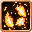

# Spark

<small>[Tensura: Mysticism](../../index.md) &rsaquo; [Abilities](../index.md) &rsaquo; [Intrinsic Skills](index.md)</small>

| | |
|---|---|
| **Type** | Intrinsic Skill |
| **ID** | `mysticism:spark` |
| **Cooldowns (s)** | 15 |
| **Activation** | Passive |

> Light your weapon and fists aflame, igniting your next target on fire for a short period of time.

## How it works

- Triggers when you damage a target

## Obtaining

- Listed in the `intrinsicSkills` config option (config/mysticism/race/insect/ant_config.toml): The list of intrinsic skills that the race gets.

## Stats (config defaults)

Set in [`config/mysticism/ability/skill/intrinsic_config.toml`](../../configs/config-mysticism-ability-skill-intrinsic-config.md).

| Option | Default | Description |
|---|---|---|
| `Spark.burnDuration` | 100 | The duration of the burn effect in ticks. (Multiply seconds by 20.) |
| `Spark.burnDurationMastered` | 200 | The duration of the burn effect when mastered, in ticks. (Multiply seconds by 20.) |
| `Spark.cooldown` | 15 | The cooldown in seconds. |
| `Spark.cooldownMastered` | 15 | The cooldown when mastered, in seconds. |

## Tags

`tensura:skills/intrinsic_skills`
