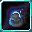

# Crasher

<small>[Tensura: Mysticism](../../index.md) &rsaquo; [Abilities](../index.md) &rsaquo; [Unique Skills](index.md)</small>

| | |
|---|---|
| **Type** | Unique Skill |
| **ID** | `mysticism:crasher` |
| **Modes** | 2 |
| **Activation** | Toggle, Hold |

> The essence of "deletion". Completely and utterly erase your foes from the plane of existence with the power of your sheer will alone.

## Modes

| # | Mode |
|---|---|
| 1 | Destroyer Haki |
| 2 | Dimension Hopper |

## Costs

| When | Magicule (MP) | Aura (AP) |
|---|---|---|
| Destroyer Haki | 250 |  |
| Dimension Hopper | 1,000 |  |
| other modes | 0 |  |

## How it works

- Can be toggled on and off
- Charged or channelled by holding the skill key
- Triggers when the held key is released
- Adjusted by scrolling while active

## Related

- **Effects:** [Insanity](../../../tensura-reincarnated/effects/insanity.md)

## Stats (config defaults)

Set in [`config/mysticism/ability/skill/unique_config.toml`](../../configs/config-mysticism-ability-skill-unique-config.md).

| Option | Default | Description |
|---|---|---|
| `Crasher.mpAcquirement` | 45,000 | Magicule Acquirement Cost. |
| `Crasher.destroyerHakiCost` | 250 | The magicule cost of the Destroyer Haki mode, taken every 10 ticks. |
| `Crasher.destroyerHakiRadius` | 15 | The radius in blocks of the Destroyer Haki mode. |
| `Crasher.destroyerHakiEP` | 0.6 | The multiplier of EP that an entity needs to have below to be affected by the Destroyer Haki's movement speed reduction. |
| `Crasher.destroyerHakiEPMastered` | 0.8 | The multiplier of EP that an entity needs to have below to be affected by Destroyer Haki's movement speed reduction when mastered. |
| `Crasher.epDifferenceMultiplier` | 0.1 | The EP difference multiplier for each Slowness Level when applied by Destroyer Haki. |
| `Crasher.destroyerHakiDamage` | 25 | The damage that Destroyer Haki will deal every 20 ticks (one second). |
| `Crasher.destroyerHakiDamageMastered` | 50 | The damage that Destroyer Haki will deal every 20 ticks (one second) when the skill is mastered. |
| `Crasher.insanityChance` | 20 | The chance that Insanity is applied to the USER every 60 ticks when Destroyer Haki is used. |
| `Crasher.insanityLevel` | 1 | The increasing level of Insanity when it is applied to the USER when Destroyer Haki is used. |
| `Crasher.insanityDuration` | 200 | The duration in tick of the Insanity effect when the USER is affected by Destroyer Haki. |
| `Crasher.slowDuration` | 200 | The duration in tick of the Slowness effect when targets are affected by Destroyer Haki. |
| `Crasher.slowDurationMastered` | 250 | The duration in tick of the Slowness effect when targets are affected by Destroyer Haki when [Crasher] is mastered.. |
| `Crasher.dimensionHopperCost` | 1,000 | The magicule cost of the Dimension Hopper mode. |
| `Crasher.dimensionHopperCooldown` | 600 | The cooldown of the Dimension Hopper mode. |
| `Crasher.dimensionHopperCooldownMastered` | 300 | The cooldown of the Dimension Hopper mode when the skill is mastered. |

## Tags

`tensura:skills/unique_skills`
