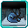

# Phaser

<small>[Tensura: Mysticism](../../index.md) &rsaquo; [Abilities](../index.md) &rsaquo; [Unique Skills](index.md)</small>

| | |
|---|---|
| **Type** | Unique Skill |
| **ID** | `mysticism:phaser` |
| **Modes** | 4 |
| **Cooldowns (s)** | 15, 5 |
| **Activation** | Toggle, Press, Hold |

> Your eyes shift. They become able to see things you normally weren't able to see before... And you become able to do things you weren't able to do before.

## Modes

| # | Mode |
|---|---|
| 1 | Eject |
| 2 | Authority Of The Gods |
| 3 | Intangibility |
| 4 | Intangibility: Toggle |

## Costs

| When | Magicule (MP) | Aura (AP) |
|---|---|---|
| Eject | 200 |  |
| Authority Of The Gods | 1,500 |  |
| Intangibility | 100 |  |
| other modes | 500 |  |

## How it works

- Can be toggled on and off
- Activated by pressing the skill key
- Charged or channelled by holding the skill key
- Triggers when the held key is released
- Has a continuous (per-tick) effect
- Triggers when you are attacked
- Triggers when a projectile hits you

## Related

- **Effects:** [Intangible](../../effects/intangible.md)
- **Items:** [Severer Blade](../../../tensura-reincarnated/items/weapons/severer-blade.md), [Kunai](../../../tensura-reincarnated/items/weapons/kunai.md)
- **Summons / entities:** Kamui Portal, Web Bullet, Severer Blade, Spear

## Stats (config defaults)

Set in [`config/mysticism/ability/skill/unique_config.toml`](../../configs/config-mysticism-ability-skill-unique-config.md).

| Option | Default | Description |
|---|---|---|
| `Phaser.mpAcquirement` | 72,000 | Magicule Acquirement Cost. |
| `Phaser.presenceSense` | 2 | The level of presence sense gained when toggling on the skill. |
| `Phaser.eyeOfInsightCost` | 50 | The Magicule cost of the Eye of Insight passive. |
| `Phaser.overuseCap` | 10 | The maximum number of abilities you can use without rest before you are forced on cooldowns from overuse. |
| `Phaser.intangibilityPassiveCooldown` | 15 | The cooldown of the Intangibility passive in seconds. |
| `Phaser.intangibilityActiveCooldown` | 15 | The cooldown of the Intangibility active in seconds, which only becomes available when the skill is mastered. |
| `Phaser.intangibilityDuration` | 100 | How long should the player phase through all attacks in ticks (seconds x 20). |
| `Phaser.intangibilityActiveCost` | 100 | The magicule cost of the Intangibility active mode. |
| `Phaser.intangibilityPassiveCost` | 100 | The magicule cost of the Intangibility passive mode. |
| `Phaser.itemEjectDamage` | 20 | The amount of damage that an ejected item from Phaser's portals should deal. |
| `Phaser.itemEjectDamageMastered` | 30 | The amount of damage that an ejected item from Phaser's portals should deal when the skill is mastered. |
| `Phaser.ejectChargeTicks` | 60 | The time taken for the portals to prime before you can shoot in ticks (seconds x 20). |
| `Phaser.ejectChargeTicksMastered` | 30 | The time taken for the portals to prime before you can shoot in ticks when the skill is mastered (seconds x 20). |
| `Phaser.ejectCost` | 200 | The magicule cost of each portal that is opened when the Eject mode is used. |
| `Phaser.kamuiWarpTicks` | 60 | The time in ticks (seconds x 20) that it takes for the user to warp into the Kamui dimension. |
| `Phaser.kamuiCooldown` | 5 | The cooldown of the Authority Of The Gods mode in seconds. |
| `Phaser.kamuiCost` | 1,500 | The magicule cost of the Authority Of The Gods mode. |

## Tags

`tensura:skills/unique_skills`
