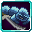

# Restricted

<small>[Tensura: Mysticism](../../index.md) &rsaquo; [Abilities](../index.md) &rsaquo; [Unique Skills](index.md)</small>

| | |
|---|---|
| **Type** | Unique Skill |
| **ID** | `mysticism:restricted` |
| **Modes** | 2 |
| **Activation** | Toggle, Press |

> You were cursed from birth. Your raw, unfiltered potential, blocked by a curse gifted by the heavens. Your skill... It's stopping you from learning other skills. But why...?

## Modes

| # | Mode |
|---|---|
| 1 | Dash |
| 2 | Counter |

## Costs

| When | Magicule (MP) | Aura (AP) |
|---|---|---|
| Always |  | 500 or 1,500 |

## How it works

- Can be toggled on and off
- Activated by pressing the skill key
- Triggers when you damage a target
- Triggers when an effect is applied to you
- Triggers when you respawn
- Does something when first learned
- Does something when mastered

### Attribute changes

| Attribute | Amount | Operation |
|---|---|---|
| mpGain | -10,000 | add |
| apGain | 2 | multiply total |
| apRegeneration | 2 | multiply total |
| degrade | 1 | add |
| speed | boost | multiply total |
| sneakingSpeed | boost | multiply total |
| safeFallDistance | boost | multiply total |
| armor | flat boost | add |

## Obtaining

- Listed in the `intrinsicSkills` config option (config/mysticism/race/restricted_human_config.toml): The list of intrinsic skills that the race gets.

## Related

- **Related skills:** [Burden](../../../tensura-reincarnated/abilities/aspectual-magic/burden.md)
- **Effects:** [Fear](../../../tensura-reincarnated/effects/fear.md), [Countering](../../effects/countering.md)
- **Summons / entities:** Tensura

## Stats (config defaults)

Set in [`config/mysticism/ability/skill/unique_config.toml`](../../configs/config-mysticism-ability-skill-unique-config.md).

| Option | Default | Description |
|---|---|---|
| `Restricted.mpAcquirement` | 20,000 | Magicule Acquirement Cost. |
| `Restricted.battlewillMultiplier` | 5 | Damage multiplier of Battlewills. |
| `Restricted.physicalAttackMultiplier` | 3 | Damage multiplier of Physical Attacks. |
| `Restricted.maximumStatBoost` | 2 | Maximum additional multiplier that your stats can be boosted to depending on the skill's mastery. |
| `Restricted.maximumFlatStatBoost` | 20 | Maximum additional flat boost that your armor stat can be boosted to depending on the skill's mastery. |
| `Restricted.decimateDistance` | 12 | The distance traveled when performing an attack using Decimate. |
| `Restricted.decimateDistanceMastered` | 16 | The distance traveled when performing an attack using Decimate when the skill is mastered. |
| `Restricted.decimateDamage` | 25 | The amount of bonus damage dealt when performing an attack using Decimate. |
| `Restricted.decimateDamageMastered` | 75 | The amount of bonus damage dealt when performing an attack using Decimate when the skill is mastered. |
| `Restricted.counterStateDuration` | 60 | The duration that your Counter state lasts in ticks (seconds x 20). |
| `Restricted.counterStateDurationMastered` | 100 | The duration that your Counter state lasts in ticks (seconds x 20) when the skill is mastered. |
| `Restricted.counterImbalanceDuration` | 100 | The duration that enemies become Imbalanced for when striking you while you are Countering. |
| `Restricted.counterImbalanceDurationMastered` | 100 | The duration that enemies become Imbalanced for when striking you while you are Countering, when the skill is mastered. |
| `Restricted.counterCooldown` | 15 | The cooldown of the Counter mode in seconds. |
| `Restricted.counterCooldownMastered` | 15 | The cooldown of the Counter mode in seconds when the skill is mastered. |

## In-game messages

Show 2 messages

- You tried to copy the skill %s, but you were unable to.
- You tried to learn the skill %s, but %s prevents you from doing so.

## Tags

`tensura:skills/unique_skills`
