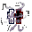

# Effects

<small>[Tensura: Mysticism](../index.md)</small>

Status effects added by Tensura: Mysticism.

| | Effect | Type | Description |
|---|---|---|---|
|  | [Aura Healing](aura-healing.md) | Beneficial | Tenacity's regeneration, paid with aura instead of magicule. |
|  | [Awakened Foresight](awakened-foresight.md) | Beneficial | Relapse's ascended mode. |
|  | [Brimstone Flames](brimstone-flames.md) | Harmful | Hellish fire. |
|  | [Collective](collective.md) | Beneficial | Relapse's Divine Inferius mode. |
|  | [Constant: Destruction](constant-destruction.md) | Beneficial | Constant's destruction mode. |
|  | [Constant: Energy](constant-energy.md) | Beneficial | Constant's energy mode, which lasts  s. |
|  | [Constant: Energy Debuff](constant-energy-debuff.md) | Neutral | The price for overspending with constant energy: your magicule and aura don't regenerate at all for  s. |
|  | [Constant: Health](constant-health.md) | Beneficial | Constant's health mode. |
|  | [Countering](countering.md) | Neutral | Restricted's counter stance. |
|  | [Cultivating](cultivating.md) | Beneficial | A Cultivator breakthrough in progress. |
|  | [Dazzled](dazzled.md) | Neutral | Captivated by a star. |
|  | [Dragon Burn](dragon-burn.md) | Harmful | Dragon embers. |
|  | [Emancipation](reducer-holy-coat.md) | Beneficial | Reducer's Emancipation: a holy coating. |
|  | [Enkidu](enkidu.md) | Neutral | The chains of Enkidu. |
|  | [Eternal Permafrost](eternal-permafrost.md) | Harmful | Creeping frost. |
|  | [Fixation](fixation.md) | Neutral | Fixed in place by Coalescence. |
|  | [Gravity Fluctuation](gravity-fluctuation.md) | Harmful | Unstable gravity. |
|  | [Imbalanced](imbalanced.md) | Neutral | Thrown off balance by a counter. |
|  | [Intangible](intangible.md) | Beneficial | Phaser's intangibility. |
|  | [Lightning Mode](lightning-mode.md) | Beneficial | Lightning Mode, a transformation. |
|  | [Marked for Death](marked-for-death.md) | Harmful | You take double damage per level (×2 at level I, ×4 at level II). |
|  | [Pay it Forward](pay-it-forward.md) | Beneficial | Provider's gift of speed. |
|  | [Pressure](pressure.md) | Harmful | Kyurem's pressure. |
|  | [Provider Boost](provider-boost.md) | Beneficial | Provider's generosity boost for creatures: +× movement speed, + step height, and every hit it deals is multiplied by . |
|  | [Purity Edge](reducer-purity-edge.md) | Beneficial | Reducer's Purity Edge, a one-shot holy strike. |
|  | [Revenant's Horror](revenants-horror.md) | Beneficial | Relapse's Revenant mode. |
|  | [Rupturing](rupturing.md) | Harmful | Ruptured veins. |
|  | [Sanctifying Light](sanctifying-light.md) | Beneficial | Relapse's Whole mode ( s). |
|  | [Severed Arm](severed-arm.md) | Beneficial | A severed arm, from Butcher's butchering. |
|  | [Severed Leg](severed-leg.md) | Beneficial | A severed leg, from Butcher's butchering. |
|  | [Stagnate](stagnate.md) | Beneficial | Stopped in time by Stagnator's aura. |
|  | [Stillness](stillness.md) | Beneficial | Your skills cost no magicule or aura while it lasts. |
|  | [Tailed Beast Cloak](tailed-beast-cloak.md) | Beneficial | Jinchuriki's chakra cloak. |
|  | [Unstable Requiem](unstable-requiem.md) | Beneficial | Relapse's Divine Excelsius mode. |
