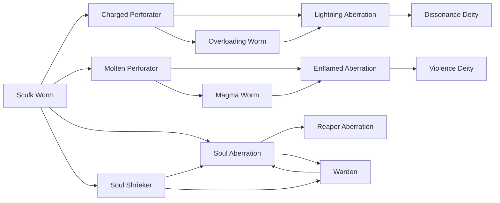

# Charged Perforator

<small>[Tensura: Mysticism](../index.md) &rsaquo; [Races](index.md)</small>

| | |
|---|---|
| **ID** | `mysticism:charged_perforator` |
| **Difficulty** | Extreme |
| **Alignment** | Majin |
| **Aura** | 10,000 - 10,000 |
| **Magicule** | 10,000 - 10,000 |
| **Health bonus** | 55 |
| **Spiritual health bonus** | 270 |
| **Attack damage bonus** | 5 |
| **Movement speed bonus** | 0.01 |
| **EP to evolve into** | 4,000 |

> A rare mutation of a sculk worm. It consumed essence of Lightning itself and gained specific abilities. But this one... Seems weird.

## Evolution

- **Evolves from:** [Sculk Worm](sculk-worm.md)
- **Evolves into:** [Overloading Worm](overloading-worm.md)
- **Default evolution:** [Overloading Worm](overloading-worm.md)
- **On awakening (True Demon Lord / True Hero):** [Lightning Aberration](lightning-aberration.md)
- **During the Harvest Festival:** [Overloading Worm](overloading-worm.md)

### Requirements to evolve into Charged Perforator

Each requirement adds its weight to the evolution progress bar; you can evolve at 100%.

| Requirement | Weight |
|---|---|
| Reach Existence Points of 4,000 | 50% |
| Consume 10 of [Lightning Essence](../items/food/lightning-essence.md) | 50% |

### Evolution tree

## Attribute modifiers

| Attribute | Amount | Operation |
|---|---|---|
| Scale | 0 | add |
| Max Health | 55 | add |
| Max Spiritual Health | 270 | add |
| Attack Damage | 5 | add |
| Attack Speed | 0.5 | add |
| Knockback Resistance | 0.2 | add |
| Movement Speed | 0.01 | add |
| Swim Speed Multiplier | 0.01 | add |

## Stats (config defaults)

Set in [`config/mysticism/race/sculk_config.toml`](../configs/config-mysticism-race-sculk-config.md).

| Option | Default | Description |
|---|---|---|
| `ChargedPerforator.essenceRequired` | 10 | Quantity of Lightning Essence required to become a Charged Perforator as a Sculk Worm. |
| `ChargedPerforator.epRequirement` | 4,000 | EP requirement to evolve into Charged Perforator. |
| `ChargedPerforator.minAura` | 10,000 | Minimal aura. |
| `ChargedPerforator.maxAura` | 10,000 | Maximum aura. |
| `ChargedPerforator.minMagicule` | 10,000 | Minimal magicule. |
| `ChargedPerforator.maxMagicule` | 10,000 | Maximum magicule. |
| `ChargedPerforator.size` | 0 | Bonus Size. |
| `ChargedPerforator.maxHealth` | 55 | Bonus Max Health. |
| `ChargedPerforator.maxSpiritualHealth` | 270 | Bonus Max Spiritual Health. |
| `ChargedPerforator.attack` | 5 | Bonus Attack Damage. |
| `ChargedPerforator.attackSpeed` | 0.5 | Bonus Attack Speed. |
| `ChargedPerforator.knockbackResistance` | 0.2 | Bonus Knockback Resistance. |
| `ChargedPerforator.movementSpeed` | 0.01 | Bonus Movement Speed. |
| `ChargedPerforator.swimSpeed` | 0.01 | Bonus Swimming Speed Multiplier. |
| `ChargedPerforator.intrinsicSkills` | "tensura:sense_soundwave", "tensura:lightning_manipulation", "tensura:electricity_resistance", "tensura:heat_resistance" | The list of intrinsic skills that the race gets. |
| `SculkWorm.minAura` | 100 | Minimal aura. |
| `SculkWorm.maxAura` | 250 | Maximum aura. |
| `SculkWorm.minMagicule` | 800 | Minimal magicule. |
| `SculkWorm.maxMagicule` | 1,200 | Maximum magicule. |
| `SculkWorm.size` | -0.5 | Bonus Size. |
| `SculkWorm.maxHealth` | -12 | Bonus Max Health. |
| `SculkWorm.maxSpiritualHealth` | -4 | Bonus Max Spiritual Health. |
| `SculkWorm.attack` | -0.5 | Bonus Attack Damage. |
| `SculkWorm.attackSpeed` | 3.5 | Bonus Attack Speed. |
| `SculkWorm.knockbackResistance` | 0 | Bonus Knockback Resistance. |
| `SculkWorm.movementSpeed` | 0.01 | Bonus Movement Speed. |
| `SculkWorm.swimSpeed` | 0 | Bonus Swimming Speed Multiplier. |
| `SculkWorm.intrinsicSkills` | "tensura:sense_soundwave" | The list of intrinsic skills that the race gets. |
