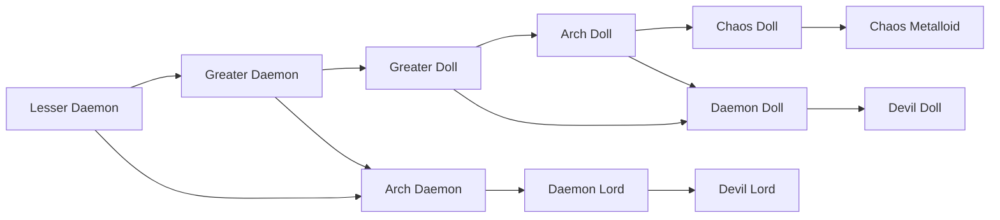

# Devil Doll

<small>[Tensura: Mysticism](../index.md) &rsaquo; [Races](index.md)</small>

| | |
|---|---|
| **ID** | `mysticism:devil_doll` |
| **Stage** | Final |
| **Difficulty** | Easy |
| **Alignment** | Majin |
| **Aura** | 1,005,000 - 1,010,000 |
| **Magicule** | 1,060,000 - 1,100,000 |
| **Health bonus** | 1,036 |
| **Spiritual health bonus** | 6,606 |
| **Attack damage bonus** | 4.5 |
| **Movement speed bonus** | 0.08 |
| **EP to evolve into** | 140,000 |

> The result of a Daemon Doll achieving Divinity and awakening.

## Evolution

- **Evolves from:** [Daemon Doll](daemon-doll.md)

### Requirements to evolve into Devil Doll

Each requirement adds its weight to the evolution progress bar; you can evolve at 100%.

| Requirement | Weight |
|---|---|
| Awaken [True Demon Lord./True Hero.] | 100% |

### Evolution tree

## Intrinsic skills

Granted automatically when you become this race.

-  [Divine Ki Release](../../tensura-reincarnated/abilities/intrinsic-skills/divine-ki-release.md)

## Traits

- Divine
- Has creative-style flight

## Attribute modifiers

| Attribute | Amount | Operation |
|---|---|---|
| Scale | 0 | add |
| Max Health | 1,036 | add |
| Max Spiritual Health | 6,606 | add |
| Attack Damage | 4.5 | add |
| Attack Speed | 0.7 | add |
| Knockback Resistance | 1 | add |
| Movement Speed | 0.08 | add |
| Swim Speed Multiplier | 0.8 | add |

## Stats (config defaults)

Set in [`config/mysticism/race/daemon_doll_config.toml`](../configs/config-mysticism-race-daemon-doll-config.md).

| Option | Default | Description |
|---|---|---|
| `DevilDoll.minAura` | 1,005,000 | Minimal aura. |
| `DevilDoll.maxAura` | 1,010,000 | Maximum aura. |
| `DevilDoll.minMagicule` | 1,060,000 | Minimal magicule. |
| `DevilDoll.maxMagicule` | 1,100,000 | Maximum magicule. |
| `DevilDoll.size` | 0 | Bonus Size. |
| `DevilDoll.maxHealth` | 1,036 | Bonus Max Health. |
| `DevilDoll.maxSpiritualHealth` | 6,606 | Bonus Max Spiritual Health. |
| `DevilDoll.attack` | 4.5 | Bonus Attack Damage. |
| `DevilDoll.attackSpeed` | 0.7 | Bonus Attack Speed. |
| `DevilDoll.knockbackResistance` | 1 | Bonus Knockback Resistance. |
| `DevilDoll.movementSpeed` | 0.08 | Bonus Movement Speed. |
| `DevilDoll.swimSpeed` | 0.8 | Bonus Swimming Speed Multiplier. |
| `DaemonDoll.minAura` | 105,000 | Minimal aura. |
| `DaemonDoll.maxAura` | 310,000 | Maximum aura. |
| `DaemonDoll.minMagicule` | 250,000 | Minimal magicule. |
| `DaemonDoll.maxMagicule` | 550,000 | Maximum magicule. |
| `DaemonDoll.size` | 0 | Bonus Size. |
| `DaemonDoll.maxHealth` | 630 | Bonus Max Health. |
| `DaemonDoll.maxSpiritualHealth` | 3,606 | Bonus Max Spiritual Health. |
| `DaemonDoll.attack` | 3.5 | Bonus Attack Damage. |
| `DaemonDoll.attackSpeed` | 0.5 | Bonus Attack Speed. |
| `DaemonDoll.knockbackResistance` | 0.8 | Bonus Knockback Resistance. |
| `DaemonDoll.movementSpeed` | 0.04 | Bonus Movement Speed. |
| `DaemonDoll.swimSpeed` | 0.4 | Bonus Swimming Speed Multiplier. |
| `ArchDoll.epRequirement` | 140,000 | EP requirement to evolve into Arch Daemon. |
| `ArchDoll.minAura` | 45,000 | Minimal aura. |
| `ArchDoll.maxAura` | 50,000 | Maximum aura. |
| `ArchDoll.minMagicule` | 130,000 | Minimal magicule. |
| `ArchDoll.maxMagicule` | 160,000 | Maximum magicule. |
| `ArchDoll.size` | 0 | Bonus Size. |
| `ArchDoll.maxHealth` | 90 | Bonus Max Health. |
| `ArchDoll.maxSpiritualHealth` | 606 | Bonus Max Spiritual Health. |
| `ArchDoll.attack` | 2.4 | Bonus Attack Damage. |
| `ArchDoll.attackSpeed` | 0.2 | Bonus Attack Speed. |
| `ArchDoll.knockbackResistance` | 0.6 | Bonus Knockback Resistance. |
| `ArchDoll.movementSpeed` | 0.01 | Bonus Movement Speed. |
| `ArchDoll.swimSpeed` | 0.1 | Bonus Swimming Speed Multiplier. |
| `GreaterDoll.minAura` | 15,000 | Minimal aura. |
| `GreaterDoll.maxAura` | 25,000 | Maximum aura. |
| `GreaterDoll.minMagicule` | 30,000 | Minimal magicule. |
| `GreaterDoll.maxMagicule` | 60,000 | Maximum magicule. |
| `GreaterDoll.size` | 0 | Bonus Size. |
| `GreaterDoll.maxHealth` | 50 | Bonus Max Health. |
| `GreaterDoll.maxSpiritualHealth` | 200 | Bonus Max Spiritual Health. |
| `GreaterDoll.attack` | 1.2 | Bonus Attack Damage. |
| `GreaterDoll.attackSpeed` | 0 | Bonus Attack Speed. |
| `GreaterDoll.knockbackResistance` | 0.4 | Bonus Knockback Resistance. |
| `GreaterDoll.movementSpeed` | 0 | Bonus Movement Speed. |
| `GreaterDoll.swimSpeed` | 0 | Bonus Swimming Speed Multiplier. |
| `GreaterDoll.intrinsicSkills` | "mysticism:magisteel_body" | The list of intrinsic skills that the race gets. |

Set in [`config/tensura/race/daemon_config.toml`](../../tensura-reincarnated/configs/config-tensura-race-daemon-config.md).

| Option | Default | Description |
|---|---|---|
| `DevilLord.learnableMagics` | "tensura:chain_explosion", "tensura:mental_crush", "tensura:demon_dominate", "tensura:anti_shock_area", "tensura:anti_magic_area" | List of Magics that players automatically get as learnable. |
| `DevilLord.minAura` | 1,000,000 | Minimal aura. |
| `DevilLord.maxAura` | 1,000,000 | Maximum aura. |
| `DevilLord.minMagicule` | 1,000,000 | Minimal magicule. |
| `DevilLord.maxMagicule` | 1,000,000 | Maximum magicule. |
| `DevilLord.size` | 0 | Bonus Size. |
| `DevilLord.maxHealth` | 1,046 | Bonus Max Health. |
| `DevilLord.maxSpiritualHealth` | 6,606 | Bonus Max Spiritual Health. |
| `DevilLord.attack` | 4 | Bonus Attack Damage. |
| `DevilLord.attackSpeed` | 0.7 | Bonus Attack Speed. |
| `DevilLord.knockbackResistance` | 0.8 | Bonus Knockback Resistance. |
| `DevilLord.movementSpeed` | 0.08 | Bonus Movement Speed. |
| `DevilLord.swimSpeed` | 0.8 | Bonus Swimming Speed Multiplier. |
| `DevilLord.learnableMagics` | "tensura:chain_explosion", "tensura:mental_crush", "tensura:demon_dominate", "tensura:anti_shock_area", "tensura:anti_magic_area" | List of Magics that players automatically get as learnable. |
| `DaemonLord.learnableMagics` | "tensura:mud_spears", "tensura:icicle_rain", "tensura:ice_breaker", "tensura:thunder_rain", "tensura:dimension_cutter", "tensura:full_recovery", "tensura:explosion", "tensura:dominate", "tensura:mirage", "tensura:reinforced_barrier" | List of Magics that players automatically get as learnable. |
| `DaemonLord.minAura` | 100,000 | Minimal aura. |
| `DaemonLord.maxAura` | 300,000 | Maximum aura. |
| `DaemonLord.minMagicule` | 200,000 | Minimal magicule. |
| `DaemonLord.maxMagicule` | 500,000 | Maximum magicule. |
| `DaemonLord.size` | 0 | Bonus Size. |
| `DaemonLord.maxHealth` | 646 | Bonus Max Health. |
| `DaemonLord.maxSpiritualHealth` | 3,606 | Bonus Max Spiritual Health. |
| `DaemonLord.attack` | 3 | Bonus Attack Damage. |
| `DaemonLord.attackSpeed` | 0.5 | Bonus Attack Speed. |
| `DaemonLord.knockbackResistance` | 0.6 | Bonus Knockback Resistance. |
| `DaemonLord.movementSpeed` | 0.04 | Bonus Movement Speed. |
| `DaemonLord.swimSpeed` | 0.4 | Bonus Swimming Speed Multiplier. |
| `DaemonLord.learnableMagics` | "tensura:mud_spears", "tensura:icicle_rain", "tensura:ice_breaker", "tensura:thunder_rain", "tensura:dimension_cutter", "tensura:full_recovery", "tensura:explosion", "tensura:dominate", "tensura:mirage", "tensura:reinforced_barrier" | List of Magics that players automatically get as learnable. |
| `ArchDaemon.learnableMagics` | "tensura:stone_shot", "tensura:fire_ball", "tensura:fire_storm", "tensura:icicle_spear", "tensura:icicle_lance", "tensura:ice_blizzard", "tensura:thunder_orb", "tensura:warp_portal", "tensura:water_jail", "tensura:acid_shell", "tensura:tornado_blade", "tensura:airflow_shut", "tensura:lighten", "tensura:burden", "tensura:protection", "tensura:confusion", "tensura:invisible", "tensura:recovery", "tensura:healing_rain", "tensura:antidote" ... (22 total) | List of Magics that players automatically get as learnable. |
| `ArchDaemon.epRequirement` | 140,000 | EP requirement to evolve into Arch Daemon. |
| `ArchDaemon.minAura` | 40,000 | Minimal aura. |
| `ArchDaemon.maxAura` | 40,000 | Maximum aura. |
| `ArchDaemon.minMagicule` | 100,000 | Minimal magicule. |
| `ArchDaemon.maxMagicule` | 100,000 | Maximum magicule. |
| `ArchDaemon.size` | 0 | Bonus Size. |
| `ArchDaemon.maxHealth` | 100 | Bonus Max Health. |
| `ArchDaemon.maxSpiritualHealth` | 606 | Bonus Max Spiritual Health. |
| `ArchDaemon.attack` | 2 | Bonus Attack Damage. |
| `ArchDaemon.attackSpeed` | 0.2 | Bonus Attack Speed. |
| `ArchDaemon.knockbackResistance` | 0.4 | Bonus Knockback Resistance. |
| `ArchDaemon.movementSpeed` | 0.01 | Bonus Movement Speed. |
| `ArchDaemon.swimSpeed` | 0.1 | Bonus Swimming Speed Multiplier. |
| `ArchDaemon.learnableMagics` | "tensura:stone_shot", "tensura:fire_ball", "tensura:fire_storm", "tensura:icicle_spear", "tensura:icicle_lance", "tensura:ice_blizzard", "tensura:thunder_orb", "tensura:warp_portal", "tensura:water_jail", "tensura:acid_shell", "tensura:tornado_blade", "tensura:airflow_shut", "tensura:lighten", "tensura:burden", "tensura:protection", "tensura:confusion", "tensura:invisible", "tensura:recovery", "tensura:healing_rain", "tensura:antidote" ... (22 total) | List of Magics that players automatically get as learnable. |
| `GreaterDaemon.epRequirement` | 20,000 | EP requirement to evolve into Greater Daemon. |
| `GreaterDaemon.minAura` | 10,000 | Minimal aura. |
| `GreaterDaemon.maxAura` | 20,000 | Maximum aura. |
| `GreaterDaemon.minMagicule` | 10,000 | Minimal magicule. |
| `GreaterDaemon.maxMagicule` | 30,000 | Maximum magicule. |
| `GreaterDaemon.size` | 0.25 | Bonus Size. |
| `GreaterDaemon.maxHealth` | 60 | Bonus Max Health. |
| `GreaterDaemon.maxSpiritualHealth` | 200 | Bonus Max Spiritual Health. |
| `GreaterDaemon.attack` | 1 | Bonus Attack Damage. |
| `GreaterDaemon.attackSpeed` | 0 | Bonus Attack Speed. |
| `GreaterDaemon.knockbackResistance` | 0.2 | Bonus Knockback Resistance. |
| `GreaterDaemon.movementSpeed` | 0 | Bonus Movement Speed. |
| `GreaterDaemon.swimSpeed` | 0 | Bonus Swimming Speed Multiplier. |
| `GreaterDaemon.learnableMagics` | "tensura:mud_hand", "tensura:earth_wall", "tensura:fire_lance", "tensura:fire_wall", "tensura:icicle_lance", "tensura:ice_wall", "tensura:thunder", "tensura:thunder_lance", "tensura:spatial_storage", "tensura:wind_cutter", "tensura:sleep_mist", "tensura:water_cutter_aspectual", "tensura:wind_protection", "tensura:float", "tensura:healing", "tensura:flame_wall", "tensura:agility", "tensura:reinforcement", "tensura:strength_aspectual", "tensura:magic_wall" | List of Magics that players automatically get as learnable. |
| `LesserDaemon.minAura` | 2,000 | Minimal aura. |
| `LesserDaemon.maxAura` | 3,000 | Maximum aura. |
| `LesserDaemon.minMagicule` | 5,000 | Minimal magicule. |
| `LesserDaemon.maxMagicule` | 6,000 | Maximum magicule. |
| `LesserDaemon.size` | 0.5 | Bonus Size. |
| `LesserDaemon.maxHealth` | 20 | Bonus Max Health. |
| `LesserDaemon.maxSpiritualHealth` | 90 | Bonus Max Spiritual Health. |
| `LesserDaemon.attack` | 0.4 | Bonus Attack Damage. |
| `LesserDaemon.attackSpeed` | -0.5 | Bonus Attack Speed. |
| `LesserDaemon.knockbackResistance` | 0.1 | Bonus Knockback Resistance. |
| `LesserDaemon.movementSpeed` | 0 | Bonus Movement Speed. |
| `LesserDaemon.swimSpeed` | 0 | Bonus Swimming Speed Multiplier. |
| `LesserDaemon.learnableMagics` | "tensura:earth_lock", "tensura:liquidize", "tensura:fire_aspectual", "tensura:water_aspectual", "tensura:drainage", "tensura:wind_gust", "tensura:escape", "tensura:freeze" | List of Magics that players automatically get as learnable. |

## Tags

`tensura:races/divine`, `tensura:races/has_creative_flight`
