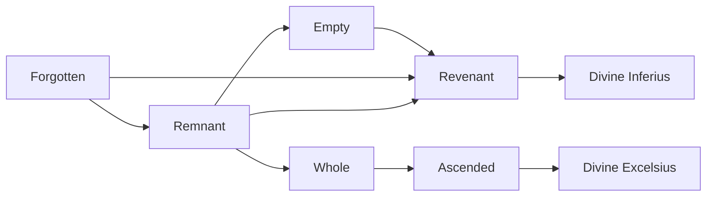

# Divine Excelsius

<small>[Tensura: Mysticism](../index.md) &rsaquo; [Races](index.md)</small>

| | |
|---|---|
| **ID** | `mysticism:divine_excelsius` |
| **Difficulty** | Intermediate |
| **Alignment** | Holy |
| **Aura** | 1,000,000 - 1,000,000 |
| **Magicule** | 1,000,000 - 1,000,000 |
| **Health bonus** | 1,091 |
| **Spiritual health bonus** | 11,051 |
| **Attack damage bonus** | 0 |
| **Movement speed bonus** | 0.04 |
| **EP to evolve into** | 2,000,000 |

> The culmination of one who has lost their past. They find meaning in their new life, pushing past all their worries and transgressions to attain Divinity.

## Evolution

- **Evolves from:** [Ascended](ascended.md)

### Requirements to evolve into Divine Excelsius

Each requirement adds its weight to the evolution progress bar; you can evolve at 100%.

| Requirement | Weight |
|---|---|
| Reach Existence Points of 2,000,000 | 50% |
| Slay 1 of c h a r y b d i s. | 50% |

### Evolution tree

## Traits

- Divine
- Spiritual lifeform

## Attribute modifiers

| Attribute | Amount | Operation |
|---|---|---|
| Scale | 0 | add |
| Max Health | 1,091 | add |
| Max Spiritual Health | 11,051 | add |
| Attack Damage | 0 | add |
| Attack Speed | 0.2 | add |
| Knockback Resistance | 1 | add |
| Movement Speed | 0.04 | add |
| Swim Speed Multiplier | 0.04 | add |

## Stats (config defaults)

Set in [`config/mysticism/race/forgotten_config.toml`](../configs/config-mysticism-race-forgotten-config.md).

| Option | Default | Description |
|---|---|---|
| `DivineExcelsius.epRequirement` | 2,000,000 | EP requirement to evolve into a Divine Excelsius. |
| `DivineExcelsius.minAura` | 1,000,000 | Minimal aura. |
| `DivineExcelsius.maxAura` | 1,000,000 | Maximum aura. |
| `DivineExcelsius.minMagicule` | 1,000,000 | Minimal magicule. |
| `DivineExcelsius.maxMagicule` | 1,000,000 | Maximum magicule. |
| `DivineExcelsius.size` | 0 | Bonus Size. |
| `DivineExcelsius.maxHealth` | 1,091 | Bonus Max Health. |
| `DivineExcelsius.maxSpiritualHealth` | 11,051 | Bonus Max Spiritual Health. |
| `DivineExcelsius.attack` | 0 | Bonus Attack Damage. |
| `DivineExcelsius.attackSpeed` | 0.2 | Bonus Attack Speed. |
| `DivineExcelsius.knockbackResistance` | 1 | Bonus Knockback Resistance. |
| `DivineExcelsius.movementSpeed` | 0.04 | Bonus Movement Speed. |
| `DivineExcelsius.swimSpeed` | 0.04 | Bonus Swimming Speed Multiplier. |
| `DivineExcelsius.intrinsicSkills` | "tensura:spiritual_attack_resistance", "tensura:possession", "mysticism:relapse", "tensura:divine_ki_release" | The list of intrinsic skills that the race gets. |
| `Ascended.epRequirement` | 600,000 | EP requirement to evolve into an Ascended. |
| `Ascended.ascendedAwakening` | false | Should Awakening as a Whole instantly set a player to this race? |
| `Ascended.minAura` | 500,000 | Minimal aura. |
| `Ascended.maxAura` | 500,000 | Maximum aura. |
| `Ascended.minMagicule` | 500,000 | Minimal magicule. |
| `Ascended.maxMagicule` | 500,000 | Maximum magicule. |
| `Ascended.size` | 0 | Bonus Size. |
| `Ascended.maxHealth` | 780 | Bonus Max Health. |
| `Ascended.maxSpiritualHealth` | 6,440 | Bonus Max Spiritual Health. |
| `Ascended.attack` | -0.25 | Bonus Attack Damage. |
| `Ascended.attackSpeed` | 0.4 | Bonus Attack Speed. |
| `Ascended.knockbackResistance` | 1 | Bonus Knockback Resistance. |
| `Ascended.movementSpeed` | 0.03 | Bonus Movement Speed. |
| `Ascended.swimSpeed` | 0.03 | Bonus Swimming Speed Multiplier. |
| `Ascended.intrinsicSkills` | "tensura:spiritual_attack_resistance", "tensura:possession", "mysticism:relapse" | The list of intrinsic skills that the race gets. |
| `Whole.epRequirement` | 200,000 | EP requirement to evolve into a Whole. |
| `Whole.minAura` | 200,000 | Minimal aura. |
| `Whole.maxAura` | 200,000 | Maximum aura. |
| `Whole.minMagicule` | 200,000 | Minimal magicule. |
| `Whole.maxMagicule` | 200,000 | Maximum magicule. |
| `Whole.size` | 0 | Bonus Size. |
| `Whole.maxHealth` | 230 | Bonus Max Health. |
| `Whole.maxSpiritualHealth` | 3,240 | Bonus Max Spiritual Health. |
| `Whole.attack` | -0.35 | Bonus Attack Damage. |
| `Whole.attackSpeed` | 0.1 | Bonus Attack Speed. |
| `Whole.knockbackResistance` | 1 | Bonus Knockback Resistance. |
| `Whole.movementSpeed` | 0.01 | Bonus Movement Speed. |
| `Whole.swimSpeed` | 0.01 | Bonus Swimming Speed Multiplier. |
| `Whole.intrinsicSkills` | "tensura:spiritual_attack_resistance", "tensura:possession", "mysticism:relapse" | The list of intrinsic skills that the race gets. |
| `Remnant.epRequirement` | 100,000 | EP requirement to evolve into a Remnant. |
| `Remnant.minAura` | 50,000 | Minimal aura. |
| `Remnant.maxAura` | 50,000 | Maximum aura. |
| `Remnant.minMagicule` | 60,000 | Minimal magicule. |
| `Remnant.maxMagicule` | 60,000 | Maximum magicule. |
| `Remnant.size` | 0 | Bonus Size. |
| `Remnant.maxHealth` | 60 | Bonus Max Health. |
| `Remnant.maxSpiritualHealth` | 1,040 | Bonus Max Spiritual Health. |
| `Remnant.attack` | -0.5 | Bonus Attack Damage. |
| `Remnant.attackSpeed` | 0.1 | Bonus Attack Speed. |
| `Remnant.knockbackResistance` | 1 | Bonus Knockback Resistance. |
| `Remnant.movementSpeed` | 0.01 | Bonus Movement Speed. |
| `Remnant.swimSpeed` | 0.01 | Bonus Swimming Speed Multiplier. |
| `Remnant.intrinsicSkills` | "tensura:spiritual_attack_resistance", "tensura:possession", "mysticism:relapse" | The list of intrinsic skills that the race gets. |
| `Forgotten.minAura` | 100 | Minimal aura. |
| `Forgotten.maxAura` | 600 | Maximum aura. |
| `Forgotten.minMagicule` | 425 | Minimal magicule. |
| `Forgotten.maxMagicule` | 700 | Maximum magicule. |
| `Forgotten.size` | 0 | Bonus Size. |
| `Forgotten.maxHealth` | 0 | Bonus Max Health. |
| `Forgotten.maxSpiritualHealth` | 0 | Bonus Max Spiritual Health. |
| `Forgotten.attack` | -1 | Bonus Attack Damage. |
| `Forgotten.attackSpeed` | 0 | Bonus Attack Speed. |
| `Forgotten.knockbackResistance` | 1 | Bonus Knockback Resistance. |
| `Forgotten.movementSpeed` | 0 | Bonus Movement Speed. |
| `Forgotten.swimSpeed` | 0 | Bonus Swimming Speed Multiplier. |
| `Forgotten.intrinsicSkills` | "tensura:spiritual_attack_resistance", "tensura:possession", "mysticism:relapse" | The list of intrinsic skills that the race gets. |

## Tags

`tensura:races/divine`, `tensura:races/spiritual`
