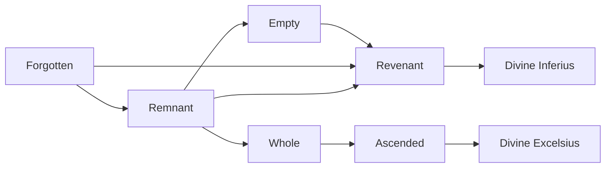

# Divine Inferius

<small>[Tensura: Mysticism](../index.md) &rsaquo; [Races](index.md)</small>

| | |
|---|---|
| **ID** | `mysticism:divine_inferius` |
| **Difficulty** | Intermediate |
| **Alignment** | Majin |
| **Aura** | 1,000,000 - 1,000,000 |
| **Magicule** | 1,000,000 - 1,000,000 |
| **Health bonus** | 980 |
| **Spiritual health bonus** | 9,636 |
| **Attack damage bonus** | 8 |
| **Movement speed bonus** | 0.055 |
| **EP to evolve into** | 2,000,000 |

> The culmination of one who has lost their past. They find meaning in death, defeating all, even one who has truly forgotten the world, just to attain Divinity.

## Evolution

- **Evolves from:** [Revenant](revenant.md)

### Requirements to evolve into Divine Inferius

Each requirement adds its weight to the evolution progress bar; you can evolve at 100%.

| Requirement | Weight |
|---|---|
| Reach Existence Points of 2,000,000 | 50% |
| Slay 1 of m e m o i r e s. | 50% |

### Evolution tree

## Traits

- Divine
- Spawns as a spiritual lifeform
- Spiritual lifeform

## Attribute modifiers

| Attribute | Amount | Operation |
|---|---|---|
| Scale | 0 | add |
| Max Health | 980 | add |
| Max Spiritual Health | 9,636 | add |
| Attack Damage | 8 | add |
| Attack Speed | 0.4 | add |
| Knockback Resistance | 1 | add |
| Movement Speed | 0.055 | add |
| Swim Speed Multiplier | 0.05 | add |

## Stats (config defaults)

Set in [`config/mysticism/race/forgotten_config.toml`](../configs/config-mysticism-race-forgotten-config.md).

| Option | Default | Description |
|---|---|---|
| `DivineInferius.epRequirement` | 2,000,000 | EP requirement to evolve into a Divine Inferius. |
| `DivineInferius.minAura` | 1,000,000 | Minimal aura. |
| `DivineInferius.maxAura` | 1,000,000 | Maximum aura. |
| `DivineInferius.minMagicule` | 1,000,000 | Minimal magicule. |
| `DivineInferius.maxMagicule` | 1,000,000 | Maximum magicule. |
| `DivineInferius.size` | 0 | Bonus Size. |
| `DivineInferius.maxHealth` | 980 | Bonus Max Health. |
| `DivineInferius.maxSpiritualHealth` | 9,636 | Bonus Max Spiritual Health. |
| `DivineInferius.attack` | 8 | Bonus Attack Damage. |
| `DivineInferius.attackSpeed` | 0.4 | Bonus Attack Speed. |
| `DivineInferius.knockbackResistance` | 1 | Bonus Knockback Resistance. |
| `DivineInferius.movementSpeed` | 0.055 | Bonus Movement Speed. |
| `DivineInferius.swimSpeed` | 0.05 | Bonus Swimming Speed Multiplier. |
| `DivineInferius.intrinsicSkills` | "tensura:spiritual_attack_resistance", "tensura:possession", "mysticism:relapse", "tensura:divine_ki_release" | The list of intrinsic skills that the race gets. |
| `Revenant.epRequirement` | 800,000 | EP requirement to evolve into a Revenant. |
| `Revenant.minAura` | 500,000 | Minimal aura. |
| `Revenant.maxAura` | 500,000 | Maximum aura. |
| `Revenant.minMagicule` | 500,000 | Minimal magicule. |
| `Revenant.maxMagicule` | 500,000 | Maximum magicule. |
| `Revenant.size` | 0 | Bonus Size. |
| `Revenant.maxHealth` | 580 | Bonus Max Health. |
| `Revenant.maxSpiritualHealth` | 5,740 | Bonus Max Spiritual Health. |
| `Revenant.attack` | 4 | Bonus Attack Damage. |
| `Revenant.attackSpeed` | 0.35 | Bonus Attack Speed. |
| `Revenant.knockbackResistance` | 1 | Bonus Knockback Resistance. |
| `Revenant.movementSpeed` | 0.0475 | Bonus Movement Speed. |
| `Revenant.swimSpeed` | 0.04 | Bonus Swimming Speed Multiplier. |
| `Revenant.intrinsicSkills` | "tensura:spiritual_attack_resistance", "tensura:possession", "mysticism:relapse" | The list of intrinsic skills that the race gets. |
| `Empty.epRequirement` | 200,000 | EP requirement to evolve into an Empty. |
| `Empty.minAura` | 200,000 | Minimal aura. |
| `Empty.maxAura` | 200,000 | Maximum aura. |
| `Empty.minMagicule` | 200,000 | Minimal magicule. |
| `Empty.maxMagicule` | 200,000 | Maximum magicule. |
| `Empty.size` | 0 | Bonus Size. |
| `Empty.maxHealth` | 160 | Bonus Max Health. |
| `Empty.maxSpiritualHealth` | 2,240 | Bonus Max Spiritual Health. |
| `Empty.attack` | 0 | Bonus Attack Damage. |
| `Empty.attackSpeed` | 0.1 | Bonus Attack Speed. |
| `Empty.knockbackResistance` | 1 | Bonus Knockback Resistance. |
| `Empty.movementSpeed` | 0.01 | Bonus Movement Speed. |
| `Empty.swimSpeed` | 0.01 | Bonus Swimming Speed Multiplier. |
| `Empty.intrinsicSkills` | "tensura:spiritual_attack_resistance", "tensura:possession", "mysticism:relapse" | The list of intrinsic skills that the race gets. |
| `Remnant.epRequirement` | 100,000 | EP requirement to evolve into a Remnant. |
| `Remnant.minAura` | 50,000 | Minimal aura. |
| `Remnant.maxAura` | 50,000 | Maximum aura. |
| `Remnant.minMagicule` | 60,000 | Minimal magicule. |
| `Remnant.maxMagicule` | 60,000 | Maximum magicule. |
| `Remnant.size` | 0 | Bonus Size. |
| `Remnant.maxHealth` | 60 | Bonus Max Health. |
| `Remnant.maxSpiritualHealth` | 1,040 | Bonus Max Spiritual Health. |
| `Remnant.attack` | -0.5 | Bonus Attack Damage. |
| `Remnant.attackSpeed` | 0.1 | Bonus Attack Speed. |
| `Remnant.knockbackResistance` | 1 | Bonus Knockback Resistance. |
| `Remnant.movementSpeed` | 0.01 | Bonus Movement Speed. |
| `Remnant.swimSpeed` | 0.01 | Bonus Swimming Speed Multiplier. |
| `Remnant.intrinsicSkills` | "tensura:spiritual_attack_resistance", "tensura:possession", "mysticism:relapse" | The list of intrinsic skills that the race gets. |
| `Forgotten.minAura` | 100 | Minimal aura. |
| `Forgotten.maxAura` | 600 | Maximum aura. |
| `Forgotten.minMagicule` | 425 | Minimal magicule. |
| `Forgotten.maxMagicule` | 700 | Maximum magicule. |
| `Forgotten.size` | 0 | Bonus Size. |
| `Forgotten.maxHealth` | 0 | Bonus Max Health. |
| `Forgotten.maxSpiritualHealth` | 0 | Bonus Max Spiritual Health. |
| `Forgotten.attack` | -1 | Bonus Attack Damage. |
| `Forgotten.attackSpeed` | 0 | Bonus Attack Speed. |
| `Forgotten.knockbackResistance` | 1 | Bonus Knockback Resistance. |
| `Forgotten.movementSpeed` | 0 | Bonus Movement Speed. |
| `Forgotten.swimSpeed` | 0 | Bonus Swimming Speed Multiplier. |
| `Forgotten.intrinsicSkills` | "tensura:spiritual_attack_resistance", "tensura:possession", "mysticism:relapse" | The list of intrinsic skills that the race gets. |

## Tags

`tensura:races/divine`, `tensura:races/spawn_as_spiritual`, `tensura:races/spiritual`
