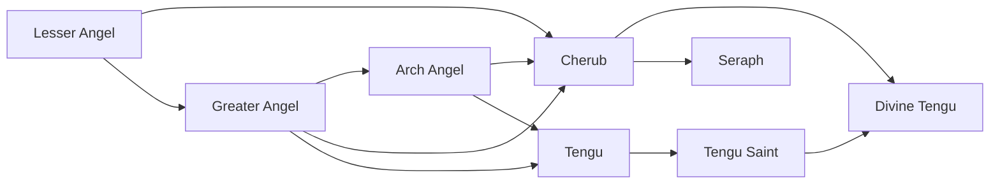

# Divine Tengu

<small>[Tensura: Mysticism](../index.md) &rsaquo; [Races](index.md)</small>

| | |
|---|---|
| **ID** | `mysticism:divine_tengu` |
| **Stage** | Final |
| **Difficulty** | Easy |
| **Alignment** | Holy |
| **Aura** | 1,500,000 - 2,800,000 |
| **Magicule** | 1,500,000 - 2,800,000 |
| **Health bonus** | 1,080 |
| **Spiritual health bonus** | 6,380 |
| **Attack damage bonus** | 5 |
| **Movement speed bonus** | 0.08 |
| **EP to evolve into** | 2,000,000 |

> The result of a Tengu achieving Divinity.

## Evolution

- **Evolves from:** [Cherub](cherub.md), [Tengu Saint](tengu-saint.md)

### Requirements to evolve into Divine Tengu

Each requirement adds its weight to the evolution progress bar; you can evolve at 100%.

| Requirement | Weight |
|---|---|
| Reach Existence Points of 2,000,000 | 100% |

### Evolution tree

## Traits

- Divine
- Has creative-style flight

## Attribute modifiers

| Attribute | Amount | Operation |
|---|---|---|
| Scale | 0 | add |
| Max Health | 1,080 | add |
| Max Spiritual Health | 6,380 | add |
| Attack Damage | 5 | add |
| Attack Speed | 0.9 | add |
| Knockback Resistance | 1 | add |
| Movement Speed | 0.08 | add |
| Swim Speed Multiplier | 0.8 | add |

## Stats (config defaults)

Set in [`config/mysticism/race/angel_config.toml`](../configs/config-mysticism-race-angel-config.md).

| Option | Default | Description |
|---|---|---|
| `DivineTengu.epRequirement` | 2,000,000 | EP requirement to evolve into a Divine Tengu. |
| `DivineTengu.minAura` | 1,500,000 | Minimal aura. |
| `DivineTengu.maxAura` | 2,800,000 | Maximum aura. |
| `DivineTengu.minMagicule` | 1,500,000 | Minimal magicule. |
| `DivineTengu.maxMagicule` | 2,800,000 | Maximum magicule. |
| `DivineTengu.size` | 0 | Bonus Size. |
| `DivineTengu.maxHealth` | 1,080 | Bonus Max Health. |
| `DivineTengu.maxSpiritualHealth` | 6,380 | Bonus Max Spiritual Health. |
| `DivineTengu.attack` | 5 | Bonus Attack Damage. |
| `DivineTengu.attackSpeed` | 0.9 | Bonus Attack Speed. |
| `DivineTengu.knockbackResistance` | 1 | Bonus Knockback Resistance. |
| `DivineTengu.movementSpeed` | 0.08 | Bonus Movement Speed. |
| `DivineTengu.swimSpeed` | 0.8 | Bonus Swimming Speed Multiplier. |
| `DivineTengu.intrinsicSkills` | "tensura:magic_resistance", "tensura:possession", "mysticism:light_manipulation", "tensura:beast_transformation", "tensura:self_regeneration", "tensura:godwolf_sense", "tensura:holy_attack_resistance", "tensura:divine_ki_release" | The list of intrinsic skills that the race gets. |
| `TenguSaint.epRequirement` | 400,000 | EP requirement to evolve into a Tengu Saint. |
| `TenguSaint.minAura` | 800,000 | Minimal aura. |
| `TenguSaint.maxAura` | 900,000 | Maximum aura. |
| `TenguSaint.minMagicule` | 800,000 | Minimal magicule. |
| `TenguSaint.maxMagicule` | 900,000 | Maximum magicule. |
| `TenguSaint.size` | 0 | Bonus Size. |
| `TenguSaint.maxHealth` | 650 | Bonus Max Health. |
| `TenguSaint.maxSpiritualHealth` | 3,800 | Bonus Max Spiritual Health. |
| `TenguSaint.attack` | 4 | Bonus Attack Damage. |
| `TenguSaint.attackSpeed` | 0.8 | Bonus Attack Speed. |
| `TenguSaint.knockbackResistance` | 0.8 | Bonus Knockback Resistance. |
| `TenguSaint.movementSpeed` | 0.04 | Bonus Movement Speed. |
| `TenguSaint.swimSpeed` | 0.4 | Bonus Swimming Speed Multiplier. |
| `TenguSaint.intrinsicSkills` | "tensura:magic_resistance", "tensura:possession", "mysticism:light_manipulation", "tensura:beast_transformation", "tensura:self_regeneration", "tensura:godwolf_sense", "tensura:holy_attack_resistance" | The list of intrinsic skills that the race gets. |
| `Tengu.minAura` | 100,000 | Minimal aura. |
| `Tengu.maxAura` | 150,000 | Maximum aura. |
| `Tengu.minMagicule` | 100,000 | Minimal magicule. |
| `Tengu.maxMagicule` | 150,000 | Maximum magicule. |
| `Tengu.size` | 0 | Bonus Size. |
| `Tengu.maxHealth` | 130 | Bonus Max Health. |
| `Tengu.maxSpiritualHealth` | 600 | Bonus Max Spiritual Health. |
| `Tengu.attack` | 2.5 | Bonus Attack Damage. |
| `Tengu.attackSpeed` | 0.4 | Bonus Attack Speed. |
| `Tengu.knockbackResistance` | 0.6 | Bonus Knockback Resistance. |
| `Tengu.movementSpeed` | 0.05 | Bonus Movement Speed. |
| `Tengu.swimSpeed` | 0.1 | Bonus Swimming Speed Multiplier. |
| `Tengu.intrinsicSkills` | "tensura:magic_resistance", "tensura:possession", "mysticism:light_manipulation", "tensura:beast_transformation", "tensura:self_regeneration", "tensura:godwolf_sense" | The list of intrinsic skills that the race gets. |
| `GreaterAngel.epRequirement` | 20,000 | EP requirement to evolve into a Greater Angel. |
| `GreaterAngel.minAura` | 35,000 | Minimal aura. |
| `GreaterAngel.maxAura` | 45,000 | Maximum aura. |
| `GreaterAngel.minMagicule` | 15,000 | Minimal magicule. |
| `GreaterAngel.maxMagicule` | 25,000 | Maximum magicule. |
| `GreaterAngel.size` | 0 | Bonus Size. |
| `GreaterAngel.maxHealth` | 60 | Bonus Max Health. |
| `GreaterAngel.maxSpiritualHealth` | 200 | Bonus Max Spiritual Health. |
| `GreaterAngel.attack` | 1 | Bonus Attack Damage. |
| `GreaterAngel.attackSpeed` | 0 | Bonus Attack Speed. |
| `GreaterAngel.knockbackResistance` | 0.2 | Bonus Knockback Resistance. |
| `GreaterAngel.movementSpeed` | 0.02 | Bonus Movement Speed. |
| `GreaterAngel.swimSpeed` | 0.2 | Bonus Swimming Speed Multiplier. |
| `GreaterAngel.intrinsicSkills` | "tensura:magic_resistance", "tensura:possession", "mysticism:light_manipulation" | The list of intrinsic skills that the race gets. |
| `LesserAngel.minAura` | 5,500 | Minimal aura. |
| `LesserAngel.maxAura` | 6,500 | Maximum aura. |
| `LesserAngel.minMagicule` | 1,500 | Minimal magicule. |
| `LesserAngel.maxMagicule` | 3,500 | Maximum magicule. |
| `LesserAngel.size` | 0 | Bonus Size. |
| `LesserAngel.maxHealth` | 20 | Bonus Max Health. |
| `LesserAngel.maxSpiritualHealth` | 90 | Bonus Max Spiritual Health. |
| `LesserAngel.attack` | 0.4 | Bonus Attack Damage. |
| `LesserAngel.attackSpeed` | 0 | Bonus Attack Speed. |
| `LesserAngel.knockbackResistance` | 0.1 | Bonus Knockback Resistance. |
| `LesserAngel.movementSpeed` | 0.01 | Bonus Movement Speed. |
| `LesserAngel.swimSpeed` | 0 | Bonus Swimming Speed Multiplier. |
| `LesserAngel.intrinsicSkills` | "tensura:magic_resistance", "tensura:possession", "mysticism:light_manipulation" | The list of intrinsic skills that the race gets. |

## Tags

`tensura:races/divine`, `tensura:races/has_creative_flight`
