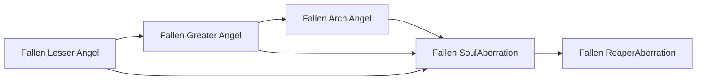

# Fallen Lesser Angel

<small>[Tensura: Mysticism](../index.md) &rsaquo; [Races](index.md)</small>

| | |
|---|---|
| **ID** | `mysticism:fallen_lesser_angel` |
| **Stage** | Starting |
| **Difficulty** | Easy |
| **Alignment** | Majin |
| **Aura** | 4,500 - 5,500 |
| **Magicule** | 5,500 - 7,500 |
| **Health bonus** | 20 |
| **Spiritual health bonus** | 90 |
| **Attack damage bonus** | 0.4 |
| **Movement speed bonus** | 0.01 |

> A lesser angel that got corrupted by magicules, despite that, they still retain the light element.

## Evolution

- **Evolves into:** [Fallen Greater Angel](fallen-greater-angel.md)
- **Default evolution:** [Fallen Greater Angel](fallen-greater-angel.md)
- **On awakening (True Demon Lord / True Hero):** [Fallen SoulAberration](fallen-cherub.md)
- **During the Harvest Festival:** [Fallen Greater Angel](fallen-greater-angel.md)

### Evolution tree

## Traits

- Has creative-style flight
- Spiritual lifeform

## Attribute modifiers

| Attribute | Amount | Operation |
|---|---|---|
| Scale | 0 | add |
| Max Health | 20 | add |
| Max Spiritual Health | 90 | add |
| Attack Damage | 0.4 | add |
| Attack Speed | 0 | add |
| Knockback Resistance | 0.1 | add |
| Movement Speed | 0.01 | add |
| Swim Speed Multiplier | 0 | add |

## Stats (config defaults)

Set in [`config/mysticism/race/angel_config.toml`](../configs/config-mysticism-race-angel-config.md).

| Option | Default | Description |
|---|---|---|
| `FallenLesserAngel.essenceRequired` | 1 | Quantity of demon essence required to become a fallen lesser angel as a lesser angel. |
| `FallenLesserAngel.minAura` | 4,500 | Minimal aura. |
| `FallenLesserAngel.maxAura` | 5,500 | Maximum aura. |
| `FallenLesserAngel.minMagicule` | 5,500 | Minimal magicule. |
| `FallenLesserAngel.maxMagicule` | 7,500 | Maximum magicule. |
| `FallenLesserAngel.size` | 0 | Bonus Size. |
| `FallenLesserAngel.maxHealth` | 20 | Bonus Max Health. |
| `FallenLesserAngel.maxSpiritualHealth` | 90 | Bonus Max Spiritual Health. |
| `FallenLesserAngel.attack` | 0.4 | Bonus Attack Damage. |
| `FallenLesserAngel.attackSpeed` | 0 | Bonus Attack Speed. |
| `FallenLesserAngel.knockbackResistance` | 0.1 | Bonus Knockback Resistance. |
| `FallenLesserAngel.movementSpeed` | 0.01 | Bonus Movement Speed. |
| `FallenLesserAngel.swimSpeed` | 0 | Bonus Swimming Speed Multiplier. |
| `FallenLesserAngel.intrinsicSkills` | "tensura:magic_resistance", "mysticism:light_manipulation" | The list of intrinsic skills that the race gets. |

## Tags

`tensura:races/has_creative_flight`, `tensura:races/spiritual`
