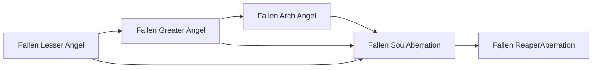

# Fallen ReaperAberration

<small>[Tensura: Mysticism](../index.md) &rsaquo; [Races](index.md)</small>

| | |
|---|---|
| **ID** | `mysticism:fallen_seraph` |
| **Stage** | Final |
| **Difficulty** | Easy |
| **Alignment** | Majin |
| **Aura** | 1,000,000 - 1,000,000 |
| **Magicule** | 1,010,000 - 1,050,000 |
| **Health bonus** | 1,060 |
| **Spiritual health bonus** | 6,300 |
| **Attack damage bonus** | 4 |
| **Movement speed bonus** | 0.08 |
| **EP to evolve into** | 140,000 |

> A seraph that got corrupted by magicules, despite that, they still retain the light element.

## Evolution

- **Evolves from:** [Fallen SoulAberration](fallen-cherub.md)

### Requirements to evolve into Fallen ReaperAberration

Each requirement adds its weight to the evolution progress bar; you can evolve at 100%.

| Requirement | Weight |
|---|---|
| Awaken [True Demon Lord./True Hero.] | 100% |

### Evolution tree

## Traits

- Divine
- Has creative-style flight

## Attribute modifiers

| Attribute | Amount | Operation |
|---|---|---|
| Scale | 0 | add |
| Max Health | 1,060 | add |
| Max Spiritual Health | 6,300 | add |
| Attack Damage | 4 | add |
| Attack Speed | 0.7 | add |
| Knockback Resistance | 0.8 | add |
| Movement Speed | 0.08 | add |
| Swim Speed Multiplier | 0.8 | add |

## Stats (config defaults)

Set in [`config/mysticism/race/angel_config.toml`](../configs/config-mysticism-race-angel-config.md).

| Option | Default | Description |
|---|---|---|
| `FallenSeraph.essenceRequired` | 10 | Quantity of demon essence required to become a fallen seraph as a seraph. |
| `FallenSeraph.minAura` | 1,000,000 | Minimal aura. |
| `FallenSeraph.maxAura` | 1,000,000 | Maximum aura. |
| `FallenSeraph.minMagicule` | 1,010,000 | Minimal magicule. |
| `FallenSeraph.maxMagicule` | 1,050,000 | Maximum magicule. |
| `FallenSeraph.size` | 0 | Bonus Size. |
| `FallenSeraph.maxHealth` | 1,060 | Bonus Max Health. |
| `FallenSeraph.maxSpiritualHealth` | 6,300 | Bonus Max Spiritual Health. |
| `FallenSeraph.attack` | 4 | Bonus Attack Damage. |
| `FallenSeraph.attackSpeed` | 0.7 | Bonus Attack Speed. |
| `FallenSeraph.knockbackResistance` | 0.8 | Bonus Knockback Resistance. |
| `FallenSeraph.movementSpeed` | 0.08 | Bonus Movement Speed. |
| `FallenSeraph.swimSpeed` | 0.8 | Bonus Swimming Speed Multiplier. |
| `FallenSeraph.intrinsicSkills` | "tensura:magic_resistance", "mysticism:light_manipulation", "tensura:physical_attack_resistance", "tensura:divine_ki_release", "mysticism:light_domination" | The list of intrinsic skills that the race gets. |
| `FallenCherub.essenceRequired` | 7 | Quantity of demon essence required to become a fallen cherub as a cherub. |
| `FallenCherub.minAura` | 165,000 | Minimal aura. |
| `FallenCherub.maxAura` | 170,000 | Maximum aura. |
| `FallenCherub.minMagicule` | 205,000 | Minimal magicule. |
| `FallenCherub.maxMagicule` | 215,000 | Maximum magicule. |
| `FallenCherub.size` | 0 | Bonus Size. |
| `FallenCherub.maxHealth` | 620 | Bonus Max Health. |
| `FallenCherub.maxSpiritualHealth` | 3,702 | Bonus Max Spiritual Health. |
| `FallenCherub.attack` | 3 | Bonus Attack Damage. |
| `FallenCherub.attackSpeed` | 0.5 | Bonus Attack Speed. |
| `FallenCherub.knockbackResistance` | 0.6 | Bonus Knockback Resistance. |
| `FallenCherub.movementSpeed` | 0.04 | Bonus Movement Speed. |
| `FallenCherub.swimSpeed` | 0.4 | Bonus Swimming Speed Multiplier. |
| `FallenCherub.intrinsicSkills` | "tensura:magic_resistance", "mysticism:light_manipulation", "tensura:physical_attack_resistance" | The list of intrinsic skills that the race gets. |
| `FallenArchAngel.essenceRequired` | 5 | Quantity of demon essence required to become a fallen arch angel as an arch angel. |
| `FallenArchAngel.epRequirement` | 140,000 | EP requirement to evolve into a Fallen Arch Angel. |
| `FallenArchAngel.minAura` | 70,000 | Minimal aura. |
| `FallenArchAngel.maxAura` | 75,000 | Maximum aura. |
| `FallenArchAngel.minMagicule` | 105,000 | Minimal magicule. |
| `FallenArchAngel.maxMagicule` | 110,000 | Maximum magicule. |
| `FallenArchAngel.size` | 0 | Bonus Size. |
| `FallenArchAngel.maxHealth` | 100 | Bonus Max Health. |
| `FallenArchAngel.maxSpiritualHealth` | 580 | Bonus Max Spiritual Health. |
| `FallenArchAngel.attack` | 2 | Bonus Attack Damage. |
| `FallenArchAngel.attackSpeed` | 0.2 | Bonus Attack Speed. |
| `FallenArchAngel.knockbackResistance` | 0.4 | Bonus Knockback Resistance. |
| `FallenArchAngel.movementSpeed` | 0.01 | Bonus Movement Speed. |
| `FallenArchAngel.swimSpeed` | 0.1 | Bonus Swimming Speed Multiplier. |
| `FallenArchAngel.intrinsicSkills` | "tensura:magic_resistance", "mysticism:light_manipulation", "tensura:physical_attack_resistance" | The list of intrinsic skills that the race gets. |
| `FallenGreaterAngel.essenceRequired` | 3 | Quantity of demon essence required to become a fallen greater angel as a greater angel. |
| `FallenGreaterAngel.epRequirement` | 20,000 | EP requirement to evolve into Fallen Greater Angel. |
| `FallenGreaterAngel.minAura` | 25,000 | Minimal aura. |
| `FallenGreaterAngel.maxAura` | 30,000 | Maximum aura. |
| `FallenGreaterAngel.minMagicule` | 35,000 | Minimal magicule. |
| `FallenGreaterAngel.maxMagicule` | 45,000 | Maximum magicule. |
| `FallenGreaterAngel.size` | 0 | Bonus Size. |
| `FallenGreaterAngel.maxHealth` | 60 | Bonus Max Health. |
| `FallenGreaterAngel.maxSpiritualHealth` | 200 | Bonus Max Spiritual Health. |
| `FallenGreaterAngel.attack` | 1 | Bonus Attack Damage. |
| `FallenGreaterAngel.attackSpeed` | 0 | Bonus Attack Speed. |
| `FallenGreaterAngel.knockbackResistance` | 0.2 | Bonus Knockback Resistance. |
| `FallenGreaterAngel.movementSpeed` | 0.02 | Bonus Movement Speed. |
| `FallenGreaterAngel.swimSpeed` | 0.2 | Bonus Swimming Speed Multiplier. |
| `FallenGreaterAngel.intrinsicSkills` | "tensura:magic_resistance", "mysticism:light_manipulation" | The list of intrinsic skills that the race gets. |
| `FallenLesserAngel.essenceRequired` | 1 | Quantity of demon essence required to become a fallen lesser angel as a lesser angel. |
| `FallenLesserAngel.minAura` | 4,500 | Minimal aura. |
| `FallenLesserAngel.maxAura` | 5,500 | Maximum aura. |
| `FallenLesserAngel.minMagicule` | 5,500 | Minimal magicule. |
| `FallenLesserAngel.maxMagicule` | 7,500 | Maximum magicule. |
| `FallenLesserAngel.size` | 0 | Bonus Size. |
| `FallenLesserAngel.maxHealth` | 20 | Bonus Max Health. |
| `FallenLesserAngel.maxSpiritualHealth` | 90 | Bonus Max Spiritual Health. |
| `FallenLesserAngel.attack` | 0.4 | Bonus Attack Damage. |
| `FallenLesserAngel.attackSpeed` | 0 | Bonus Attack Speed. |
| `FallenLesserAngel.knockbackResistance` | 0.1 | Bonus Knockback Resistance. |
| `FallenLesserAngel.movementSpeed` | 0.01 | Bonus Movement Speed. |
| `FallenLesserAngel.swimSpeed` | 0 | Bonus Swimming Speed Multiplier. |
| `FallenLesserAngel.intrinsicSkills` | "tensura:magic_resistance", "mysticism:light_manipulation" | The list of intrinsic skills that the race gets. |

## Tags

`tensura:races/divine`, `tensura:races/has_creative_flight`
