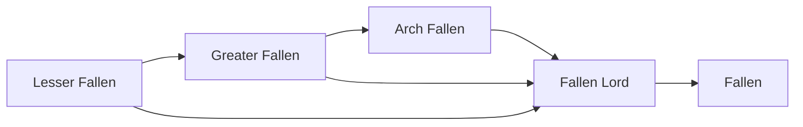

# Fallen

<small>[Tensura: Mysticism](../index.md) &rsaquo; [Races](index.md)</small>

| | |
|---|---|
| **ID** | `mysticism:fallen` |
| **Stage** | Final |
| **Difficulty** | Easy |
| **Alignment** | Majin |
| **Aura** | 1,000,000 - 1,000,000 |
| **Magicule** | 1,200,000 - 1,300,000 |
| **Health bonus** | 1,080 |
| **Spiritual health bonus** | 6,350 |
| **Attack damage bonus** | 4.5 |
| **Movement speed bonus** | 0.08 |
| **EP to evolve into** | 300,000 |

> A seraph that got corrupted by magicules, then chose to abandon the light for the darkness.

## Evolution

- **Evolves from:** [Fallen Lord](fallen-lord.md)

### Requirements to evolve into Fallen

Each requirement adds its weight to the evolution progress bar; you can evolve at 100%.

| Requirement | Weight |
|---|---|
| Awaken [True Demon Lord./True Hero.] | 100% |

### Evolution tree

## Traits

- Divine

## Attribute modifiers

| Attribute | Amount | Operation |
|---|---|---|
| Scale | 0 | add |
| Max Health | 1,080 | add |
| Max Spiritual Health | 6,350 | add |
| Attack Damage | 4.5 | add |
| Attack Speed | 0.7 | add |
| Knockback Resistance | 0.8 | add |
| Movement Speed | 0.08 | add |
| Swim Speed Multiplier | 0.8 | add |

## Stats (config defaults)

Set in [`config/mysticism/race/angel_config.toml`](../configs/config-mysticism-race-angel-config.md).

| Option | Default | Description |
|---|---|---|
| `Fallen.minAura` | 1,000,000 | Minimal aura. |
| `Fallen.maxAura` | 1,000,000 | Maximum aura. |
| `Fallen.minMagicule` | 1,200,000 | Minimal magicule. |
| `Fallen.maxMagicule` | 1,300,000 | Maximum magicule. |
| `Fallen.size` | 0 | Bonus Size. |
| `Fallen.maxHealth` | 1,080 | Bonus Max Health. |
| `Fallen.maxSpiritualHealth` | 6,350 | Bonus Max Spiritual Health. |
| `Fallen.attack` | 4.5 | Bonus Attack Damage. |
| `Fallen.attackSpeed` | 0.7 | Bonus Attack Speed. |
| `Fallen.knockbackResistance` | 0.8 | Bonus Knockback Resistance. |
| `Fallen.movementSpeed` | 0.08 | Bonus Movement Speed. |
| `Fallen.swimSpeed` | 0.8 | Bonus Swimming Speed Multiplier. |
| `Fallen.intrinsicSkills` | "tensura:magic_resistance", "mysticism:darkness_manipulation", "tensura:physical_attack_resistance", "tensura:darkness_attack_resistance", "tensura:divine_ki_release", "mysticism:darkness_domination" | The list of intrinsic skills that the race gets. |
| `FallenLord.epRequirement` | 300,000 | EP requirement to evolve into a Fallen Arch Angel. |
| `FallenLord.minAura` | 165,000 | Minimal aura. |
| `FallenLord.maxAura` | 170,000 | Maximum aura. |
| `FallenLord.minMagicule` | 225,000 | Minimal magicule. |
| `FallenLord.maxMagicule` | 250,000 | Maximum magicule. |
| `FallenLord.size` | 0 | Bonus Size. |
| `FallenLord.maxHealth` | 640 | Bonus Max Health. |
| `FallenLord.maxSpiritualHealth` | 3,742 | Bonus Max Spiritual Health. |
| `FallenLord.attack` | 3.5 | Bonus Attack Damage. |
| `FallenLord.attackSpeed` | 0.8 | Bonus Attack Speed. |
| `FallenLord.knockbackResistance` | 0.6 | Bonus Knockback Resistance. |
| `FallenLord.movementSpeed` | 0.04 | Bonus Movement Speed. |
| `FallenLord.swimSpeed` | 0.4 | Bonus Swimming Speed Multiplier. |
| `FallenLord.intrinsicSkills` | "tensura:magic_resistance", "mysticism:darkness_manipulation", "tensura:physical_attack_resistance", "tensura:darkness_attack_resistance" | The list of intrinsic skills that the race gets. |
| `ArchFallen.epRequirement` | 140,000 | EP requirement to evolve into a Fallen Arch Angel. |
| `ArchFallen.minAura` | 70,000 | Minimal aura. |
| `ArchFallen.maxAura` | 75,000 | Maximum aura. |
| `ArchFallen.minMagicule` | 120,000 | Minimal magicule. |
| `ArchFallen.maxMagicule` | 145,000 | Maximum magicule. |
| `ArchFallen.size` | 0 | Bonus Size. |
| `ArchFallen.maxHealth` | 110 | Bonus Max Health. |
| `ArchFallen.maxSpiritualHealth` | 600 | Bonus Max Spiritual Health. |
| `ArchFallen.attack` | 2.3 | Bonus Attack Damage. |
| `ArchFallen.attackSpeed` | 0.4 | Bonus Attack Speed. |
| `ArchFallen.knockbackResistance` | 0.4 | Bonus Knockback Resistance. |
| `ArchFallen.movementSpeed` | 0.01 | Bonus Movement Speed. |
| `ArchFallen.swimSpeed` | 0.1 | Bonus Swimming Speed Multiplier. |
| `ArchFallen.intrinsicSkills` | "tensura:magic_resistance", "mysticism:darkness_manipulation", "tensura:physical_attack_resistance" | The list of intrinsic skills that the race gets. |
| `GreaterFallen.epRequirement` | 20,000 | EP requirement to evolve into Fallen Greater Angel. |
| `GreaterFallen.minAura` | 25,000 | Minimal aura. |
| `GreaterFallen.maxAura` | 30,000 | Maximum aura. |
| `GreaterFallen.minMagicule` | 40,000 | Minimal magicule. |
| `GreaterFallen.maxMagicule` | 55,000 | Maximum magicule. |
| `GreaterFallen.size` | 0 | Bonus Size. |
| `GreaterFallen.maxHealth` | 80 | Bonus Max Health. |
| `GreaterFallen.maxSpiritualHealth` | 220 | Bonus Max Spiritual Health. |
| `GreaterFallen.attack` | 1.2 | Bonus Attack Damage. |
| `GreaterFallen.attackSpeed` | 0.2 | Bonus Attack Speed. |
| `GreaterFallen.knockbackResistance` | 0.2 | Bonus Knockback Resistance. |
| `GreaterFallen.movementSpeed` | 0.02 | Bonus Movement Speed. |
| `GreaterFallen.swimSpeed` | 0.2 | Bonus Swimming Speed Multiplier. |
| `GreaterFallen.intrinsicSkills` | "tensura:magic_resistance", "mysticism:darkness_manipulation" | The list of intrinsic skills that the race gets. |
| `LesserFallen.minAura` | 4,500 | Minimal aura. |
| `LesserFallen.maxAura` | 5,500 | Maximum aura. |
| `LesserFallen.minMagicule` | 7,500 | Minimal magicule. |
| `LesserFallen.maxMagicule` | 9,500 | Maximum magicule. |
| `LesserFallen.size` | 0 | Bonus Size. |
| `LesserFallen.maxHealth` | 30 | Bonus Max Health. |
| `LesserFallen.maxSpiritualHealth` | 100 | Bonus Max Spiritual Health. |
| `LesserFallen.attack` | 0.5 | Bonus Attack Damage. |
| `LesserFallen.attackSpeed` | 0.1 | Bonus Attack Speed. |
| `LesserFallen.knockbackResistance` | 0.1 | Bonus Knockback Resistance. |
| `LesserFallen.movementSpeed` | 0.01 | Bonus Movement Speed. |
| `LesserFallen.swimSpeed` | 0 | Bonus Swimming Speed Multiplier. |
| `LesserFallen.intrinsicSkills` | "tensura:magic_resistance", "mysticism:darkness_manipulation" | The list of intrinsic skills that the race gets. |

## Tags

`tensura:races/divine`
