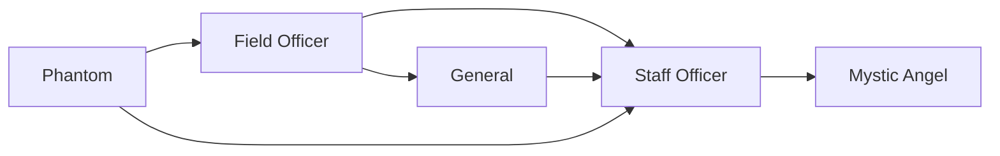

# Field Officer

<small>[Tensura: Mysticism](../index.md) &rsaquo; [Races](index.md)</small>

| | |
|---|---|
| **ID** | `mysticism:field_officer` |
| **Difficulty** | Hard |
| **Alignment** | Majin |
| **Aura** | 15,000 - 25,000 |
| **Magicule** | 25,000 - 30,000 |
| **Health bonus** | 50 |
| **Spiritual health bonus** | 150 |
| **Attack damage bonus** | 1 |
| **Movement speed bonus** | 0.02 |
| **EP to evolve into** | 20,000 |

> The evolution of a Phantom with an ego, now having the ability to split bodies.

## Evolution

- **Evolves from:** [Phantom](phantom.md)
- **Evolves into:** [General](general.md)
- **Default evolution:** [General](general.md)
- **On awakening (True Demon Lord / True Hero):** [Staff Officer](staff-officer.md)
- **During the Harvest Festival:** [General](general.md)

### Requirements to evolve into Field Officer

Each requirement adds its weight to the evolution progress bar; you can evolve at 100%.

| Requirement | Weight |
|---|---|
| Reach Existence Points of 20,000 | 100% |

### Evolution tree

## Traits

- Spawns as a spiritual lifeform

## Attribute modifiers

| Attribute | Amount | Operation |
|---|---|---|
| Scale | 0 | add |
| Max Health | 50 | add |
| Max Spiritual Health | 150 | add |
| Attack Damage | 1 | add |
| Attack Speed | 0 | add |
| Knockback Resistance | 0.2 | add |
| Movement Speed | 0.02 | add |
| Swim Speed Multiplier | 0.2 | add |

## Stats (config defaults)

Set in [`config/mysticism/race/phantom_config.toml`](../configs/config-mysticism-race-phantom-config.md).

| Option | Default | Description |
|---|---|---|
| `FieldOfficer.essenceRequired` | 3 | Quantity of cryptid essence required to become a field officer as a greater angel. |
| `FieldOfficer.epRequirement` | 20,000 | EP requirement to evolve into a field officer. |
| `FieldOfficer.minAura` | 15,000 | Minimal aura. |
| `FieldOfficer.maxAura` | 25,000 | Maximum aura. |
| `FieldOfficer.minMagicule` | 25,000 | Minimal magicule. |
| `FieldOfficer.maxMagicule` | 30,000 | Maximum magicule. |
| `FieldOfficer.size` | 0 | Bonus Size. |
| `FieldOfficer.maxHealth` | 50 | Bonus Max Health. |
| `FieldOfficer.maxSpiritualHealth` | 150 | Bonus Max Spiritual Health. |
| `FieldOfficer.attack` | 1 | Bonus Attack Damage. |
| `FieldOfficer.attackSpeed` | 0 | Bonus Attack Speed. |
| `FieldOfficer.knockbackResistance` | 0.2 | Bonus Knockback Resistance. |
| `FieldOfficer.movementSpeed` | 0.02 | Bonus Movement Speed. |
| `FieldOfficer.swimSpeed` | 0.2 | Bonus Swimming Speed Multiplier. |
| `FieldOfficer.intrinsicSkills` | "tensura:magic_resistance", "tensura:possession" | The list of intrinsic skills that the race gets. |
| `Phantom.essenceRequired` | 1 | Quantity of cryptid essence required to become a phantom as a lesser angel. |
| `Phantom.minAura` | 2,500 | Minimal aura. |
| `Phantom.maxAura` | 3,500 | Maximum aura. |
| `Phantom.minMagicule` | 5,500 | Minimal magicule. |
| `Phantom.maxMagicule` | 6,500 | Maximum magicule. |
| `Phantom.size` | 0 | Bonus Size. |
| `Phantom.maxHealth` | 15 | Bonus Max Health. |
| `Phantom.maxSpiritualHealth` | 70 | Bonus Max Spiritual Health. |
| `Phantom.attack` | 0.3 | Bonus Attack Damage. |
| `Phantom.attackSpeed` | 0 | Bonus Attack Speed. |
| `Phantom.knockbackResistance` | 0.1 | Bonus Knockback Resistance. |
| `Phantom.movementSpeed` | 0.01 | Bonus Movement Speed. |
| `Phantom.swimSpeed` | 0 | Bonus Swimming Speed Multiplier. |
| `Phantom.intrinsicSkills` | "tensura:magic_resistance", "tensura:possession" | The list of intrinsic skills that the race gets. |

## Tags

`tensura:races/spawn_as_spiritual`
