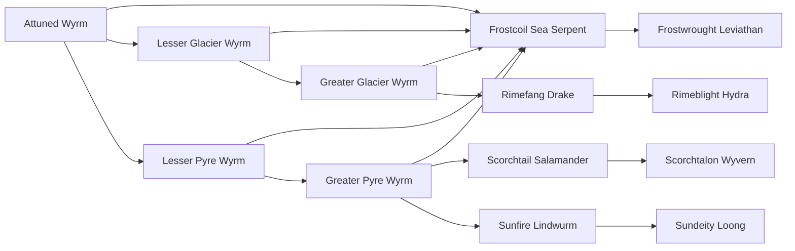

# Frostwrought Leviathan

<small>[Tensura: Mysticism](../index.md) &rsaquo; [Races](index.md)</small>

| | |
|---|---|
| **ID** | `mysticism:frostwrought_leviathan` |
| **Difficulty** | Hard |
| **Alignment** | Default |
| **Aura** | 1,200,000 - 1,200,000 |
| **Magicule** | 800,000 - 800,000 |
| **Health bonus** | 880 |
| **Spiritual health bonus** | 3,520 |
| **Attack damage bonus** | 14 |
| **Movement speed bonus** | 0.05 |
| **EP to evolve into** | 1,500,000 |

> A deadly dragon that lives near the bottom of the ocean's, a tame but deadly race able to manipulate sound to find and catch threads.

## Evolution

- **Evolves from:** [Frostcoil Sea Serpent](frostcoil-sea-serpent.md)

### Requirements to evolve into Frostwrought Leviathan

Each requirement adds its weight to the evolution progress bar; you can evolve at 100%.

| Requirement | Weight |
|---|---|
| Reach Existence Points of 1,500,000 | 33.4% |
| Master name | 33.3% |
| Master name | 33.3% |

### Evolution tree

## Traits

- Divine
- Has creative-style flight
- Spiritual lifeform

## Attribute modifiers

| Attribute | Amount | Operation |
|---|---|---|
| Scale | 1.2 | add |
| Max Health | 880 | add |
| Max Spiritual Health | 3,520 | add |
| Attack Damage | 14 | add |
| Attack Speed | 1.5 | add |
| Knockback Resistance | 0.08 | add |
| Movement Speed | 0.05 | add |
| Swim Speed Multiplier | 0.05 | add |

## Stats (config defaults)

Set in [`config/mysticism/race/wyrm_config.toml`](../configs/config-mysticism-race-wyrm-config.md).

| Option | Default | Description |
|---|---|---|
| `FrostwroughtLeviathan.minAura` | 1,200,000 | Minimal aura. |
| `FrostwroughtLeviathan.maxAura` | 1,200,000 | Maximum aura. |
| `FrostwroughtLeviathan.minMagicule` | 800,000 | Minimal magicule. |
| `FrostwroughtLeviathan.maxMagicule` | 800,000 | Maximum magicule. |
| `FrostwroughtLeviathan.size` | 1.2 | Bonus Size. |
| `FrostwroughtLeviathan.maxHealth` | 880 | Bonus Max Health. |
| `FrostwroughtLeviathan.maxSpiritualHealth` | 3,520 | Bonus Max Spiritual Health. |
| `FrostwroughtLeviathan.attack` | 14 | Bonus Attack Damage. |
| `FrostwroughtLeviathan.attackSpeed` | 1.5 | Bonus Attack Speed. |
| `FrostwroughtLeviathan.knockbackResistance` | 0.08 | Bonus Knockback Resistance. |
| `FrostwroughtLeviathan.movementSpeed` | 0.05 | Bonus Movement Speed. |
| `FrostwroughtLeviathan.swimSpeed` | 0.05 | Bonus Swimming Speed Multiplier. |
| `FrostwroughtLeviathan.epRequirement` | 1,500,000 | EP requirement to evolve into a Frostwrought Leviathan. |
| `FrostwroughtLeviathan.abilityRequirement` | "tensura:water_domination" | The first ability needed to evolve into a Frostwrought Leviathan. |
| `FrostwroughtLeviathan.abilityMasteryRequirement` | true | Does the first ability need to be mastered? (true/false) |
| `FrostwroughtLeviathan.ability2Requirement` | "tensura:dragon_ear" | The second ability needed to evolve into a Frostwrought Leviathan. |
| `FrostwroughtLeviathan.ability2MasteryRequirement` | true | Does the second ability need to be mastered? (true/false) |
| `FrostwroughtLeviathan.intrinsicSkills` | "tensura:cold_resistance", "mysticism:cryogenic_cessation", "tensura:dragon_ear", "tensura:dragon_skin", "tensura:ultrasonic_waves", "tensura:hydraulic_propulsion", "tensura:dragon_mode", "tensura:sound_manipulation", "tensura:divine_ki_release" | The list of intrinsic skills that the race gets. |
| `FrostcoilSeaSerpent.minAura` | 200,000 | Minimal aura. |
| `FrostcoilSeaSerpent.maxAura` | 200,000 | Maximum aura. |
| `FrostcoilSeaSerpent.minMagicule` | 150,000 | Minimal magicule. |
| `FrostcoilSeaSerpent.maxMagicule` | 150,000 | Maximum magicule. |
| `FrostcoilSeaSerpent.size` | 1 | Bonus Size. |
| `FrostcoilSeaSerpent.maxHealth` | 340 | Bonus Max Health. |
| `FrostcoilSeaSerpent.maxSpiritualHealth` | 1,360 | Bonus Max Spiritual Health. |
| `FrostcoilSeaSerpent.attack` | 7 | Bonus Attack Damage. |
| `FrostcoilSeaSerpent.attackSpeed` | 1 | Bonus Attack Speed. |
| `FrostcoilSeaSerpent.knockbackResistance` | 0.06 | Bonus Knockback Resistance. |
| `FrostcoilSeaSerpent.movementSpeed` | 0.03 | Bonus Movement Speed. |
| `FrostcoilSeaSerpent.swimSpeed` | 0.03 | Bonus Swimming Speed Multiplier. |
| `FrostcoilSeaSerpent.epRequirement` | 200,000 | EP requirement to evolve into Frostcoil Sea Serpent. |
| `FrostcoilSeaSerpent.abilityRequirement` | "tensura:water_manipulation" | The first ability needed to evolve into Frostcoil Sea Serpent. |
| `FrostcoilSeaSerpent.abilityMasteryRequirement` | true | Does the ffirst ability need to be mastered? (true/false) |
| `FrostcoilSeaSerpent.ability2Requirement` | "mysticism:cryogenic_cessation" | The second ability needed to evolve into Frostcoil Sea Serpent. |
| `FrostcoilSeaSerpent.ability2MasteryRequirement` | true | Does the second ability need to be mastered? (true/false) |
| `FrostcoilSeaSerpent.intrinsicSkills` | "tensura:cold_resistance", "mysticism:cryogenic_cessation", "tensura:dragon_ear", "tensura:dragon_skin", "tensura:ultrasonic_waves", "tensura:hydraulic_propulsion" | The list of intrinsic skills that the race gets. |
| `GreaterGlacierWyrm.minAura` | 8,000 | Minimal aura. |
| `GreaterGlacierWyrm.maxAura` | 8,000 | Maximum aura. |
| `GreaterGlacierWyrm.minMagicule` | 10,000 | Minimal magicule. |
| `GreaterGlacierWyrm.maxMagicule` | 10,000 | Maximum magicule. |
| `GreaterGlacierWyrm.size` | 0.8 | Bonus Size. |
| `GreaterGlacierWyrm.maxHealth` | 180 | Bonus Max Health. |
| `GreaterGlacierWyrm.maxSpiritualHealth` | 660 | Bonus Max Spiritual Health. |
| `GreaterGlacierWyrm.attack` | 3 | Bonus Attack Damage. |
| `GreaterGlacierWyrm.attackSpeed` | 2 | Bonus Attack Speed. |
| `GreaterGlacierWyrm.knockbackResistance` | 0.05 | Bonus Knockback Resistance. |
| `GreaterGlacierWyrm.movementSpeed` | 0.02 | Bonus Movement Speed. |
| `GreaterGlacierWyrm.swimSpeed` | 0.02 | Bonus Swimming Speed Multiplier. |
| `GreaterGlacierWyrm.iceEssenceAmount` | 10 | Amount of Ice Essence needed eaten to evolve into a Greater Glacier Wyrm. |
| `GreaterGlacierWyrm.epRequirement` | 30,000 | EP requirement to evolve into Greater Glacier Wyrm. |
| `GreaterGlacierWyrm.intrinsicSkills` | "tensura:cold_resistance", "mysticism:cryogenic_cessation" | The list of intrinsic skills that the race gets. |
| `LesserGlacierWyrm.minAura` | 1,000 | Minimal aura. |
| `LesserGlacierWyrm.maxAura` | 1,500 | Maximum aura. |
| `LesserGlacierWyrm.minMagicule` | 2,000 | Minimal magicule. |
| `LesserGlacierWyrm.maxMagicule` | 2,500 | Maximum magicule. |
| `LesserGlacierWyrm.size` | 0.5 | Bonus Size. |
| `LesserGlacierWyrm.maxHealth` | 40 | Bonus Max Health. |
| `LesserGlacierWyrm.maxSpiritualHealth` | 160 | Bonus Max Spiritual Health. |
| `LesserGlacierWyrm.attack` | 1 | Bonus Attack Damage. |
| `LesserGlacierWyrm.attackSpeed` | 1 | Bonus Attack Speed. |
| `LesserGlacierWyrm.knockbackResistance` | 0.04 | Bonus Knockback Resistance. |
| `LesserGlacierWyrm.movementSpeed` | 0.03 | Bonus Movement Speed. |
| `LesserGlacierWyrm.swimSpeed` | 0.03 | Bonus Swimming Speed Multiplier. |
| `LesserGlacierWyrm.iceEssenceAmount` | 1 | Amount of Ice Essence needed eaten to evolve into a Lesser Glacier Wyrm. |
| `LesserGlacierWyrm.intrinsicSkills` | "tensura:cold_resistance" | The list of intrinsic skills that the race gets. |
| `AttunedWyrm.minAura` | 500 | Minimal aura. |
| `AttunedWyrm.maxAura` | 1,000 | Maximum aura. |
| `AttunedWyrm.minMagicule` | 1,500 | Minimal magicule. |
| `AttunedWyrm.maxMagicule` | 2,000 | Maximum magicule. |
| `AttunedWyrm.size` | 0.3 | Bonus Size. |
| `AttunedWyrm.maxHealth` | 0 | Bonus Max Health. |
| `AttunedWyrm.maxSpiritualHealth` | 0 | Bonus Max Spiritual Health. |
| `AttunedWyrm.attack` | 1 | Bonus Attack Damage. |
| `AttunedWyrm.attackSpeed` | 0.5 | Bonus Attack Speed. |
| `AttunedWyrm.knockbackResistance` | 1 | Bonus Knockback Resistance. |
| `AttunedWyrm.movementSpeed` | 0 | Bonus Movement Speed. |
| `AttunedWyrm.swimSpeed` | 0 | Bonus Swimming Speed Multiplier. |
| `AttunedWyrm.intrinsicSkills` | [] (empty) | The list of intrinsic skills that the race gets. |

## Tags

`tensura:races/divine`, `tensura:races/has_creative_flight`, `tensura:races/spiritual`
