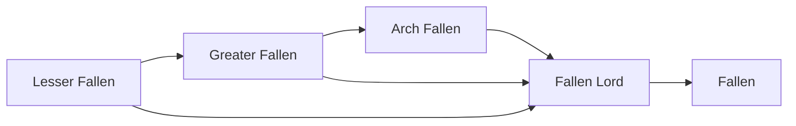

# Greater Fallen

<small>[Tensura: Mysticism](../index.md) &rsaquo; [Races](index.md)</small>

| | |
|---|---|
| **ID** | `mysticism:greater_fallen` |
| **Difficulty** | Easy |
| **Alignment** | Majin |
| **Aura** | 25,000 - 30,000 |
| **Magicule** | 40,000 - 55,000 |
| **Health bonus** | 80 |
| **Spiritual health bonus** | 220 |
| **Attack damage bonus** | 1.2 |
| **Movement speed bonus** | 0.02 |
| **EP to evolve into** | 20,000 |

> A greater angel that got corrupted by magicules, then chose to abandon the light for the darkness.

## Evolution

- **Evolves from:** [Lesser Fallen](lesser-fallen.md)
- **Evolves into:** [Arch Fallen](arch-fallen.md)
- **Default evolution:** [Arch Fallen](arch-fallen.md)
- **On awakening (True Demon Lord / True Hero):** [Fallen Lord](fallen-lord.md)
- **During the Harvest Festival:** [Arch Fallen](arch-fallen.md)

### Requirements to evolve into Greater Fallen

Each requirement adds its weight to the evolution progress bar; you can evolve at 100%.

| Requirement | Weight |
|---|---|
| Reach Existence Points of 20,000 | 100% |

### Evolution tree

## Attribute modifiers

| Attribute | Amount | Operation |
|---|---|---|
| Scale | 0 | add |
| Max Health | 80 | add |
| Max Spiritual Health | 220 | add |
| Attack Damage | 1.2 | add |
| Attack Speed | 0.2 | add |
| Knockback Resistance | 0.2 | add |
| Movement Speed | 0.02 | add |
| Swim Speed Multiplier | 0.2 | add |

## Stats (config defaults)

Set in [`config/mysticism/race/angel_config.toml`](../configs/config-mysticism-race-angel-config.md).

| Option | Default | Description |
|---|---|---|
| `GreaterFallen.epRequirement` | 20,000 | EP requirement to evolve into Fallen Greater Angel. |
| `GreaterFallen.minAura` | 25,000 | Minimal aura. |
| `GreaterFallen.maxAura` | 30,000 | Maximum aura. |
| `GreaterFallen.minMagicule` | 40,000 | Minimal magicule. |
| `GreaterFallen.maxMagicule` | 55,000 | Maximum magicule. |
| `GreaterFallen.size` | 0 | Bonus Size. |
| `GreaterFallen.maxHealth` | 80 | Bonus Max Health. |
| `GreaterFallen.maxSpiritualHealth` | 220 | Bonus Max Spiritual Health. |
| `GreaterFallen.attack` | 1.2 | Bonus Attack Damage. |
| `GreaterFallen.attackSpeed` | 0.2 | Bonus Attack Speed. |
| `GreaterFallen.knockbackResistance` | 0.2 | Bonus Knockback Resistance. |
| `GreaterFallen.movementSpeed` | 0.02 | Bonus Movement Speed. |
| `GreaterFallen.swimSpeed` | 0.2 | Bonus Swimming Speed Multiplier. |
| `GreaterFallen.intrinsicSkills` | "tensura:magic_resistance", "mysticism:darkness_manipulation" | The list of intrinsic skills that the race gets. |
| `LesserFallen.minAura` | 4,500 | Minimal aura. |
| `LesserFallen.maxAura` | 5,500 | Maximum aura. |
| `LesserFallen.minMagicule` | 7,500 | Minimal magicule. |
| `LesserFallen.maxMagicule` | 9,500 | Maximum magicule. |
| `LesserFallen.size` | 0 | Bonus Size. |
| `LesserFallen.maxHealth` | 30 | Bonus Max Health. |
| `LesserFallen.maxSpiritualHealth` | 100 | Bonus Max Spiritual Health. |
| `LesserFallen.attack` | 0.5 | Bonus Attack Damage. |
| `LesserFallen.attackSpeed` | 0.1 | Bonus Attack Speed. |
| `LesserFallen.knockbackResistance` | 0.1 | Bonus Knockback Resistance. |
| `LesserFallen.movementSpeed` | 0.01 | Bonus Movement Speed. |
| `LesserFallen.swimSpeed` | 0 | Bonus Swimming Speed Multiplier. |
| `LesserFallen.intrinsicSkills` | "tensura:magic_resistance", "mysticism:darkness_manipulation" | The list of intrinsic skills that the race gets. |
