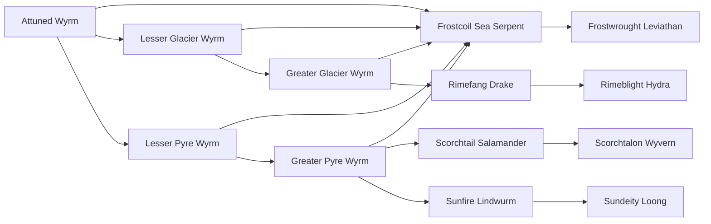

# Greater Glacier Wyrm

<small>[Tensura: Mysticism](../index.md) &rsaquo; [Races](index.md)</small>

| | |
|---|---|
| **ID** | `mysticism:greater_glacier_wyrm` |
| **Difficulty** | Hard |
| **Alignment** | Default |
| **Aura** | 8,000 - 8,000 |
| **Magicule** | 10,000 - 10,000 |
| **Health bonus** | 180 |
| **Spiritual health bonus** | 660 |
| **Attack damage bonus** | 3 |
| **Movement speed bonus** | 0.02 |
| **EP to evolve into** | 30,000 |

> A higher evolution of the wyrm that live in the Icy Tundras, even more powerful and deadly then their previous evolutions, using its icy breath to freeze all those who come across it.A higher evolution of the wyrm that live in the Icy Tundras, even more powerful and deadly then their previous evolutions, using its icy breath to freeze all those who come across it.

## Evolution

- **Evolves from:** [Lesser Glacier Wyrm](lesser-glacier-wyrm.md)
- **Evolves into:** [Frostcoil Sea Serpent](frostcoil-sea-serpent.md), [Rimefang Drake](rimefang-drake.md)
- **Default evolution:** [Frostcoil Sea Serpent](frostcoil-sea-serpent.md)
- **On awakening (True Demon Lord / True Hero):** [Frostcoil Sea Serpent](frostcoil-sea-serpent.md)
- **During the Harvest Festival:** [Frostcoil Sea Serpent](frostcoil-sea-serpent.md)

### Requirements to evolve into Greater Glacier Wyrm

Each requirement adds its weight to the evolution progress bar; you can evolve at 100%.

| Requirement | Weight |
|---|---|
| Reach Existence Points of 30,000 | 50% |
| Consume 10 of [Ice Essence](../items/materials/ice-essence.md) | 50% |

### Evolution tree

## Attribute modifiers

| Attribute | Amount | Operation |
|---|---|---|
| Scale | 0.8 | add |
| Max Health | 180 | add |
| Max Spiritual Health | 660 | add |
| Attack Damage | 3 | add |
| Attack Speed | 2 | add |
| Knockback Resistance | 0.05 | add |
| Movement Speed | 0.02 | add |
| Swim Speed Multiplier | 0.02 | add |

## Stats (config defaults)

Set in [`config/mysticism/race/wyrm_config.toml`](../configs/config-mysticism-race-wyrm-config.md).

| Option | Default | Description |
|---|---|---|
| `GreaterGlacierWyrm.minAura` | 8,000 | Minimal aura. |
| `GreaterGlacierWyrm.maxAura` | 8,000 | Maximum aura. |
| `GreaterGlacierWyrm.minMagicule` | 10,000 | Minimal magicule. |
| `GreaterGlacierWyrm.maxMagicule` | 10,000 | Maximum magicule. |
| `GreaterGlacierWyrm.size` | 0.8 | Bonus Size. |
| `GreaterGlacierWyrm.maxHealth` | 180 | Bonus Max Health. |
| `GreaterGlacierWyrm.maxSpiritualHealth` | 660 | Bonus Max Spiritual Health. |
| `GreaterGlacierWyrm.attack` | 3 | Bonus Attack Damage. |
| `GreaterGlacierWyrm.attackSpeed` | 2 | Bonus Attack Speed. |
| `GreaterGlacierWyrm.knockbackResistance` | 0.05 | Bonus Knockback Resistance. |
| `GreaterGlacierWyrm.movementSpeed` | 0.02 | Bonus Movement Speed. |
| `GreaterGlacierWyrm.swimSpeed` | 0.02 | Bonus Swimming Speed Multiplier. |
| `GreaterGlacierWyrm.iceEssenceAmount` | 10 | Amount of Ice Essence needed eaten to evolve into a Greater Glacier Wyrm. |
| `GreaterGlacierWyrm.epRequirement` | 30,000 | EP requirement to evolve into Greater Glacier Wyrm. |
| `GreaterGlacierWyrm.intrinsicSkills` | "tensura:cold_resistance", "mysticism:cryogenic_cessation" | The list of intrinsic skills that the race gets. |
| `LesserGlacierWyrm.minAura` | 1,000 | Minimal aura. |
| `LesserGlacierWyrm.maxAura` | 1,500 | Maximum aura. |
| `LesserGlacierWyrm.minMagicule` | 2,000 | Minimal magicule. |
| `LesserGlacierWyrm.maxMagicule` | 2,500 | Maximum magicule. |
| `LesserGlacierWyrm.size` | 0.5 | Bonus Size. |
| `LesserGlacierWyrm.maxHealth` | 40 | Bonus Max Health. |
| `LesserGlacierWyrm.maxSpiritualHealth` | 160 | Bonus Max Spiritual Health. |
| `LesserGlacierWyrm.attack` | 1 | Bonus Attack Damage. |
| `LesserGlacierWyrm.attackSpeed` | 1 | Bonus Attack Speed. |
| `LesserGlacierWyrm.knockbackResistance` | 0.04 | Bonus Knockback Resistance. |
| `LesserGlacierWyrm.movementSpeed` | 0.03 | Bonus Movement Speed. |
| `LesserGlacierWyrm.swimSpeed` | 0.03 | Bonus Swimming Speed Multiplier. |
| `LesserGlacierWyrm.iceEssenceAmount` | 1 | Amount of Ice Essence needed eaten to evolve into a Lesser Glacier Wyrm. |
| `LesserGlacierWyrm.intrinsicSkills` | "tensura:cold_resistance" | The list of intrinsic skills that the race gets. |
| `AttunedWyrm.minAura` | 500 | Minimal aura. |
| `AttunedWyrm.maxAura` | 1,000 | Maximum aura. |
| `AttunedWyrm.minMagicule` | 1,500 | Minimal magicule. |
| `AttunedWyrm.maxMagicule` | 2,000 | Maximum magicule. |
| `AttunedWyrm.size` | 0.3 | Bonus Size. |
| `AttunedWyrm.maxHealth` | 0 | Bonus Max Health. |
| `AttunedWyrm.maxSpiritualHealth` | 0 | Bonus Max Spiritual Health. |
| `AttunedWyrm.attack` | 1 | Bonus Attack Damage. |
| `AttunedWyrm.attackSpeed` | 0.5 | Bonus Attack Speed. |
| `AttunedWyrm.knockbackResistance` | 1 | Bonus Knockback Resistance. |
| `AttunedWyrm.movementSpeed` | 0 | Bonus Movement Speed. |
| `AttunedWyrm.swimSpeed` | 0 | Bonus Swimming Speed Multiplier. |
| `AttunedWyrm.intrinsicSkills` | [] (empty) | The list of intrinsic skills that the race gets. |
