# Races

<small>[Tensura: Mysticism](../index.md)</small>

Tensura: Mysticism adds **186** races: **12** starting, **142** in-between and **32** final.

- **Starting:** the first race of its evolution line. Nothing evolves into it, so you get it by reincarnating into it or through a special item, skill or event.
- **In-between:** reached by evolving, and can evolve further.
- **Final:** the last step of its line. It does not evolve any further.

Races that link to other mods' races (for example an addon race that evolves from a Tensura race) are placed using the whole pack's evolution trees.

| Race | Stage | Difficulty | Alignment | Evolves from | Evolves into |
|---|---|---|---|---|---|
| [Amped Guitar Wolf](amped-guitar-wolf.md) | In-between | Easy | Majin | [Guitar Wolf](guitar-wolf.md), [String Spirit Wolf](string-spirit-wolf.md) | [String Spirit Wolf](string-spirit-wolf.md) |
| [Ant](ant.md) | In-between | Easy | Majin | [Insect](insect.md) | [Fire Ant](fire-ant.md), [Hardshell Ant](hardshell-ant.md), [Earth Soul Insect](earth-soul-insect.md) |
| [Antumbra Spirit Wolf](antumbra-spirit-wolf.md) | In-between | Easy | Majin | [Light Fang](light-fang.md), [Mystical Light Fang](mystical-light-fang.md) | [Divine Wolf](divine-wolf.md), [Mystical Light Fang](mystical-light-fang.md) |
| [Arch Angel](arch-angel.md) | In-between | Easy | Holy | [Greater Angel](greater-angel.md) | [Cherub](cherub.md), [Tengu](tengu.md) |
| [Arch Doll](arch-doll.md) | In-between | Easy | Majin | [Greater Doll](greater-doll.md) | [Daemon Doll](daemon-doll.md), [Chaos Doll](chaos-doll.md) |
| [Arch Fallen](arch-fallen.md) | In-between | Easy | Majin | [Greater Fallen](greater-fallen.md) | [Fallen Lord](fallen-lord.md) |
| [Army Wasp](army-wasp.md) | In-between | Easy | Majin | [Wasp](wasp.md) | [Army Wasp Insectar](army-wasp-insectar.md), [Star Soul Insect](star-soul-insect.md) |
| [Army Wasp Insectar](army-wasp-insectar.md) | In-between | Easy | Majin | [Army Wasp](army-wasp.md) | [Army Wasp Savant](army-wasp-savant.md), [Wind Soul Insect](wind-soul-insect.md), [Star Soul Insect](star-soul-insect.md) |
| [Army Wasp Savant](army-wasp-savant.md) | In-between | Easy | Majin | [Army Wasp Insectar](army-wasp-insectar.md) | [Divine Army Wasp](divine-army-wasp.md) |
| [Ascended](ascended.md) | In-between | Intermediate | Holy | [Whole](whole.md) | [Divine Excelsius](divine-excelsius.md) |
| [Attuned Wyrm](attuned-wyrm.md) | Starting | Hard | Default |  | [Lesser Glacier Wyrm](lesser-glacier-wyrm.md), [Lesser Pyre Wyrm](lesser-pyre-wyrm.md), [Frostcoil Sea Serpent](frostcoil-sea-serpent.md) |
| [Beetle](beetle.md) | In-between | Easy | Majin | [Insect](insect.md) | [Stag Beetle](stag-beetle.md), [Drone Beetle](drone-beetle.md), [Lightning Soul Insect](lightning-soul-insect.md) |
| [Black Fang](black-fang.md) | In-between | Easy | Majin | [Direwolf](direwolf.md), [Magic Spirit Wolf](magic-spirit-wolf.md), [Divine Wolf](divine-wolf.md) | [Mystical Black Fang](mystical-black-fang.md), [Magic Spirit Wolf](magic-spirit-wolf.md) |
| [Blazing Scorch Wolf](blazing-scorch-wolf.md) | In-between | Easy | Majin | [Scorch Wolf](scorch-wolf.md), [Molten Spirit Wolf](molten-spirit-wolf.md) | [Molten Spirit Wolf](molten-spirit-wolf.md), [Storm Spirit Wolf](storm-spirit-wolf.md) |
| [Blue Centipede](blue-centipede.md) | In-between | Easy | Majin | [Centipede](centipede.md) | [Blue Centipede Insectar](blue-centipede-insectar.md), [Water Soul Insect](water-soul-insect.md) |
| [Blue Centipede Insectar](blue-centipede-insectar.md) | In-between | Easy | Majin | [Blue Centipede](blue-centipede.md) | [Blue Centipede Savant](blue-centipede-savant.md), [Water Soul Insect](water-soul-insect.md) |
| [Blue Centipede Savant](blue-centipede-savant.md) | In-between | Easy | Majin | [Blue Centipede Insectar](blue-centipede-insectar.md) | [Divine Blue Centipede](divine-blue-centipede.md) |
| [Blue Fang](blue-fang.md) | In-between | Easy | Majin | [Direwolf](direwolf.md) | [Mystical Black Fang](mystical-blue-fang.md), [Magic Spirit Wolf](ocean-spirit-wolf.md) |
| [Bound Enlightenment](bound-enlightenment.md) | In-between | Hard | Default | [Restricted Human](restricted-human.md), [Restricted Saint](restricted-saint.md) | [Heavenly Restriction](heavenly-restriction.md) |
| [Brown Fang](brown-fang.md) | In-between | Easy | Majin | [Direwolf](direwolf.md) | [Mystical Brown Fang](mystical-brown-fang.md), [Mountain Spirit Wolf](mountain-spirit-wolf.md) |
| [Centipede](centipede.md) | In-between | Easy | Majin | [Insect](insect.md) | [Yellow Centipede](yellow-centipede.md), [Blue Centipede](blue-centipede.md), [Purple Centipede](purple-centipede.md), [Paralysis Soul Insect](paralysis-soul-insect.md) |
| [Chaos Doll](chaos-doll.md) | In-between | Easy | Majin | [Arch Doll](arch-doll.md) | [Chaos Metalloid](chaos-metalloid.md) |
| [Chaos Metalloid](chaos-metalloid.md) | Final | Easy | Majin | [Chaos Doll](chaos-doll.md) |  |
| [Charged Perforator](charged-perforator.md) | In-between | Extreme | Majin | [Sculk Worm](sculk-worm.md) | [Overloading Worm](overloading-worm.md), [Lightning Aberration](lightning-aberration.md) |
| [Cherub](cherub.md) | In-between | Easy | Holy | [Lesser Angel](lesser-angel.md), [Greater Angel](greater-angel.md), [Arch Angel](arch-angel.md) | [Seraph](seraph.md), [Divine Tengu](divine-tengu.md) |
| [Corrosion Soul Insect](corrosion-soul-insect.md) | In-between | Easy | Majin | [Lixivant Mantis](lixivant-mantis.md), [Lixivant Mantis Insectar](lixivant-mantis-insectar.md) | [Divine Lixivant Mantis](divine-lixivant-mantis.md) |
| [Daemon Doll](daemon-doll.md) | In-between | Easy | Majin | [Greater Doll](greater-doll.md), [Arch Doll](arch-doll.md) | [Devil Doll](devil-doll.md) |
| [Darkness Fang](darkness-fang.md) | In-between | Easy | Majin | [Direwolf](direwolf.md) | [Mystical Darkness Fang](mystical-darkness-fang.md), [Penumbra Spirit Wolf](penumbra-spirit-wolf.md) |
| [Devil Doll](devil-doll.md) | Final | Easy | Majin | [Daemon Doll](daemon-doll.md) |  |
| [Direwolf](direwolf.md) | Starting | Easy | Majin |  | [Black Fang](black-fang.md), [Blue Fang](blue-fang.md), [Brown Fang](brown-fang.md), [Darkness Fang](darkness-fang.md), [Frost Wolf](frost-wolf.md), [Green Fang](green-fang.md) and 7 more |
| [Dissonance Deity](dissonance-deity.md) | Final | Extreme | Majin | [Lightning Aberration](lightning-aberration.md) |  |
| [Divine Army Wasp](divine-army-wasp.md) | Final | Easy | Majin | [Army Wasp Savant](army-wasp-savant.md), [Wind Soul Insect](wind-soul-insect.md) |  |
| [Divine Blue Centipede](divine-blue-centipede.md) | Final | Easy | Majin | [Blue Centipede Savant](blue-centipede-savant.md), [Water Soul Insect](water-soul-insect.md) |  |
| [Divine Drone Beetle](divine-drone-beetle.md) | Final | Easy | Majin | [Drone Beetle Savant](drone-beetle-savant.md), [Lightning Soul Insect](lightning-soul-insect.md) |  |
| [Divine Elemental](divine-elemental.md) | Final | Hard | Default | [Elemental Lord](elemental-lord.md) |  |
| [Divine Excelsius](divine-excelsius.md) | Final | Intermediate | Holy | [Ascended](ascended.md) |  |
| [Divine Fire Ant](divine-fire-ant.md) | Final | Easy | Majin | [Fire Ant Savant](fire-ant-savant.md), [Flame Soul Insect](flame-soul-insect.md) |  |
| [Divine Hardshell Ant](divine-hardshell-ant.md) | Final | Easy | Majin | [Hardshell Ant Savant](hardshell-ant-savant.md), [Earth Soul Insect](earth-soul-insect.md) |  |
| [Divine Inferius](divine-inferius.md) | Final | Intermediate | Majin | [Revenant](revenant.md) |  |
| [Divine Lixivant Mantis](divine-lixivant-mantis.md) | Final | Easy | Majin | [Lixivant Mantis Savant](lixivant-mantis-savant.md), [Corrosion Soul Insect](corrosion-soul-insect.md) |  |
| [Divine Loxodrome Scorpion](divine-loxodrome-scorpion.md) | Final | Easy | Majin | [Loxodrome Scorpion Savant](loxodrome-scorpion-savant.md), [Poison Soul Insect](poison-soul-insect.md) |  |
| [Divine Majin Elemental](divine-majin-elemental.md) | Final | Hard | Majin | [Majin Elemental Lord](majin-lord.md) |  |
| [Divine Preying Mantis](divine-preying-mantis.md) | Final | Easy | Majin | [Preying Mantis Savant](preying-mantis-savant.md), [Steel Soul Insect](steel-soul-insect.md) |  |
| [Divine Purple Centipede](divine-purple-centipede.md) | Final | Easy | Majin | [Purple Centipede Savant](purple-centipede-savant.md), [Spatial Soul Insect](spatial-soul-insect.md) |  |
| [Divine Queen Wasp](divine-queen-wasp.md) | Final | Easy | Majin | [Queen Wasp Savant](queen-wasp-savant.md), [Star Soul Insect](star-soul-insect.md) |  |
| [Divine Singularity Scorpion](divine-singularity-scorpion.md) | Final | Easy | Majin | [Singularity Scorpion Savant](singularity-scorpion-savant.md), [Gravity Soul Insect](gravity-soul-insect.md) |  |
| [Divine Stag Beetle](divine-stag-beetle.md) | Final | Easy | Majin | [Stag Beetle Savant](stag-beetle-savant.md), [Fantasy Soul Insect](fantasy-soul-insect.md) |  |
| [Divine Tengu](divine-tengu.md) | Final | Easy | Holy | [Tengu Saint](tengu-saint.md), [Cherub](cherub.md) |  |
| [Divine Wolf](divine-wolf.md) | In-between | Easy | Majin | [Magic Spirit Wolf](magic-spirit-wolf.md), [Magic Spirit Wolf](ocean-spirit-wolf.md), [Mountain Spirit Wolf](mountain-spirit-wolf.md), [Penumbra Spirit Wolf](penumbra-spirit-wolf.md), [Glacier Spirit Wolf](glacier-spirit-wolf.md), [Magic Spirit Wolf](gale-spirit-wolf.md) and 6 more | [Black Fang](black-fang.md) |
| [Divine Yellow Centipede](divine-yellow-centipede.md) | Final | Easy | Majin | [Yellow Centipede Savant](yellow-centipede-savant.md), [Paralysis Soul Insect](paralysis-soul-insect.md) |  |
| [Dragonoid](dragonoid.md) | Starting | Easy | Majin |  | [True Dragonoid](true-dragonoid.md) |
| [Drone Beetle](drone-beetle.md) | In-between | Easy | Majin | [Beetle](beetle.md) | [Drone Beetle Insectar](drone-beetle-insectar.md), [Fantasy Soul Insect](fantasy-soul-insect.md) |
| [Drone Beetle Insectar](drone-beetle-insectar.md) | In-between | Easy | Majin | [Drone Beetle](drone-beetle.md) | [Drone Beetle Savant](drone-beetle-savant.md), [Lightning Soul Insect](lightning-soul-insect.md), [Fantasy Soul Insect](fantasy-soul-insect.md) |
| [Drone Beetle Savant](drone-beetle-savant.md) | In-between | Easy | Majin | [Drone Beetle Insectar](drone-beetle-insectar.md) | [Divine Drone Beetle](divine-drone-beetle.md) |
| [Earth Soul Insect](earth-soul-insect.md) | In-between | Easy | Majin | [Ant](ant.md), [Fire Ant](fire-ant.md), [Hardshell Ant](hardshell-ant.md), [Hardshell Ant Insectar](hardshell-ant-insectar.md) | [Divine Hardshell Ant](divine-hardshell-ant.md) |
| [Elemental Lord](elemental-lord.md) | In-between | Hard | Default | [Lesser Elemental](lesser-elemental.md), [Medium Elemental](medium-elemental.md), [Greater Elemental](greater-elemental.md), [Majin Elemental Lord](majin-lord.md) | [Divine Elemental](divine-elemental.md) |
| [Empty](empty.md) | In-between | Intermediate | Majin | [Remnant](remnant.md) | [Revenant](revenant.md) |
| [Enflamed Aberration](enflamed-aberration.md) | In-between | Extreme | Majin | [Molten Perforator](molten-perforator.md), [Magma Worm](magma-worm.md) | [Violence Deity](violence-deity.md) |
| [Fallen](fallen.md) | Final | Easy | Majin | [Fallen Lord](fallen-lord.md) |  |
| [Fallen Arch Angel](fallen-arch-angel.md) | In-between | Easy | Majin | [Fallen Greater Angel](fallen-greater-angel.md) | [Fallen SoulAberration](fallen-cherub.md) |
| [Fallen Greater Angel](fallen-greater-angel.md) | In-between | Easy | Majin | [Fallen Lesser Angel](fallen-lesser-angel.md) | [Fallen Arch Angel](fallen-arch-angel.md), [Fallen SoulAberration](fallen-cherub.md) |
| [Fallen Lesser Angel](fallen-lesser-angel.md) | Starting | Easy | Majin |  | [Fallen Greater Angel](fallen-greater-angel.md), [Fallen SoulAberration](fallen-cherub.md) |
| [Fallen Lord](fallen-lord.md) | In-between | Easy | Majin | [Lesser Fallen](lesser-fallen.md), [Greater Fallen](greater-fallen.md), [Arch Fallen](arch-fallen.md) | [Fallen](fallen.md) |
| [Fallen ReaperAberration](fallen-seraph.md) | Final | Easy | Majin | [Fallen SoulAberration](fallen-cherub.md) |  |
| [Fallen SoulAberration](fallen-cherub.md) | In-between | Easy | Majin | [Fallen Lesser Angel](fallen-lesser-angel.md), [Fallen Greater Angel](fallen-greater-angel.md), [Fallen Arch Angel](fallen-arch-angel.md) | [Fallen ReaperAberration](fallen-seraph.md) |
| [Fantasy Soul Insect](fantasy-soul-insect.md) | In-between | Easy | Majin | [Stag Beetle](stag-beetle.md), [Stag Beetle Insectar](stag-beetle-insectar.md), [Drone Beetle](drone-beetle.md), [Drone Beetle Insectar](drone-beetle-insectar.md) | [Divine Stag Beetle](divine-stag-beetle.md) |
| [Field Officer](field-officer.md) | In-between | Hard | Majin | [Phantom](phantom.md) | [General](general.md), [Staff Officer](staff-officer.md) |
| [Fire Ant](fire-ant.md) | In-between | Easy | Majin | [Ant](ant.md) | [Fire Ant Insectar](fire-ant-insectar.md), [Earth Soul Insect](earth-soul-insect.md) |
| [Fire Ant Insectar](fire-ant-insectar.md) | In-between | Easy | Majin | [Fire Ant](fire-ant.md) | [Fire Ant Savant](fire-ant-savant.md), [Flame Soul Insect](flame-soul-insect.md) |
| [Fire Ant Savant](fire-ant-savant.md) | In-between | Easy | Majin | [Fire Ant Insectar](fire-ant-insectar.md) | [Divine Fire Ant](divine-fire-ant.md) |
| [Flame Soul Insect](flame-soul-insect.md) | In-between | Easy | Majin | [Fire Ant Insectar](fire-ant-insectar.md) | [Divine Fire Ant](divine-fire-ant.md) |
| [Forgotten](forgotten.md) | Starting | Intermediate | Majin |  | [Remnant](remnant.md), [Revenant](revenant.md) |
| [Frost Wolf](frost-wolf.md) | In-between | Easy | Majin | [Direwolf](direwolf.md) | [Nivalis Frost Wolf](nivalis-frost-wolf.md), [Glacier Spirit Wolf](glacier-spirit-wolf.md) |
| [Frostcoil Sea Serpent](frostcoil-sea-serpent.md) | In-between | Hard | Default | [Attuned Wyrm](attuned-wyrm.md), [Lesser Glacier Wyrm](lesser-glacier-wyrm.md), [Greater Glacier Wyrm](greater-glacier-wyrm.md), [Lesser Pyre Wyrm](lesser-pyre-wyrm.md), [Greater Pyre Wyrm](greater-pyre-wyrm.md) | [Frostwrought Leviathan](frostwrought-leviathan.md) |
| [Frostwrought Leviathan](frostwrought-leviathan.md) | Final | Hard | Default | [Frostcoil Sea Serpent](frostcoil-sea-serpent.md) |  |
| [General](general.md) | In-between | Hard | Majin | [Field Officer](field-officer.md) | [Staff Officer](staff-officer.md) |
| [Glacier Spirit Wolf](glacier-spirit-wolf.md) | In-between | Easy | Majin | [Frost Wolf](frost-wolf.md), [Nivalis Frost Wolf](nivalis-frost-wolf.md) | [Divine Wolf](divine-wolf.md), [Nivalis Frost Wolf](nivalis-frost-wolf.md) |
| [Gravity Soul Insect](gravity-soul-insect.md) | In-between | Easy | Majin | [Singularity Scorpion](singularity-scorpion.md), [Singularity Scorpion Insectar](singularity-scorpion-insectar.md) | [Divine Singularity Scorpion](divine-singularity-scorpion.md) |
| [Greater Angel](greater-angel.md) | In-between | Easy | Holy | [Lesser Angel](lesser-angel.md) | [Arch Angel](arch-angel.md), [Cherub](cherub.md), [Tengu](tengu.md) |
| [Greater Doll](greater-doll.md) | In-between | Easy | Majin | [Greater Daemon](../../tensura-reincarnated/races/greater-daemon.md) | [Arch Doll](arch-doll.md), [Daemon Doll](daemon-doll.md) |
| [Greater Elemental](greater-elemental.md) | In-between | Hard | Default | [Medium Elemental](medium-elemental.md) | [Elemental Lord](elemental-lord.md), [Majin Elemental Lord](majin-lord.md) |
| [Greater Fallen](greater-fallen.md) | In-between | Easy | Majin | [Lesser Fallen](lesser-fallen.md) | [Arch Fallen](arch-fallen.md), [Fallen Lord](fallen-lord.md) |
| [Greater Glacier Wyrm](greater-glacier-wyrm.md) | In-between | Hard | Default | [Lesser Glacier Wyrm](lesser-glacier-wyrm.md) | [Frostcoil Sea Serpent](frostcoil-sea-serpent.md), [Rimefang Drake](rimefang-drake.md) |
| [Greater Pyre Wyrm](greater-pyre-wyrm.md) | In-between | Hard | Default | [Lesser Pyre Wyrm](lesser-pyre-wyrm.md) | [Scorchtail Salamander](scorchtail-salamander.md), [Sunfire Lindwurm](sunfire-lindwurm.md), [Frostcoil Sea Serpent](frostcoil-sea-serpent.md) |
| [Green Fang](green-fang.md) | In-between | Easy | Majin | [Direwolf](direwolf.md) | [Mystical Green Fang](mystical-green-fang.md), [Magic Spirit Wolf](gale-spirit-wolf.md) |
| [Guitar Wolf](guitar-wolf.md) | In-between | Easy | Majin | [Direwolf](direwolf.md) | [Amped Guitar Wolf](amped-guitar-wolf.md), [String Spirit Wolf](string-spirit-wolf.md) |
| [Hardshell Ant](hardshell-ant.md) | In-between | Easy | Majin | [Ant](ant.md) | [Hardshell Ant Insectar](hardshell-ant-insectar.md), [Earth Soul Insect](earth-soul-insect.md) |
| [Hardshell Ant Insectar](hardshell-ant-insectar.md) | In-between | Easy | Majin | [Hardshell Ant](hardshell-ant.md) | [Hardshell Ant Savant](hardshell-ant-savant.md), [Earth Soul Insect](earth-soul-insect.md) |
| [Hardshell Ant Savant](hardshell-ant-savant.md) | In-between | Easy | Majin | [Hardshell Ant Insectar](hardshell-ant-insectar.md) | [Divine Hardshell Ant](divine-hardshell-ant.md) |
| [Heavenly Restriction](heavenly-restriction.md) | In-between | Hard | Default | [Bound Enlightenment](bound-enlightenment.md) | [Restricted Saint](restricted-saint.md) |
| [Insect](insect.md) | Starting | Easy | Majin |  | [Ant](ant.md), [Beetle](beetle.md), [Centipede](centipede.md), [Mantis](mantis.md), [Scorpion](scorpion.md), [Wasp](wasp.md) and 1 more |
| [Lesser Angel](lesser-angel.md) | Starting | Easy | Holy |  | [Greater Angel](greater-angel.md), [Cherub](cherub.md) |
| [Lesser Elemental](lesser-elemental.md) | Starting | Hard | Default |  | [Medium Elemental](medium-elemental.md), [Elemental Lord](elemental-lord.md) |
| [Lesser Fallen](lesser-fallen.md) | Starting | Easy | Majin |  | [Greater Fallen](greater-fallen.md), [Fallen Lord](fallen-lord.md) |
| [Lesser Glacier Wyrm](lesser-glacier-wyrm.md) | In-between | Hard | Default | [Attuned Wyrm](attuned-wyrm.md) | [Greater Glacier Wyrm](greater-glacier-wyrm.md), [Frostcoil Sea Serpent](frostcoil-sea-serpent.md) |
| [Lesser Pyre Wyrm](lesser-pyre-wyrm.md) | In-between | Hard | Default | [Attuned Wyrm](attuned-wyrm.md) | [Greater Pyre Wyrm](greater-pyre-wyrm.md), [Frostcoil Sea Serpent](frostcoil-sea-serpent.md) |
| [Light Fang](light-fang.md) | In-between | Easy | Majin | [Direwolf](direwolf.md) | [Mystical Light Fang](mystical-light-fang.md), [Antumbra Spirit Wolf](antumbra-spirit-wolf.md) |
| [Lightning Aberration](lightning-aberration.md) | In-between | Extreme | Majin | [Charged Perforator](charged-perforator.md), [Overloading Worm](overloading-worm.md) | [Dissonance Deity](dissonance-deity.md) |
| [Lightning Soul Insect](lightning-soul-insect.md) | In-between | Easy | Majin | [Beetle](beetle.md), [Drone Beetle Insectar](drone-beetle-insectar.md) | [Divine Drone Beetle](divine-drone-beetle.md) |
| [Lixivant Mantis](lixivant-mantis.md) | In-between | Easy | Majin | [Mantis](mantis.md) | [Lixivant Mantis Insectar](lixivant-mantis-insectar.md), [Corrosion Soul Insect](corrosion-soul-insect.md) |
| [Lixivant Mantis Insectar](lixivant-mantis-insectar.md) | In-between | Easy | Majin | [Lixivant Mantis](lixivant-mantis.md) | [Lixivant Mantis Savant](lixivant-mantis-savant.md), [Corrosion Soul Insect](corrosion-soul-insect.md) |
| [Lixivant Mantis Savant](lixivant-mantis-savant.md) | In-between | Easy | Majin | [Lixivant Mantis Insectar](lixivant-mantis-insectar.md) | [Divine Lixivant Mantis](divine-lixivant-mantis.md) |
| [Loxodrome Scorpion](loxodrome-scorpion.md) | In-between | Easy | Majin | [Scorpion](scorpion.md) | [Loxodrome Scorpion Insectar](loxodrome-scorpion-insectar.md), [Poison Soul Insect](poison-soul-insect.md) |
| [Loxodrome Scorpion Insectar](loxodrome-scorpion-insectar.md) | In-between | Easy | Majin | [Loxodrome Scorpion](loxodrome-scorpion.md) | [Loxodrome Scorpion Savant](loxodrome-scorpion-savant.md), [Poison Soul Insect](poison-soul-insect.md) |
| [Loxodrome Scorpion Savant](loxodrome-scorpion-savant.md) | In-between | Easy | Majin | [Loxodrome Scorpion Insectar](loxodrome-scorpion-insectar.md) | [Divine Loxodrome Scorpion](divine-loxodrome-scorpion.md) |
| [Magic Spirit Wolf](magic-spirit-wolf.md) | In-between | Easy | Majin | [Direwolf](direwolf.md), [Black Fang](black-fang.md), [Mystical Black Fang](mystical-black-fang.md) | [Divine Wolf](divine-wolf.md), [Black Fang](black-fang.md) |
| [Magic Spirit Wolf](ocean-spirit-wolf.md) | In-between | Easy | Majin | [Blue Fang](blue-fang.md), [Mystical Black Fang](mystical-blue-fang.md) | [Divine Wolf](divine-wolf.md), [Mystical Black Fang](mystical-blue-fang.md) |
| [Magic Spirit Wolf](gale-spirit-wolf.md) | In-between | Easy | Majin | [Green Fang](green-fang.md), [Mystical Green Fang](mystical-green-fang.md) | [Divine Wolf](divine-wolf.md), [Mystical Green Fang](mystical-green-fang.md) |
| [Magma Worm](magma-worm.md) | In-between | Extreme | Majin | [Molten Perforator](molten-perforator.md) | [Enflamed Aberration](enflamed-aberration.md) |
| [Majin Elemental Lord](majin-lord.md) | In-between | Hard | Majin | [Greater Elemental](greater-elemental.md) | [Divine Majin Elemental](divine-majin-elemental.md), [Elemental Lord](elemental-lord.md) |
| [Mantis](mantis.md) | In-between | Easy | Majin | [Insect](insect.md) | [Preying Mantis](preying-mantis.md), [Lixivant Mantis](lixivant-mantis.md), [Steel Soul Insect](steel-soul-insect.md) |
| [Medium Elemental](medium-elemental.md) | In-between | Hard | Default | [Lesser Elemental](lesser-elemental.md) | [Greater Elemental](greater-elemental.md), [Elemental Lord](elemental-lord.md) |
| [Molten Perforator](molten-perforator.md) | In-between | Extreme | Majin | [Sculk Worm](sculk-worm.md) | [Magma Worm](magma-worm.md), [Enflamed Aberration](enflamed-aberration.md) |
| [Molten Spirit Wolf](molten-spirit-wolf.md) | In-between | Easy | Majin | [Blazing Scorch Wolf](blazing-scorch-wolf.md) | [Divine Wolf](divine-wolf.md), [Blazing Scorch Wolf](blazing-scorch-wolf.md) |
| [Mountain Spirit Wolf](mountain-spirit-wolf.md) | In-between | Easy | Majin | [Brown Fang](brown-fang.md), [Mystical Brown Fang](mystical-brown-fang.md) | [Divine Wolf](divine-wolf.md), [Mystical Brown Fang](mystical-brown-fang.md) |
| [Mystic Angel](mystic-angel.md) | Final | Hard | Chaos | [Staff Officer](staff-officer.md) |  |
| [Mystical Black Fang](mystical-black-fang.md) | In-between | Easy | Majin | [Black Fang](black-fang.md) | [Magic Spirit Wolf](magic-spirit-wolf.md) |
| [Mystical Black Fang](mystical-blue-fang.md) | In-between | Easy | Majin | [Blue Fang](blue-fang.md), [Magic Spirit Wolf](ocean-spirit-wolf.md) | [Magic Spirit Wolf](ocean-spirit-wolf.md) |
| [Mystical Brown Fang](mystical-brown-fang.md) | In-between | Easy | Majin | [Brown Fang](brown-fang.md), [Mountain Spirit Wolf](mountain-spirit-wolf.md) | [Mountain Spirit Wolf](mountain-spirit-wolf.md) |
| [Mystical Darkness Fang](mystical-darkness-fang.md) | In-between | Easy | Majin | [Darkness Fang](darkness-fang.md), [Penumbra Spirit Wolf](penumbra-spirit-wolf.md) | [Penumbra Spirit Wolf](penumbra-spirit-wolf.md) |
| [Mystical Green Fang](mystical-green-fang.md) | In-between | Easy | Majin | [Green Fang](green-fang.md), [Magic Spirit Wolf](gale-spirit-wolf.md) | [Magic Spirit Wolf](gale-spirit-wolf.md) |
| [Mystical Light Fang](mystical-light-fang.md) | In-between | Easy | Majin | [Light Fang](light-fang.md), [Antumbra Spirit Wolf](antumbra-spirit-wolf.md) | [Antumbra Spirit Wolf](antumbra-spirit-wolf.md) |
| [Mystical Purple Fang](mystical-purple-fang.md) | In-between | Easy | Majin | [Purple Fang](purple-fang.md), [Planet Spirit Wolf](planet-spirit-wolf.md) | [Planet Spirit Wolf](planet-spirit-wolf.md) |
| [Mystical Red Fang](mystical-red-fang.md) | In-between | Easy | Majin | [Red Fang](red-fang.md), [Volcanic Spirit Wolf](volcanic-spirit-wolf.md) | [Volcanic Spirit Wolf](volcanic-spirit-wolf.md) |
| [Nivalis Frost Wolf](nivalis-frost-wolf.md) | In-between | Easy | Majin | [Frost Wolf](frost-wolf.md), [Glacier Spirit Wolf](glacier-spirit-wolf.md) | [Glacier Spirit Wolf](glacier-spirit-wolf.md) |
| [Overloading Worm](overloading-worm.md) | In-between | Extreme | Majin | [Charged Perforator](charged-perforator.md) | [Lightning Aberration](lightning-aberration.md) |
| [Paralysis Soul Insect](paralysis-soul-insect.md) | In-between | Easy | Majin | [Centipede](centipede.md), [Yellow Centipede](yellow-centipede.md), [Yellow Centipede Insectar](yellow-centipede-insectar.md) | [Divine Yellow Centipede](divine-yellow-centipede.md) |
| [Penumbra Spirit Wolf](penumbra-spirit-wolf.md) | In-between | Easy | Majin | [Darkness Fang](darkness-fang.md), [Mystical Darkness Fang](mystical-darkness-fang.md) | [Divine Wolf](divine-wolf.md), [Mystical Darkness Fang](mystical-darkness-fang.md) |
| [Phantom](phantom.md) | Starting | Hard | Majin |  | [Field Officer](field-officer.md), [Staff Officer](staff-officer.md) |
| [Planet Spirit Wolf](planet-spirit-wolf.md) | In-between | Easy | Majin | [Purple Fang](purple-fang.md), [Mystical Purple Fang](mystical-purple-fang.md) | [Divine Wolf](divine-wolf.md), [Mystical Purple Fang](mystical-purple-fang.md) |
| [Poison Soul Insect](poison-soul-insect.md) | In-between | Easy | Majin | [Scorpion](scorpion.md), [Loxodrome Scorpion](loxodrome-scorpion.md), [Loxodrome Scorpion Insectar](loxodrome-scorpion-insectar.md) | [Divine Loxodrome Scorpion](divine-loxodrome-scorpion.md) |
| [Preying Mantis](preying-mantis.md) | In-between | Easy | Majin | [Mantis](mantis.md) | [Preying Mantis Insectar](preying-mantis-insectar.md), [Steel Soul Insect](steel-soul-insect.md) |
| [Preying Mantis Insectar](preying-mantis-insectar.md) | In-between | Easy | Majin | [Preying Mantis](preying-mantis.md) | [Preying Mantis Savant](preying-mantis-savant.md), [Steel Soul Insect](steel-soul-insect.md) |
| [Preying Mantis Savant](preying-mantis-savant.md) | In-between | Easy | Majin | [Preying Mantis Insectar](preying-mantis-insectar.md) | [Divine Preying Mantis](divine-preying-mantis.md) |
| [Purple Centipede](purple-centipede.md) | In-between | Easy | Majin | [Centipede](centipede.md), [Purple Centipede Insectar](purple-centipede-insectar.md) | [Purple Centipede Insectar](purple-centipede-insectar.md), [Spatial Soul Insect](spatial-soul-insect.md) |
| [Purple Centipede Insectar](purple-centipede-insectar.md) | In-between | Easy | Majin | [Purple Centipede](purple-centipede.md) | [Purple Centipede](purple-centipede.md), [Purple Centipede Savant](purple-centipede-savant.md), [Spatial Soul Insect](spatial-soul-insect.md) |
| [Purple Centipede Savant](purple-centipede-savant.md) | In-between | Easy | Majin | [Purple Centipede Insectar](purple-centipede-insectar.md) | [Divine Purple Centipede](divine-purple-centipede.md) |
| [Purple Fang](purple-fang.md) | In-between | Easy | Majin | [Direwolf](direwolf.md) | [Mystical Purple Fang](mystical-purple-fang.md), [Planet Spirit Wolf](planet-spirit-wolf.md) |
| [Queen Wasp](queen-wasp.md) | In-between | Easy | Majin | [Wasp](wasp.md) | [Queen Wasp Insectar](queen-wasp-insectar.md), [Star Soul Insect](star-soul-insect.md) |
| [Queen Wasp Insectar](queen-wasp-insectar.md) | In-between | Easy | Majin | [Queen Wasp](queen-wasp.md) | [Queen Wasp Savant](queen-wasp-savant.md), [Star Soul Insect](star-soul-insect.md) |
| [Queen Wasp Savant](queen-wasp-savant.md) | In-between | Easy | Majin | [Queen Wasp Insectar](queen-wasp-insectar.md) | [Divine Queen Wasp](divine-queen-wasp.md) |
| [Reaper Aberration](reaper-aberration.md) | Final | Extreme | Majin | [Soul Aberration](soul-aberration.md) |  |
| [Red Fang](red-fang.md) | In-between | Easy | Majin | [Direwolf](direwolf.md) | [Mystical Red Fang](mystical-red-fang.md), [Volcanic Spirit Wolf](volcanic-spirit-wolf.md) |
| [Remnant](remnant.md) | In-between | Intermediate | Majin | [Forgotten](forgotten.md) | [Empty](empty.md), [Whole](whole.md), [Revenant](revenant.md) |
| [Restricted Human](restricted-human.md) | Starting | Hard | Default |  | [Restricted Saint](restricted-saint.md), [Bound Enlightenment](bound-enlightenment.md) |
| [Restricted Saint](restricted-saint.md) | In-between | Hard | Default | [Restricted Human](restricted-human.md), [Heavenly Restriction](heavenly-restriction.md) | [Bound Enlightenment](bound-enlightenment.md) |
| [Revenant](revenant.md) | In-between | Intermediate | Majin | [Forgotten](forgotten.md), [Remnant](remnant.md), [Empty](empty.md) | [Divine Inferius](divine-inferius.md) |
| [Rimeblight Hydra](rimeblight-hydra.md) | Final | Hard | Majin | [Rimefang Drake](rimefang-drake.md) |  |
| [Rimefang Drake](rimefang-drake.md) | In-between | Hard | Majin | [Greater Glacier Wyrm](greater-glacier-wyrm.md) | [Rimeblight Hydra](rimeblight-hydra.md) |
| [Scorch Wolf](scorch-wolf.md) | In-between | Easy | Majin | [Direwolf](direwolf.md) | [Blazing Scorch Wolf](blazing-scorch-wolf.md), [Storm Spirit Wolf](storm-spirit-wolf.md) |
| [Scorchtail Salamander](scorchtail-salamander.md) | In-between | Hard | Majin | [Greater Pyre Wyrm](greater-pyre-wyrm.md) | [Scorchtalon Wyvern](scorchtalon-wyvern.md) |
| [Scorchtalon Wyvern](scorchtalon-wyvern.md) | Final | Hard | Majin | [Scorchtail Salamander](scorchtail-salamander.md) |  |
| [Scorpion](scorpion.md) | In-between | Easy | Majin | [Insect](insect.md) | [Loxodrome Scorpion](loxodrome-scorpion.md), [Singularity Scorpion](singularity-scorpion.md), [Poison Soul Insect](poison-soul-insect.md) |
| [Sculk Worm](sculk-worm.md) | Starting | Extreme | Majin |  | [Soul Shrieker](soul-shrieker.md), [Molten Perforator](molten-perforator.md), [Charged Perforator](charged-perforator.md), [Soul Aberration](soul-aberration.md) |
| [Seraph](seraph.md) | Final | Easy | Holy | [Cherub](cherub.md) |  |
| [Singularity Scorpion](singularity-scorpion.md) | In-between | Easy | Majin | [Scorpion](scorpion.md) | [Singularity Scorpion Insectar](singularity-scorpion-insectar.md), [Gravity Soul Insect](gravity-soul-insect.md) |
| [Singularity Scorpion Insectar](singularity-scorpion-insectar.md) | In-between | Easy | Majin | [Singularity Scorpion](singularity-scorpion.md) | [Singularity Scorpion Savant](singularity-scorpion-savant.md), [Gravity Soul Insect](gravity-soul-insect.md) |
| [Singularity Scorpion Savant](singularity-scorpion-savant.md) | In-between | Easy | Majin | [Singularity Scorpion Insectar](singularity-scorpion-insectar.md) | [Divine Singularity Scorpion](divine-singularity-scorpion.md) |
| [Soul Aberration](soul-aberration.md) | In-between | Extreme | Majin | [Sculk Worm](sculk-worm.md), [Soul Shrieker](soul-shrieker.md), [Warden](warden.md) | [Reaper Aberration](reaper-aberration.md), [Warden](warden.md) |
| [Soul Shrieker](soul-shrieker.md) | In-between | Extreme | Majin | [Sculk Worm](sculk-worm.md) | [Warden](warden.md), [Soul Aberration](soul-aberration.md) |
| [Spatial Soul Insect](spatial-soul-insect.md) | In-between | Easy | Majin | [Purple Centipede](purple-centipede.md), [Purple Centipede Insectar](purple-centipede-insectar.md) | [Divine Purple Centipede](divine-purple-centipede.md) |
| [Staff Officer](staff-officer.md) | In-between | Hard | Chaos | [Phantom](phantom.md), [Field Officer](field-officer.md), [General](general.md) | [Mystic Angel](mystic-angel.md) |
| [Stag Beetle](stag-beetle.md) | In-between | Easy | Majin | [Beetle](beetle.md) | [Stag Beetle Insectar](stag-beetle-insectar.md), [Fantasy Soul Insect](fantasy-soul-insect.md) |
| [Stag Beetle Insectar](stag-beetle-insectar.md) | In-between | Easy | Majin | [Stag Beetle](stag-beetle.md) | [Stag Beetle Savant](stag-beetle-savant.md), [Fantasy Soul Insect](fantasy-soul-insect.md) |
| [Stag Beetle Savant](stag-beetle-savant.md) | In-between | Easy | Majin | [Stag Beetle Insectar](stag-beetle-insectar.md) | [Divine Stag Beetle](divine-stag-beetle.md) |
| [Star Soul Insect](star-soul-insect.md) | In-between | Easy | Majin | [Queen Wasp](queen-wasp.md), [Queen Wasp Insectar](queen-wasp-insectar.md), [Army Wasp](army-wasp.md), [Army Wasp Insectar](army-wasp-insectar.md) | [Divine Queen Wasp](divine-queen-wasp.md) |
| [Star Wolf](star-wolf.md) | In-between | Easy | Majin | [Direwolf](direwolf.md) | [Tempest Star Wolf](tempest-star-wolf.md), [Storm Spirit Wolf](storm-spirit-wolf.md) |
| [Steel Soul Insect](steel-soul-insect.md) | In-between | Easy | Majin | [Mantis](mantis.md), [Preying Mantis](preying-mantis.md), [Preying Mantis Insectar](preying-mantis-insectar.md) | [Divine Preying Mantis](divine-preying-mantis.md) |
| [Storm Spirit Wolf](storm-spirit-wolf.md) | In-between | Easy | Majin | [Scorch Wolf](scorch-wolf.md), [Blazing Scorch Wolf](blazing-scorch-wolf.md), [Star Wolf](star-wolf.md), [Tempest Star Wolf](tempest-star-wolf.md) | [Divine Wolf](divine-wolf.md), [Tempest Star Wolf](tempest-star-wolf.md) |
| [String Spirit Wolf](string-spirit-wolf.md) | In-between | Easy | Majin | [Guitar Wolf](guitar-wolf.md), [Amped Guitar Wolf](amped-guitar-wolf.md) | [Divine Wolf](divine-wolf.md), [Amped Guitar Wolf](amped-guitar-wolf.md) |
| [Sundeity Loong](sundeity-loong.md) | Final | Hard | Default | [Sunfire Lindwurm](sunfire-lindwurm.md) |  |
| [Sunfire Lindwurm](sunfire-lindwurm.md) | In-between | Hard | Default | [Greater Pyre Wyrm](greater-pyre-wyrm.md) | [Sundeity Loong](sundeity-loong.md) |
| [Tempest Star Wolf](tempest-star-wolf.md) | In-between | Easy | Majin | [Star Wolf](star-wolf.md), [Storm Spirit Wolf](storm-spirit-wolf.md) | [Storm Spirit Wolf](storm-spirit-wolf.md) |
| [Tengu](tengu.md) | In-between | Easy | Holy | [Greater Angel](greater-angel.md), [Arch Angel](arch-angel.md) | [Tengu Saint](tengu-saint.md) |
| [Tengu Saint](tengu-saint.md) | In-between | Easy | Holy | [Tengu](tengu.md) | [Divine Tengu](divine-tengu.md) |
| [True Dragonoid](true-dragonoid.md) | Final | Easy | Majin | [Dragonoid](dragonoid.md) |  |
| [Violence Deity](violence-deity.md) | Final | Extreme | Majin | [Enflamed Aberration](enflamed-aberration.md) |  |
| [Volcanic Spirit Wolf](volcanic-spirit-wolf.md) | In-between | Easy | Majin | [Red Fang](red-fang.md), [Mystical Red Fang](mystical-red-fang.md) | [Divine Wolf](divine-wolf.md), [Mystical Red Fang](mystical-red-fang.md) |
| [Warden](warden.md) | In-between | Extreme | Majin | [Soul Shrieker](soul-shrieker.md), [Soul Aberration](soul-aberration.md) | [Soul Aberration](soul-aberration.md) |
| [Wasp](wasp.md) | In-between | Easy | Majin | [Insect](insect.md) | [Army Wasp](army-wasp.md), [Queen Wasp](queen-wasp.md), [Wind Soul Insect](wind-soul-insect.md) |
| [Water Soul Insect](water-soul-insect.md) | In-between | Easy | Majin | [Blue Centipede](blue-centipede.md), [Blue Centipede Insectar](blue-centipede-insectar.md) | [Divine Blue Centipede](divine-blue-centipede.md) |
| [Whole](whole.md) | In-between | Intermediate | Holy | [Remnant](remnant.md) | [Ascended](ascended.md) |
| [Wind Soul Insect](wind-soul-insect.md) | In-between | Easy | Majin | [Wasp](wasp.md), [Army Wasp Insectar](army-wasp-insectar.md) | [Divine Army Wasp](divine-army-wasp.md) |
| [Yellow Centipede](yellow-centipede.md) | In-between | Easy | Majin | [Centipede](centipede.md), [Insect](insect.md) | [Yellow Centipede Insectar](yellow-centipede-insectar.md), [Paralysis Soul Insect](paralysis-soul-insect.md) |
| [Yellow Centipede Insectar](yellow-centipede-insectar.md) | In-between | Easy | Majin | [Yellow Centipede](yellow-centipede.md) | [Yellow Centipede Savant](yellow-centipede-savant.md), [Paralysis Soul Insect](paralysis-soul-insect.md) |
| [Yellow Centipede Savant](yellow-centipede-savant.md) | In-between | Easy | Majin | [Yellow Centipede Insectar](yellow-centipede-insectar.md) | [Divine Yellow Centipede](divine-yellow-centipede.md) |

## Evolution trees

### Insect line

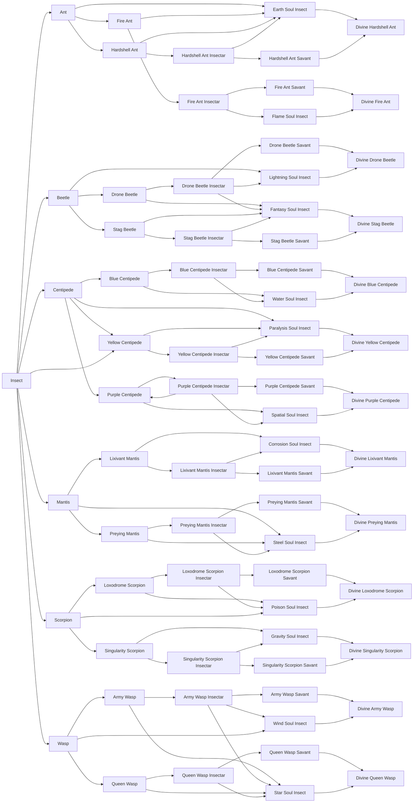

### Direwolf line

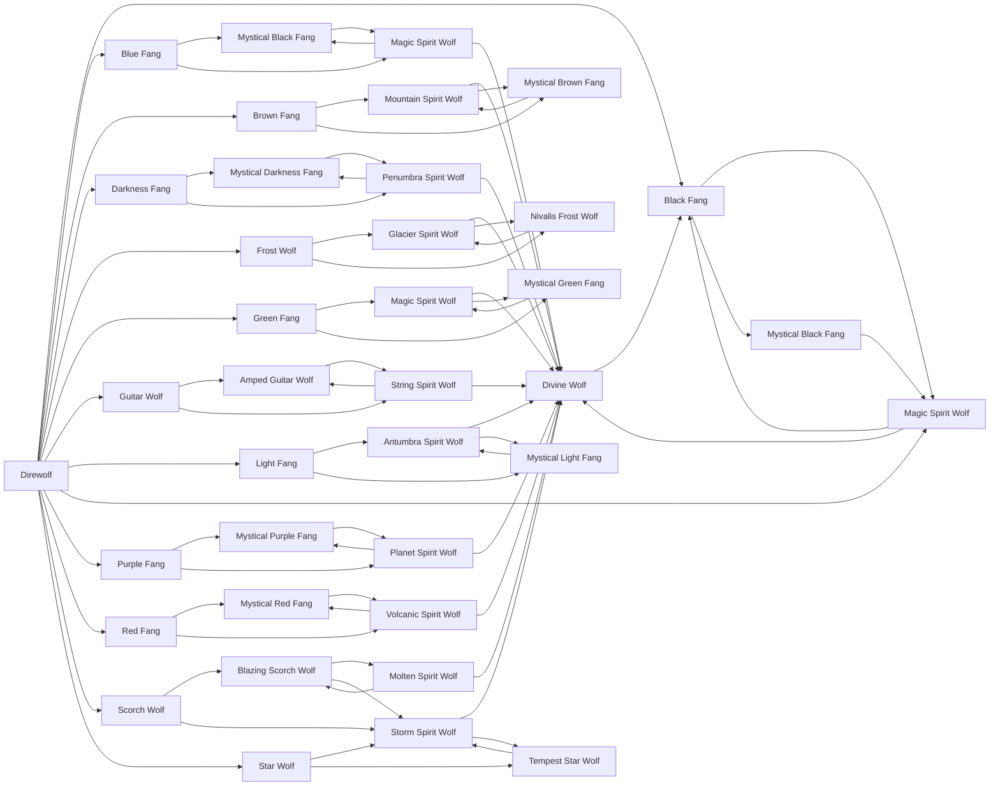

### Sculk Worm line

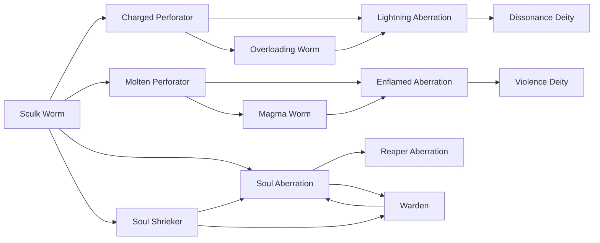

### Attuned Wyrm line

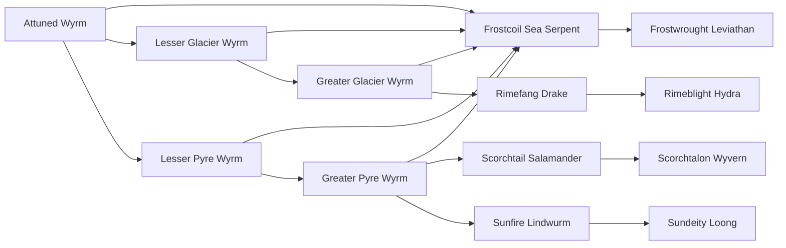

### Forgotten line

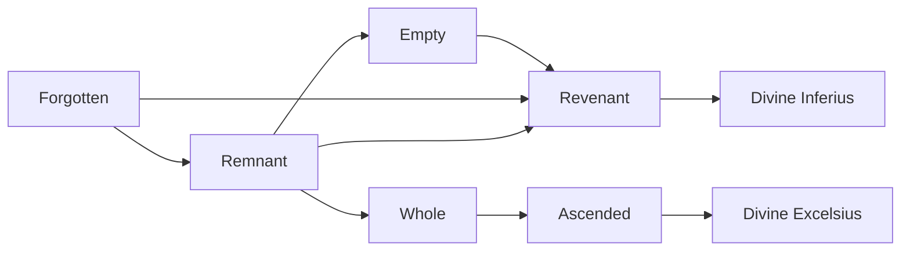

### Lesser Angel line

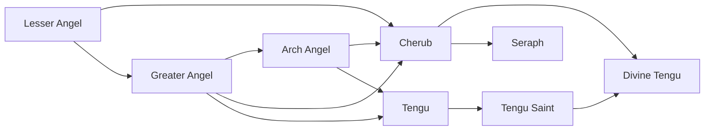

### Lesser Elemental line

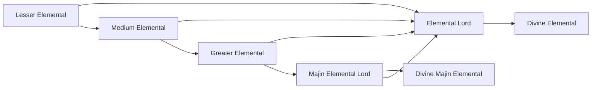

### Arch Doll line

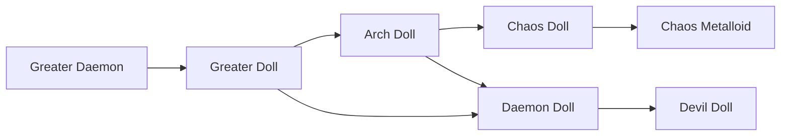

### Fallen Lesser Angel line

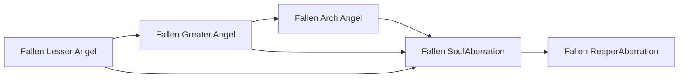

### Lesser Fallen line

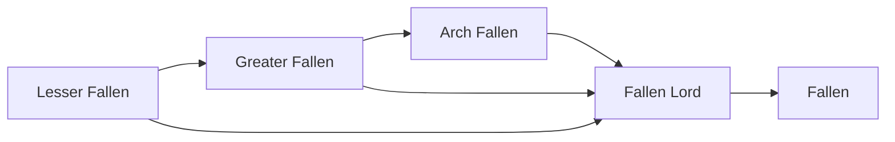

### Phantom line

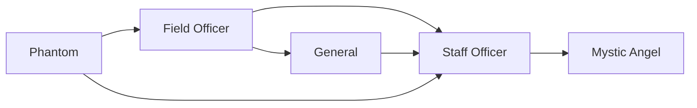

### Restricted Human line

### Dragonoid line

