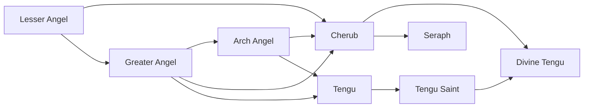

# Lesser Angel

<small>[Tensura: Mysticism](../index.md) &rsaquo; [Races](index.md)</small>

| | |
|---|---|
| **ID** | `mysticism:lesser_angel` |
| **Stage** | Starting |
| **Difficulty** | Easy |
| **Alignment** | Holy |
| **Aura** | 5,500 - 6,500 |
| **Magicule** | 1,500 - 3,500 |
| **Health bonus** | 20 |
| **Spiritual health bonus** | 90 |
| **Attack damage bonus** | 0.4 |
| **Movement speed bonus** | 0.01 |

> A spiritual life-form similar to Daemons known to wreck havoc on the world every 500 years.

## Evolution

- **Evolves into:** [Greater Angel](greater-angel.md)
- **Default evolution:** [Greater Angel](greater-angel.md)
- **On awakening (True Demon Lord / True Hero):** [Cherub](cherub.md)
- **During the Harvest Festival:** [Greater Angel](greater-angel.md)

### Evolution tree

## Traits

- Has creative-style flight
- Spawns as a spiritual lifeform
- Spiritual lifeform

## Attribute modifiers

| Attribute | Amount | Operation |
|---|---|---|
| Scale | 0 | add |
| Max Health | 20 | add |
| Max Spiritual Health | 90 | add |
| Attack Damage | 0.4 | add |
| Attack Speed | 0 | add |
| Knockback Resistance | 0.1 | add |
| Movement Speed | 0.01 | add |
| Swim Speed Multiplier | 0 | add |

## Stats (config defaults)

Set in [`config/mysticism/race/angel_config.toml`](../configs/config-mysticism-race-angel-config.md).

| Option | Default | Description |
|---|---|---|
| `LesserAngel.minAura` | 5,500 | Minimal aura. |
| `LesserAngel.maxAura` | 6,500 | Maximum aura. |
| `LesserAngel.minMagicule` | 1,500 | Minimal magicule. |
| `LesserAngel.maxMagicule` | 3,500 | Maximum magicule. |
| `LesserAngel.size` | 0 | Bonus Size. |
| `LesserAngel.maxHealth` | 20 | Bonus Max Health. |
| `LesserAngel.maxSpiritualHealth` | 90 | Bonus Max Spiritual Health. |
| `LesserAngel.attack` | 0.4 | Bonus Attack Damage. |
| `LesserAngel.attackSpeed` | 0 | Bonus Attack Speed. |
| `LesserAngel.knockbackResistance` | 0.1 | Bonus Knockback Resistance. |
| `LesserAngel.movementSpeed` | 0.01 | Bonus Movement Speed. |
| `LesserAngel.swimSpeed` | 0 | Bonus Swimming Speed Multiplier. |
| `LesserAngel.intrinsicSkills` | "tensura:magic_resistance", "tensura:possession", "mysticism:light_manipulation" | The list of intrinsic skills that the race gets. |

## Tags

`tensura:races/has_creative_flight`, `tensura:races/spawn_as_spiritual`, `tensura:races/spiritual`
