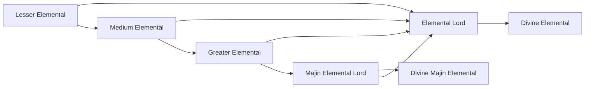

# Lesser Elemental

<small>[Tensura: Mysticism](../index.md) &rsaquo; [Races](index.md)</small>

| | |
|---|---|
| **ID** | `mysticism:lesser_elemental` |
| **Difficulty** | Hard |
| **Alignment** | Default |
| **Aura** | 300 - 500 |
| **Magicule** | 500 - 1,000 |
| **Health bonus** | -12 |
| **Spiritual health bonus** | 120 |
| **Attack damage bonus** | -0.8 |
| **Movement speed bonus** | 0.01 |

> A curious Elemental with a mind not yet formed. What shape will it take?

## Evolution

- **Evolves into:** [Medium Elemental](medium-elemental.md)
- **Default evolution:** [Medium Elemental](medium-elemental.md)
- **On awakening (True Demon Lord / True Hero):** [Elemental Lord](elemental-lord.md)
- **During the Harvest Festival:** [Medium Elemental](medium-elemental.md)

### Evolution tree

## Intrinsic skills

Granted automatically when you become this race.

-  [Possession](../../tensura-reincarnated/abilities/intrinsic-skills/possession.md)

## Traits

- Has creative-style flight
- Spawns as a spiritual lifeform
- Spiritual lifeform

## Attribute modifiers

| Attribute | Amount | Operation |
|---|---|---|
| Scale | -0.75 | add |
| Max Health | -12 | add |
| Max Spiritual Health | 120 | add |
| Attack Damage | -0.8 | add |
| Attack Speed | 0 | add |
| Knockback Resistance | 0 | add |
| Movement Speed | 0.01 | add |
| Swim Speed Multiplier | 0 | add |

## Stats (config defaults)

Set in [`config/mysticism/race/elemental_config.toml`](../configs/config-mysticism-race-elemental-config.md).

| Option | Default | Description |
|---|---|---|
| `LesserElemental.minAura` | 300 | Minimal aura. |
| `LesserElemental.maxAura` | 500 | Maximum aura. |
| `LesserElemental.minMagicule` | 500 | Minimal magicule. |
| `LesserElemental.maxMagicule` | 1,000 | Maximum magicule. |
| `LesserElemental.size` | -0.75 | Bonus Size. |
| `LesserElemental.maxHealth` | -12 | Bonus Max Health. |
| `LesserElemental.maxSpiritualHealth` | 120 | Bonus Max Spiritual Health. |
| `LesserElemental.attack` | -0.8 | Bonus Attack Damage. |
| `LesserElemental.attackSpeed` | 0 | Bonus Attack Speed. |
| `LesserElemental.knockbackResistance` | 0 | Bonus Knockback Resistance. |
| `LesserElemental.movementSpeed` | 0.01 | Bonus Movement Speed. |
| `LesserElemental.swimSpeed` | 0 | Bonus Swimming Speed Multiplier. |
| `LesserElemental.flightSpeed` | -0.025 | Bonus Flight Speed. |

Set in [`config/mysticism/general.toml`](../configs/config-mysticism-general.md).

| Option | Default | Description |
|---|---|---|
| `General.refresh` | true | Should the Tensura configurations add Mysticism's skills and races on next launch? |
| `General.flightSpeed` | 0.05 | The default flying speed of all Mysticism races. |
| `General.seCostMultiplier` | 4 | SE cost multiplier when acquiring a Unique Skill. Default: 4, which means the skill's magicule cost \* 4 |

## Tags

`tensura:races/has_creative_flight`, `tensura:races/spawn_as_spiritual`, `tensura:races/spiritual`
