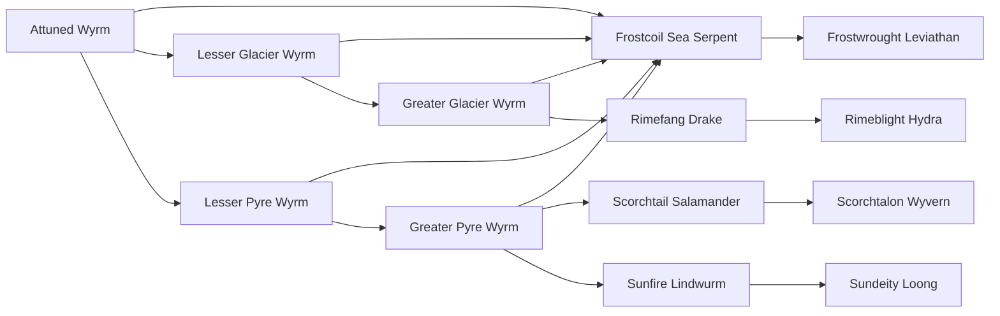

# Lesser Glacier Wyrm

<small>[Tensura: Mysticism](../index.md) &rsaquo; [Races](index.md)</small>

| | |
|---|---|
| **ID** | `mysticism:lesser_glacier_wyrm` |
| **Stage** | In-between |
| **Difficulty** | Hard |
| **Alignment** | Default |
| **Aura** | 1,000 - 1,500 |
| **Magicule** | 2,000 - 2,500 |
| **Health bonus** | 40 |
| **Spiritual health bonus** | 160 |
| **Attack damage bonus** | 1 |
| **Movement speed bonus** | 0.03 |

> A Race of Wyrm that live in the depth of the Icy Tundras, thriving on the cold and all those live in it.

## Evolution

- **Evolves from:** [Attuned Wyrm](attuned-wyrm.md)
- **Evolves into:** [Greater Glacier Wyrm](greater-glacier-wyrm.md)
- **Default evolution:** [Greater Glacier Wyrm](greater-glacier-wyrm.md)
- **On awakening (True Demon Lord / True Hero):** [Frostcoil Sea Serpent](frostcoil-sea-serpent.md)
- **During the Harvest Festival:** [Greater Glacier Wyrm](greater-glacier-wyrm.md)

### Requirements to evolve into Lesser Glacier Wyrm

Each requirement adds its weight to the evolution progress bar; you can evolve at 100%.

| Requirement | Weight |
|---|---|
| Consume 1 of [Ice Essence](../items/materials/ice-essence.md) | 100% |

### Evolution tree

## Attribute modifiers

| Attribute | Amount | Operation |
|---|---|---|
| Scale | 0.5 | add |
| Max Health | 40 | add |
| Max Spiritual Health | 160 | add |
| Attack Damage | 1 | add |
| Attack Speed | 1 | add |
| Knockback Resistance | 0.04 | add |
| Movement Speed | 0.03 | add |
| Swim Speed Multiplier | 0.03 | add |

## Stats (config defaults)

Set in [`config/mysticism/race/wyrm_config.toml`](../configs/config-mysticism-race-wyrm-config.md).

| Option | Default | Description |
|---|---|---|
| `LesserGlacierWyrm.minAura` | 1,000 | Minimal aura. |
| `LesserGlacierWyrm.maxAura` | 1,500 | Maximum aura. |
| `LesserGlacierWyrm.minMagicule` | 2,000 | Minimal magicule. |
| `LesserGlacierWyrm.maxMagicule` | 2,500 | Maximum magicule. |
| `LesserGlacierWyrm.size` | 0.5 | Bonus Size. |
| `LesserGlacierWyrm.maxHealth` | 40 | Bonus Max Health. |
| `LesserGlacierWyrm.maxSpiritualHealth` | 160 | Bonus Max Spiritual Health. |
| `LesserGlacierWyrm.attack` | 1 | Bonus Attack Damage. |
| `LesserGlacierWyrm.attackSpeed` | 1 | Bonus Attack Speed. |
| `LesserGlacierWyrm.knockbackResistance` | 0.04 | Bonus Knockback Resistance. |
| `LesserGlacierWyrm.movementSpeed` | 0.03 | Bonus Movement Speed. |
| `LesserGlacierWyrm.swimSpeed` | 0.03 | Bonus Swimming Speed Multiplier. |
| `LesserGlacierWyrm.iceEssenceAmount` | 1 | Amount of Ice Essence needed eaten to evolve into a Lesser Glacier Wyrm. |
| `LesserGlacierWyrm.intrinsicSkills` | "tensura:cold_resistance" | The list of intrinsic skills that the race gets. |
| `AttunedWyrm.minAura` | 500 | Minimal aura. |
| `AttunedWyrm.maxAura` | 1,000 | Maximum aura. |
| `AttunedWyrm.minMagicule` | 1,500 | Minimal magicule. |
| `AttunedWyrm.maxMagicule` | 2,000 | Maximum magicule. |
| `AttunedWyrm.size` | 0.3 | Bonus Size. |
| `AttunedWyrm.maxHealth` | 0 | Bonus Max Health. |
| `AttunedWyrm.maxSpiritualHealth` | 0 | Bonus Max Spiritual Health. |
| `AttunedWyrm.attack` | 1 | Bonus Attack Damage. |
| `AttunedWyrm.attackSpeed` | 0.5 | Bonus Attack Speed. |
| `AttunedWyrm.knockbackResistance` | 1 | Bonus Knockback Resistance. |
| `AttunedWyrm.movementSpeed` | 0 | Bonus Movement Speed. |
| `AttunedWyrm.swimSpeed` | 0 | Bonus Swimming Speed Multiplier. |
| `AttunedWyrm.intrinsicSkills` | [] (empty) | The list of intrinsic skills that the race gets. |
