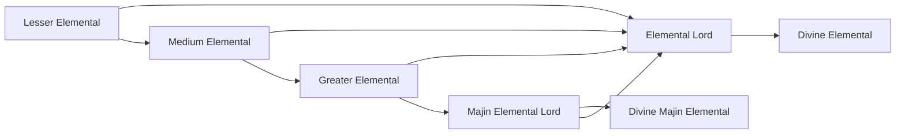

# Medium Elemental

<small>[Tensura: Mysticism](../index.md) &rsaquo; [Races](index.md)</small>

| | |
|---|---|
| **ID** | `mysticism:medium_elemental` |
| **Difficulty** | Hard |
| **Alignment** | Default |
| **Aura** | 11,250 - 11,250 |
| **Magicule** | 11,250 - 11,250 |
| **Health bonus** | 5 |
| **Spiritual health bonus** | 425 |
| **Attack damage bonus** | -0.5 |
| **Movement speed bonus** | 0.02 |
| **EP to evolve into** | 20,000 |

> An Elemental that has evolved, taking the form of a mythological creature. Its arsenal of Spiritual Magic is now stronger as well.

> [!NOTE]
> **Pack note:** this pack changes the defaults below.
> - `General.refresh` is **false** (mod default: true)

## Evolution

- **Evolves from:** [Lesser Elemental](lesser-elemental.md)
- **Evolves into:** [Greater Elemental](greater-elemental.md)
- **Default evolution:** [Greater Elemental](greater-elemental.md)
- **On awakening (True Demon Lord / True Hero):** [Elemental Lord](elemental-lord.md)
- **During the Harvest Festival:** [Greater Elemental](greater-elemental.md)

### Requirements to evolve into Medium Elemental

Each requirement adds its weight to the evolution progress bar; you can evolve at 100%.

| Requirement | Weight |
|---|---|
| Reach Existence Points of 20,000 | 100% |

### Evolution tree

## Intrinsic skills

Granted automatically when you become this race.

-  [Possession](../../tensura-reincarnated/abilities/intrinsic-skills/possession.md)

## Traits

- Has creative-style flight
- Spiritual lifeform

## Attribute modifiers

| Attribute | Amount | Operation |
|---|---|---|
| Scale | -0.5 | add |
| Max Health | 5 | add |
| Max Spiritual Health | 425 | add |
| Attack Damage | -0.5 | add |
| Attack Speed | 0.1 | add |
| Knockback Resistance | 0 | add |
| Movement Speed | 0.02 | add |
| Swim Speed Multiplier | 0.2 | add |

## Stats (config defaults)

Set in [`config/mysticism/race/elemental_config.toml`](../configs/config-mysticism-race-elemental-config.md).

| Option | Default | Description |
|---|---|---|
| `MediumElemental.epRequirement` | 20,000 | EP requirement to evolve into Medium Elemental. |
| `MediumElemental.minAura` | 11,250 | Minimal aura. |
| `MediumElemental.maxAura` | 11,250 | Maximum aura. |
| `MediumElemental.minMagicule` | 11,250 | Minimal magicule. |
| `MediumElemental.maxMagicule` | 11,250 | Maximum magicule. |
| `MediumElemental.size` | -0.5 | Bonus Size. |
| `MediumElemental.maxHealth` | 5 | Bonus Max Health. |
| `MediumElemental.maxSpiritualHealth` | 425 | Bonus Max Spiritual Health. |
| `MediumElemental.attack` | -0.5 | Bonus Attack Damage. |
| `MediumElemental.attackSpeed` | 0.1 | Bonus Attack Speed. |
| `MediumElemental.knockbackResistance` | 0 | Bonus Knockback Resistance. |
| `MediumElemental.movementSpeed` | 0.02 | Bonus Movement Speed. |
| `MediumElemental.swimSpeed` | 0.2 | Bonus Swimming Speed Multiplier. |
| `MediumElemental.flightSpeed` | -0.01 | Bonus Flight Speed. |
| `LesserElemental.minAura` | 300 | Minimal aura. |
| `LesserElemental.maxAura` | 500 | Maximum aura. |
| `LesserElemental.minMagicule` | 500 | Minimal magicule. |
| `LesserElemental.maxMagicule` | 1,000 | Maximum magicule. |
| `LesserElemental.size` | -0.75 | Bonus Size. |
| `LesserElemental.maxHealth` | -12 | Bonus Max Health. |
| `LesserElemental.maxSpiritualHealth` | 120 | Bonus Max Spiritual Health. |
| `LesserElemental.attack` | -0.8 | Bonus Attack Damage. |
| `LesserElemental.attackSpeed` | 0 | Bonus Attack Speed. |
| `LesserElemental.knockbackResistance` | 0 | Bonus Knockback Resistance. |
| `LesserElemental.movementSpeed` | 0.01 | Bonus Movement Speed. |
| `LesserElemental.swimSpeed` | 0 | Bonus Swimming Speed Multiplier. |
| `LesserElemental.flightSpeed` | -0.025 | Bonus Flight Speed. |

Set in [`config/mysticism/general.toml`](../configs/config-mysticism-general.md).

| Option | Default | This pack | Description |
|---|---|---|---|
| `General.refresh` | true | false | Should the Tensura configurations add Mysticism's skills and races on next launch? |
| `General.flightSpeed` | 0.05 | | The default flying speed of all Mysticism races. |
| `General.seCostMultiplier` | 4 | | SE cost multiplier when acquiring a Unique Skill. Default: 4, which means the skill's magicule cost \* 4 |

## Tags

`tensura:races/has_creative_flight`, `tensura:races/spiritual`
