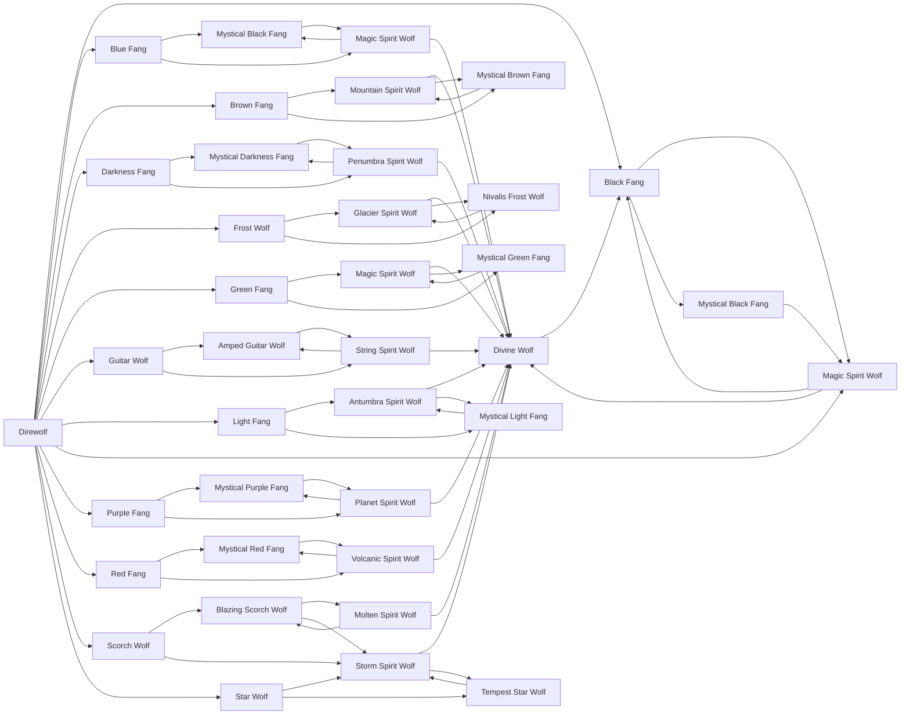

# Planet Spirit Wolf

<small>[Tensura: Mysticism](../index.md) &rsaquo; [Races](index.md)</small>

| | |
|---|---|
| **ID** | `mysticism:planet_spirit_wolf` |
| **Stage** | In-between |
| **Difficulty** | Easy |
| **Alignment** | Majin |
| **Aura** | 425,000 - 425,000 |
| **Magicule** | 425,000 - 425,000 |
| **Health bonus** | 680 |
| **Spiritual health bonus** | 4,360 |
| **Attack damage bonus** | 4 |
| **Movement speed bonus** | 0.04 |
| **EP to evolve into** | 800,000 |

> A truly scary being. This is a Direwolf that has "evolved the correct way" and become a Spiritual Lifeform. One is rarely born once in a millennium, and all normal Direwolves and Purple Fangs bow to this creature.

## Evolution

- **Evolves from:** [Mystical Purple Fang](mystical-purple-fang.md), [Purple Fang](purple-fang.md)
- **Evolves into:** [Divine Wolf](divine-wolf.md)
- **Default evolution:** [Divine Wolf](divine-wolf.md)
- **On awakening (True Demon Lord / True Hero):** [Divine Wolf](divine-wolf.md)
- **During the Harvest Festival:** [Mystical Purple Fang](mystical-purple-fang.md)

### Requirements to evolve into Planet Spirit Wolf

Each requirement adds its weight to the evolution progress bar; you can evolve at 100%.

| Requirement | Weight |
|---|---|
| Reach Existence Points of 800,000 | 50% |
| Master [Spatial Domination](../../tensura-reincarnated/abilities/extra-skills/spatial-domination.md) | 50% |

### Evolution tree

## Traits

- Spiritual lifeform

## Attribute modifiers

| Attribute | Amount | Operation |
|---|---|---|
| Step Height | 0.5 | add |
| Scale | 0 | add |
| Max Health | 680 | add |
| Max Spiritual Health | 4,360 | add |
| Attack Damage | 4 | add |
| Attack Speed | 0 | add |
| Knockback Resistance | 0.2 | add |
| Movement Speed | 0.04 | add |
| Swim Speed Multiplier | 0.4 | add |

## Stats (config defaults)

Set in [`config/mysticism/race/direwolf/direwolf_config.toml`](../configs/config-mysticism-race-direwolf-direwolf-config.md).

| Option | Default | Description |
|---|---|---|
| `PlanetSpiritWolf.epRequirement` | 800,000 | EP requirement to evolve into Planet Spirit Wolf. |
| `PlanetSpiritWolf.abilityRequirement` | "tensura:spatial_domination" | The ability needed to evolve into Planet Spirit Wolf. |
| `PlanetSpiritWolf.abilityMasteryRequirement` | true | Does the ability need to be mastered? (true/false) |
| `PlanetSpiritWolf.minAura` | 425,000 | Minimal aura. |
| `PlanetSpiritWolf.maxAura` | 425,000 | Maximum aura. |
| `PlanetSpiritWolf.minMagicule` | 425,000 | Minimal magicule. |
| `PlanetSpiritWolf.maxMagicule` | 425,000 | Maximum magicule. |
| `PlanetSpiritWolf.size` | 0 | Bonus Size. |
| `PlanetSpiritWolf.maxHealth` | 680 | Bonus Max Health. |
| `PlanetSpiritWolf.maxSpiritualHealth` | 4,360 | Bonus Max Spiritual Health. |
| `PlanetSpiritWolf.attack` | 4 | Bonus Attack Damage. |
| `PlanetSpiritWolf.attackSpeed` | 0 | Bonus Attack Speed. |
| `PlanetSpiritWolf.knockbackResistance` | 0.2 | Bonus Knockback Resistance. |
| `PlanetSpiritWolf.movementSpeed` | 0.04 | Bonus Movement Speed. |
| `PlanetSpiritWolf.swimSpeed` | 0.4 | Bonus Swimming Speed Multiplier. |
| `PlanetSpiritWolf.stepHeight` | 0.5 | Bonus Step Height. |
| `PlanetSpiritWolf.intrinsicSkills` | "tensura:thought_communication", "tensura:shadow_motion", "tensura:coercion", "tensura:spatial_manipulation", "tensura:godwolf_sense", "tensura:spatial_attack_resistance", "tensura:ultra_instinct" | The list of intrinsic skills that the race gets. |
| `MysticalPurpleFang.epRequirement` | 200,000 | EP requirement to evolve into Mystical Purple Fang. |
| `MysticalPurpleFang.abilityRequirement` | "tensura:spatial_manipulation" | The ability needed to evolve into Mystical Purple Fang. |
| `MysticalPurpleFang.abilityMasteryRequirement` | true | Does the ability need to be mastered? (true/false) |
| `MysticalPurpleFang.minAura` | 125,000 | Minimal aura. |
| `MysticalPurpleFang.maxAura` | 125,000 | Maximum aura. |
| `MysticalPurpleFang.minMagicule` | 125,000 | Minimal magicule. |
| `MysticalPurpleFang.maxMagicule` | 125,000 | Maximum magicule. |
| `MysticalPurpleFang.size` | 0 | Bonus Size. |
| `MysticalPurpleFang.maxHealth` | 380 | Bonus Max Health. |
| `MysticalPurpleFang.maxSpiritualHealth` | 2,320 | Bonus Max Spiritual Health. |
| `MysticalPurpleFang.attack` | 3 | Bonus Attack Damage. |
| `MysticalPurpleFang.attackSpeed` | 0 | Bonus Attack Speed. |
| `MysticalPurpleFang.knockbackResistance` | 0.1 | Bonus Knockback Resistance. |
| `MysticalPurpleFang.movementSpeed` | 0.03 | Bonus Movement Speed. |
| `MysticalPurpleFang.swimSpeed` | 0.3 | Bonus Swimming Speed Multiplier. |
| `MysticalPurpleFang.stepHeight` | 0.5 | Bonus Step Height. |
| `MysticalPurpleFang.intrinsicSkills` | "tensura:thought_communication", "tensura:shadow_motion", "tensura:coercion", "tensura:spatial_manipulation", "tensura:godwolf_sense" | The list of intrinsic skills that the race gets. |
| `PurpleFang.epRequirement` | 10,000 | EP requirement to evolve into Purple Fang. |
| `PurpleFang.minAura` | 5,250 | Minimal aura. |
| `PurpleFang.maxAura` | 5,250 | Maximum aura. |
| `PurpleFang.minMagicule` | 5,250 | Minimal magicule. |
| `PurpleFang.maxMagicule` | 5,250 | Maximum magicule. |
| `PurpleFang.size` | 0 | Bonus Size. |
| `PurpleFang.maxHealth` | 25 | Bonus Max Health. |
| `PurpleFang.maxSpiritualHealth` | 265 | Bonus Max Spiritual Health. |
| `PurpleFang.attack` | 3 | Bonus Attack Damage. |
| `PurpleFang.attackSpeed` | 0.1 | Bonus Attack Speed. |
| `PurpleFang.knockbackResistance` | 0 | Bonus Knockback Resistance. |
| `PurpleFang.movementSpeed` | 0.0275 | Bonus Movement Speed. |
| `PurpleFang.swimSpeed` | 0.1 | Bonus Swimming Speed Multiplier. |
| `PurpleFang.stepHeight` | 0.5 | Bonus Step Height. |
| `PurpleFang.intrinsicSkills` | "tensura:thought_communication", "tensura:shadow_motion", "tensura:coercion", "tensura:spatial_manipulation" | The list of intrinsic skills that the race gets. |
| `Direwolf.minAura` | 1,834 | Minimal aura. |
| `Direwolf.maxAura` | 2,166 | Maximum aura. |
| `Direwolf.minMagicule` | 1,833 | Minimal magicule. |
| `Direwolf.maxMagicule` | 2,167 | Maximum magicule. |
| `Direwolf.size` | -0.25 | Bonus Size. |
| `Direwolf.maxHealth` | 6 | Bonus Max Health. |
| `Direwolf.maxSpiritualHealth` | 35 | Bonus Max Spiritual Health. |
| `Direwolf.attack` | 3 | Bonus Attack Damage. |
| `Direwolf.attackSpeed` | 0 | Bonus Attack Speed. |
| `Direwolf.knockbackResistance` | 0 | Bonus Knockback Resistance. |
| `Direwolf.movementSpeed` | 0.025 | Bonus Movement Speed. |
| `Direwolf.swimSpeed` | 0.1 | Bonus Swimming Speed Multiplier. |
| `Direwolf.stepHeight` | 0.5 | Bonus Step Height. |
| `Direwolf.intrinsicSkills` | "tensura:thought_communication", "tensura:shadow_motion", "tensura:coercion" | The list of intrinsic skills that the race gets. |

## Tags

`tensura:races/spiritual`
