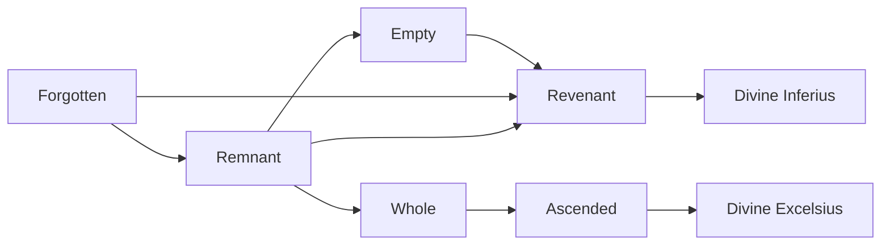

# Remnant

<small>[Tensura: Mysticism](../index.md) &rsaquo; [Races](index.md)</small>

| | |
|---|---|
| **ID** | `mysticism:remnant` |
| **Stage** | In-between |
| **Difficulty** | Intermediate |
| **Alignment** | Majin |
| **Aura** | 50,000 - 50,000 |
| **Magicule** | 60,000 - 60,000 |
| **Health bonus** | 60 |
| **Spiritual health bonus** | 1,040 |
| **Attack damage bonus** | -0.5 |
| **Movement speed bonus** | 0.01 |
| **EP to evolve into** | 100,000 |

> These lost souls piece their past back together slowly. They have regained some semblance of self-being, but it's still not enough.

## Evolution

- **Evolves from:** [Forgotten](forgotten.md)
- **Evolves into:** [Empty](empty.md), [Whole](whole.md)
- **Default evolution:** [Empty](empty.md)
- **On awakening (True Demon Lord / True Hero):** [Revenant](revenant.md)
- **During the Harvest Festival:** [Empty](empty.md)

### Requirements to evolve into Remnant

Each requirement adds its weight to the evolution progress bar; you can evolve at 100%.

| Requirement | Weight |
|---|---|
| Reach Existence Points of 100,000 | 100% |

### Evolution tree

## Traits

- Spawns as a spiritual lifeform
- Spiritual lifeform

## Attribute modifiers

| Attribute | Amount | Operation |
|---|---|---|
| Scale | 0 | add |
| Max Health | 60 | add |
| Max Spiritual Health | 1,040 | add |
| Attack Damage | -0.5 | add |
| Attack Speed | 0.1 | add |
| Knockback Resistance | 1 | add |
| Movement Speed | 0.01 | add |
| Swim Speed Multiplier | 0.01 | add |

## Stats (config defaults)

Set in [`config/mysticism/race/forgotten_config.toml`](../configs/config-mysticism-race-forgotten-config.md).

| Option | Default | Description |
|---|---|---|
| `Remnant.epRequirement` | 100,000 | EP requirement to evolve into a Remnant. |
| `Remnant.minAura` | 50,000 | Minimal aura. |
| `Remnant.maxAura` | 50,000 | Maximum aura. |
| `Remnant.minMagicule` | 60,000 | Minimal magicule. |
| `Remnant.maxMagicule` | 60,000 | Maximum magicule. |
| `Remnant.size` | 0 | Bonus Size. |
| `Remnant.maxHealth` | 60 | Bonus Max Health. |
| `Remnant.maxSpiritualHealth` | 1,040 | Bonus Max Spiritual Health. |
| `Remnant.attack` | -0.5 | Bonus Attack Damage. |
| `Remnant.attackSpeed` | 0.1 | Bonus Attack Speed. |
| `Remnant.knockbackResistance` | 1 | Bonus Knockback Resistance. |
| `Remnant.movementSpeed` | 0.01 | Bonus Movement Speed. |
| `Remnant.swimSpeed` | 0.01 | Bonus Swimming Speed Multiplier. |
| `Remnant.intrinsicSkills` | "tensura:spiritual_attack_resistance", "tensura:possession", "mysticism:relapse" | The list of intrinsic skills that the race gets. |
| `Forgotten.minAura` | 100 | Minimal aura. |
| `Forgotten.maxAura` | 600 | Maximum aura. |
| `Forgotten.minMagicule` | 425 | Minimal magicule. |
| `Forgotten.maxMagicule` | 700 | Maximum magicule. |
| `Forgotten.size` | 0 | Bonus Size. |
| `Forgotten.maxHealth` | 0 | Bonus Max Health. |
| `Forgotten.maxSpiritualHealth` | 0 | Bonus Max Spiritual Health. |
| `Forgotten.attack` | -1 | Bonus Attack Damage. |
| `Forgotten.attackSpeed` | 0 | Bonus Attack Speed. |
| `Forgotten.knockbackResistance` | 1 | Bonus Knockback Resistance. |
| `Forgotten.movementSpeed` | 0 | Bonus Movement Speed. |
| `Forgotten.swimSpeed` | 0 | Bonus Swimming Speed Multiplier. |
| `Forgotten.intrinsicSkills` | "tensura:spiritual_attack_resistance", "tensura:possession", "mysticism:relapse" | The list of intrinsic skills that the race gets. |

## Tags

`tensura:races/spawn_as_spiritual`, `tensura:races/spiritual`
