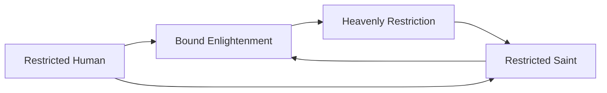

# Restricted Saint

<small>[Tensura: Mysticism](../index.md) &rsaquo; [Races](index.md)</small>

| | |
|---|---|
| **ID** | `mysticism:restricted_saint` |
| **Stage** | In-between |
| **Difficulty** | Hard |
| **Alignment** | Default |
| **Aura** | 280,000 - 280,000 |
| **Magicule** | 100 - 100 |
| **Health bonus** | 120 |
| **Spiritual health bonus** | 450 |
| **Attack damage bonus** | 1.5 |
| **Movement speed bonus** | 0.015 |
| **EP to evolve into** | 200,000 |

## Evolution

- **Evolves from:** [Restricted Human](restricted-human.md), [Heavenly Restriction](heavenly-restriction.md)
- **Evolves into:** [Bound Enlightenment](bound-enlightenment.md)
- **Default evolution:** [Bound Enlightenment](bound-enlightenment.md)
- **On awakening (True Demon Lord / True Hero):** [Bound Enlightenment](bound-enlightenment.md)
- **During the Harvest Festival:** [Bound Enlightenment](bound-enlightenment.md)

### Requirements to evolve into Restricted Saint

Each requirement adds its weight to the evolution progress bar; you can evolve at 100%.

| Requirement | Weight |
|---|---|
| Reach Existence Points of 200,000 | 100% |

### Evolution tree

## Attribute modifiers

| Attribute | Amount | Operation |
|---|---|---|
| Scale | 0 | add |
| Max Health | 120 | add |
| Max Spiritual Health | 450 | add |
| Attack Damage | 1.5 | add |
| Attack Speed | 0.3 | add |
| Knockback Resistance | 0.15 | add |
| Movement Speed | 0.015 | add |
| Swim Speed Multiplier | 0.15 | add |

## Stats (config defaults)

Set in [`config/mysticism/race/restricted_human_config.toml`](../configs/config-mysticism-race-restricted-human-config.md).

| Option | Default | Description |
|---|---|---|
| `RestrictedSaint.epRequirement` | 200,000 | EP requirement to evolve into Restricted Saint. |
| `RestrictedSaint.minAura` | 280,000 | Minimal aura. |
| `RestrictedSaint.maxAura` | 280,000 | Maximum aura. |
| `RestrictedSaint.minMagicule` | 100 | Minimal magicule. |
| `RestrictedSaint.maxMagicule` | 100 | Maximum magicule. |
| `RestrictedSaint.size` | 0 | Bonus Size. |
| `RestrictedSaint.maxHealth` | 120 | Bonus Max Health. |
| `RestrictedSaint.maxSpiritualHealth` | 450 | Bonus Max Spiritual Health. |
| `RestrictedSaint.attack` | 1.5 | Bonus Attack Damage. |
| `RestrictedSaint.attackSpeed` | 0.3 | Bonus Attack Speed. |
| `RestrictedSaint.knockbackResistance` | 0.15 | Bonus Knockback Resistance. |
| `RestrictedSaint.movementSpeed` | 0.015 | Bonus Movement Speed. |
| `RestrictedSaint.swimSpeed` | 0.15 | Bonus Swimming Speed Multiplier. |
| `RestrictedSaint.intrinsicSkills` | "mysticism:restricted" | The list of intrinsic skills that the race gets. |
| `RestrictedHuman.epRequirement` | 50,000 | EP requirement to evolve into Restricted Human. |
| `RestrictedHuman.bossRequirement` | 2 | The number of Bosses defeated to evolve into Restricted Human. |
| `RestrictedHuman.minAura` | 1,520 | Minimal aura. |
| `RestrictedHuman.maxAura` | 2,280 | Maximum aura. |
| `RestrictedHuman.minMagicule` | 50 | Minimal magicule. |
| `RestrictedHuman.maxMagicule` | 70 | Maximum magicule. |
| `RestrictedHuman.size` | 0 | Bonus Size. |
| `RestrictedHuman.maxHealth` | 10 | Bonus Max Health. |
| `RestrictedHuman.maxSpiritualHealth` | 0 | Bonus Max Spiritual Health. |
| `RestrictedHuman.attack` | 0.5 | Bonus Attack Damage. |
| `RestrictedHuman.attackSpeed` | 0.1 | Bonus Attack Speed. |
| `RestrictedHuman.knockbackResistance` | 0 | Bonus Knockback Resistance. |
| `RestrictedHuman.movementSpeed` | 0.05 | Bonus Movement Speed. |
| `RestrictedHuman.swimSpeed` | 0.1 | Bonus Swimming Speed Multiplier. |
| `RestrictedHuman.intrinsicSkills` | "mysticism:restricted" | The list of intrinsic skills that the race gets. |

Set in [`config/tensura/race/human_config.toml`](../../tensura-reincarnated/configs/config-tensura-race-human-config.md).

| Option | Default | Description |
|---|---|---|
| `Human.minAura` | 760 | Minimal aura. |
| `Human.maxAura` | 1,140 | Maximum aura. |
| `Human.minMagicule` | 50 | Minimal magicule. |
| `Human.maxMagicule` | 70 | Maximum magicule. |
| `Human.size` | 0 | Bonus Size. |
| `Human.maxHealth` | 0 | Bonus Max Health. |
| `Human.maxSpiritualHealth` | 0 | Bonus Max Spiritual Health. |
| `Human.attack` | 0 | Bonus Attack Damage. |
| `Human.attackSpeed` | 0 | Bonus Attack Speed. |
| `Human.knockbackResistance` | 0 | Bonus Knockback Resistance. |
| `Human.movementSpeed` | 0 | Bonus Movement Speed. |
| `Human.swimSpeed` | 0 | Bonus Swimming Speed Multiplier. |
