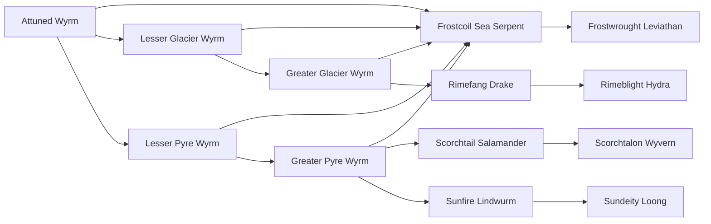

# Rimefang Drake

<small>[Tensura: Mysticism](../index.md) &rsaquo; [Races](index.md)</small>

| | |
|---|---|
| **ID** | `mysticism:rimefang_drake` |
| **Stage** | In-between |
| **Difficulty** | Hard |
| **Alignment** | Majin |
| **Aura** | 150,000 - 150,000 |
| **Magicule** | 200,000 - 200,000 |
| **Health bonus** | 380 |
| **Spiritual health bonus** | 1,520 |
| **Attack damage bonus** | 6 |
| **Movement speed bonus** | 0.03 |
| **EP to evolve into** | 200,000 |

> A wingless dragon monster that lives in the icy tundras, thanks to its improved eyesight, its able to see its prey from far distances.

## Evolution

- **Evolves from:** [Greater Glacier Wyrm](greater-glacier-wyrm.md)
- **Evolves into:** [Rimeblight Hydra](rimeblight-hydra.md)
- **Default evolution:** [Rimeblight Hydra](rimeblight-hydra.md)
- **On awakening (True Demon Lord / True Hero):** [Rimeblight Hydra](rimeblight-hydra.md)

### Requirements to evolve into Rimefang Drake

Each requirement adds its weight to the evolution progress bar; you can evolve at 100%.

| Requirement | Weight |
|---|---|
| Reach Existence Points of 200,000 | 33.4% |
| Master [Ice Manipulation](../abilities/extra-skills/ice-manipulation.md) | 33.3% |
| Master [Cryogenic Cessation](../abilities/extra-skills/cryogenic-cessation.md) | 33.3% |

### Evolution tree

## Attribute modifiers

| Attribute | Amount | Operation |
|---|---|---|
| Scale | 1 | add |
| Max Health | 380 | add |
| Max Spiritual Health | 1,520 | add |
| Attack Damage | 6 | add |
| Attack Speed | 0.8 | add |
| Knockback Resistance | 0.06 | add |
| Movement Speed | 0.03 | add |
| Swim Speed Multiplier | 0.03 | add |

## Stats (config defaults)

Set in [`config/mysticism/race/wyrm_config.toml`](../configs/config-mysticism-race-wyrm-config.md).

| Option | Default | Description |
|---|---|---|
| `RimeFangDrake.minAura` | 150,000 | Minimal aura. |
| `RimeFangDrake.maxAura` | 150,000 | Maximum aura. |
| `RimeFangDrake.minMagicule` | 200,000 | Minimal magicule. |
| `RimeFangDrake.maxMagicule` | 200,000 | Maximum magicule. |
| `RimeFangDrake.size` | 1 | Bonus Size. |
| `RimeFangDrake.maxHealth` | 380 | Bonus Max Health. |
| `RimeFangDrake.maxSpiritualHealth` | 1,520 | Bonus Max Spiritual Health. |
| `RimeFangDrake.attack` | 6 | Bonus Attack Damage. |
| `RimeFangDrake.attackSpeed` | 0.8 | Bonus Attack Speed. |
| `RimeFangDrake.knockbackResistance` | 0.06 | Bonus Knockback Resistance. |
| `RimeFangDrake.movementSpeed` | 0.03 | Bonus Movement Speed. |
| `RimeFangDrake.swimSpeed` | 0.03 | Bonus Swimming Speed Multiplier. |
| `RimeFangDrake.epRequirement` | 200,000 | EP requirement to evolve into Rimefang Drake. |
| `RimeFangDrake.abilityRequirement` | "mysticism:ice_manipulation" | The first ability needed to evolve into Rimefang Drake. |
| `RimeFangDrake.abilityMasteryRequirement` | true | Does the first ability need to be mastered? (true/false) |
| `RimeFangDrake.ability2Requirement` | "mysticism:cryogenic_cessation" | The second ability needed to evolve into Rimefang Drake. |
| `RimeFangDrake.ability2MasteryRequirement` | true | Does the second ability need to be mastered? (true/false) |
| `RimeFangDrake.intrinsicSkills` | "tensura:cold_resistance", "mysticism:cryogenic_cessation", "tensura:dragon_eye", "tensura:dragon_skin" | The list of intrinsic skills that the race gets. |
| `GreaterGlacierWyrm.minAura` | 8,000 | Minimal aura. |
| `GreaterGlacierWyrm.maxAura` | 8,000 | Maximum aura. |
| `GreaterGlacierWyrm.minMagicule` | 10,000 | Minimal magicule. |
| `GreaterGlacierWyrm.maxMagicule` | 10,000 | Maximum magicule. |
| `GreaterGlacierWyrm.size` | 0.8 | Bonus Size. |
| `GreaterGlacierWyrm.maxHealth` | 180 | Bonus Max Health. |
| `GreaterGlacierWyrm.maxSpiritualHealth` | 660 | Bonus Max Spiritual Health. |
| `GreaterGlacierWyrm.attack` | 3 | Bonus Attack Damage. |
| `GreaterGlacierWyrm.attackSpeed` | 2 | Bonus Attack Speed. |
| `GreaterGlacierWyrm.knockbackResistance` | 0.05 | Bonus Knockback Resistance. |
| `GreaterGlacierWyrm.movementSpeed` | 0.02 | Bonus Movement Speed. |
| `GreaterGlacierWyrm.swimSpeed` | 0.02 | Bonus Swimming Speed Multiplier. |
| `GreaterGlacierWyrm.iceEssenceAmount` | 10 | Amount of Ice Essence needed eaten to evolve into a Greater Glacier Wyrm. |
| `GreaterGlacierWyrm.epRequirement` | 30,000 | EP requirement to evolve into Greater Glacier Wyrm. |
| `GreaterGlacierWyrm.intrinsicSkills` | "tensura:cold_resistance", "mysticism:cryogenic_cessation" | The list of intrinsic skills that the race gets. |
| `LesserGlacierWyrm.minAura` | 1,000 | Minimal aura. |
| `LesserGlacierWyrm.maxAura` | 1,500 | Maximum aura. |
| `LesserGlacierWyrm.minMagicule` | 2,000 | Minimal magicule. |
| `LesserGlacierWyrm.maxMagicule` | 2,500 | Maximum magicule. |
| `LesserGlacierWyrm.size` | 0.5 | Bonus Size. |
| `LesserGlacierWyrm.maxHealth` | 40 | Bonus Max Health. |
| `LesserGlacierWyrm.maxSpiritualHealth` | 160 | Bonus Max Spiritual Health. |
| `LesserGlacierWyrm.attack` | 1 | Bonus Attack Damage. |
| `LesserGlacierWyrm.attackSpeed` | 1 | Bonus Attack Speed. |
| `LesserGlacierWyrm.knockbackResistance` | 0.04 | Bonus Knockback Resistance. |
| `LesserGlacierWyrm.movementSpeed` | 0.03 | Bonus Movement Speed. |
| `LesserGlacierWyrm.swimSpeed` | 0.03 | Bonus Swimming Speed Multiplier. |
| `LesserGlacierWyrm.iceEssenceAmount` | 1 | Amount of Ice Essence needed eaten to evolve into a Lesser Glacier Wyrm. |
| `LesserGlacierWyrm.intrinsicSkills` | "tensura:cold_resistance" | The list of intrinsic skills that the race gets. |
| `AttunedWyrm.minAura` | 500 | Minimal aura. |
| `AttunedWyrm.maxAura` | 1,000 | Maximum aura. |
| `AttunedWyrm.minMagicule` | 1,500 | Minimal magicule. |
| `AttunedWyrm.maxMagicule` | 2,000 | Maximum magicule. |
| `AttunedWyrm.size` | 0.3 | Bonus Size. |
| `AttunedWyrm.maxHealth` | 0 | Bonus Max Health. |
| `AttunedWyrm.maxSpiritualHealth` | 0 | Bonus Max Spiritual Health. |
| `AttunedWyrm.attack` | 1 | Bonus Attack Damage. |
| `AttunedWyrm.attackSpeed` | 0.5 | Bonus Attack Speed. |
| `AttunedWyrm.knockbackResistance` | 1 | Bonus Knockback Resistance. |
| `AttunedWyrm.movementSpeed` | 0 | Bonus Movement Speed. |
| `AttunedWyrm.swimSpeed` | 0 | Bonus Swimming Speed Multiplier. |
| `AttunedWyrm.intrinsicSkills` | [] (empty) | The list of intrinsic skills that the race gets. |
