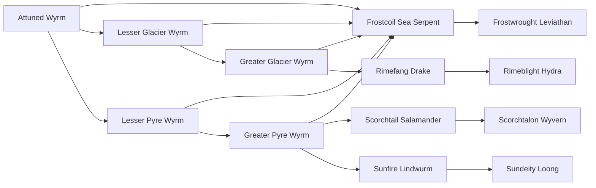

# Scorchtalon Wyvern

<small>[Tensura: Mysticism](../index.md) &rsaquo; [Races](index.md)</small>

| | |
|---|---|
| **ID** | `mysticism:scorchtalon_wyvern` |
| **Stage** | Final |
| **Difficulty** | Hard |
| **Alignment** | Majin |
| **Aura** | 750,000 - 750,000 |
| **Magicule** | 1,500,000 - 1,500,000 |
| **Health bonus** | 780 |
| **Spiritual health bonus** | 3,120 |
| **Attack damage bonus** | 6.5 |
| **Movement speed bonus** | 0.05 |
| **EP to evolve into** | 1,500,000 |

> A dragon monster race that scorches all those who come across it. Even its own kind is not safe from it.

## Evolution

- **Evolves from:** [Scorchtail Salamander](scorchtail-salamander.md)

### Requirements to evolve into Scorchtalon Wyvern

Each requirement adds its weight to the evolution progress bar; you can evolve at 100%.

| Requirement | Weight |
|---|---|
| Reach Existence Points of 1,500,000 | 33.4% |
| Master [Flame Domination](../../tensura-reincarnated/abilities/extra-skills/flame-domination.md) | 33.3% |
| Master [Dragon Skin](../../tensura-reincarnated/abilities/intrinsic-skills/dragon-skin.md) | 33.3% |

### Evolution tree

## Traits

- Divine

## Attribute modifiers

| Attribute | Amount | Operation |
|---|---|---|
| Scale | 1 | add |
| Max Health | 780 | add |
| Max Spiritual Health | 3,120 | add |
| Attack Damage | 6.5 | add |
| Attack Speed | 1 | add |
| Knockback Resistance | 0.1 | add |
| Movement Speed | 0.05 | add |
| Swim Speed Multiplier | 0.05 | add |

## Stats (config defaults)

Set in [`config/mysticism/race/wyrm_config.toml`](../configs/config-mysticism-race-wyrm-config.md).

| Option | Default | Description |
|---|---|---|
| `ScorchtalonWyvern.minAura` | 750,000 | Minimal aura. |
| `ScorchtalonWyvern.maxAura` | 750,000 | Maximum aura. |
| `ScorchtalonWyvern.minMagicule` | 1,500,000 | Minimal magicule. |
| `ScorchtalonWyvern.maxMagicule` | 1,500,000 | Maximum magicule. |
| `ScorchtalonWyvern.size` | 1 | Bonus Size. |
| `ScorchtalonWyvern.maxHealth` | 780 | Bonus Max Health. |
| `ScorchtalonWyvern.maxSpiritualHealth` | 3,120 | Bonus Max Spiritual Health. |
| `ScorchtalonWyvern.attack` | 6.5 | Bonus Attack Damage. |
| `ScorchtalonWyvern.attackSpeed` | 1 | Bonus Attack Speed. |
| `ScorchtalonWyvern.knockbackResistance` | 0.1 | Bonus Knockback Resistance. |
| `ScorchtalonWyvern.movementSpeed` | 0.05 | Bonus Movement Speed. |
| `ScorchtalonWyvern.swimSpeed` | 0.05 | Bonus Swimming Speed Multiplier. |
| `ScorchtalonWyvern.epRequirement` | 1,500,000 | EP requirement to evolve into a Scorhtalon Wyvern. |
| `ScorchtalonWyvern.abilityRequirement` | "tensura:flame_domination" | The first ability needed to evolve into a Scorhtalon Wyvern. |
| `ScorchtalonWyvern.abilityMasteryRequirement` | true | Does the first ability need to be mastered? (true/false) |
| `ScorchtalonWyvern.ability2Requirement` | "tensura:dragon_skin" | The second ability needed to evolve into a Scorhtalon Wyvern. |
| `ScorchtalonWyvern.ability2MasteryRequirement` | true | Does the second ability need to be mastered? (true/false) |
| `ScorchtalonWyvern.flightBoost` | 0.5 | Flight Boost Power. |
| `ScorchtalonWyvern.flightCooldown` | 3 | Flight Boost Cooldown. |
| `ScorchtalonWyvern.intrinsicSkills` | "tensura:flame_attack_resistance", "mysticism:profaned_prominence", "tensura:dragon_skin", "tensura:dragon_eye", "tensura:heat_resistance", "tensura:dragon_mode", "tensura:divine_ki_release" | The list of intrinsic skills that the race gets. |
| `ScorchtailSalamander.minAura` | 100,000 | Minimal aura. |
| `ScorchtailSalamander.maxAura` | 100,000 | Maximum aura. |
| `ScorchtailSalamander.minMagicule` | 150,000 | Minimal magicule. |
| `ScorchtailSalamander.maxMagicule` | 150,000 | Maximum magicule. |
| `ScorchtailSalamander.size` | 0.5 | Bonus Size. |
| `ScorchtailSalamander.maxHealth` | 380 | Bonus Max Health. |
| `ScorchtailSalamander.maxSpiritualHealth` | 1,520 | Bonus Max Spiritual Health. |
| `ScorchtailSalamander.attack` | 4.5 | Bonus Attack Damage. |
| `ScorchtailSalamander.attackSpeed` | 1.8 | Bonus Attack Speed. |
| `ScorchtailSalamander.knockbackResistance` | 0.09 | Bonus Knockback Resistance. |
| `ScorchtailSalamander.movementSpeed` | 0.03 | Bonus Movement Speed. |
| `ScorchtailSalamander.swimSpeed` | 0.03 | Bonus Swimming Speed Multiplier. |
| `ScorchtailSalamander.epRequirement` | 180,000 | EP requirement to evolve into Scorchtail Salamander. |
| `ScorchtailSalamander.abilityRequirement` | "tensura:flame_manipulation" | The first ability needed to evolve into Scorchtail Salamander. |
| `ScorchtailSalamander.abilityMasteryRequirement` | true | Does the ffirst ability need to be mastered? (true/false) |
| `ScorchtailSalamander.ability2Requirement` | "mysticism:profaned_prominence" | The second ability needed to evolve into Scorchtail Salamander. |
| `ScorchtailSalamander.ability2MasteryRequirement` | true | Does the second ability need to be mastered? (true/false) |
| `ScorchtailSalamander.intrinsicSkills` | "tensura:flame_attack_resistance", "mysticism:profaned_prominence", "tensura:dragon_skin", "tensura:dragon_eye", "tensura:heat_resistance" | The list of intrinsic skills that the race gets. |
| `GreaterPyreWyrm.minAura` | 5,000 | Minimal aura. |
| `GreaterPyreWyrm.maxAura` | 8,000 | Maximum aura. |
| `GreaterPyreWyrm.minMagicule` | 5,000 | Minimal magicule. |
| `GreaterPyreWyrm.maxMagicule` | 10,000 | Maximum magicule. |
| `GreaterPyreWyrm.size` | 0.8 | Bonus Size. |
| `GreaterPyreWyrm.maxHealth` | 180 | Bonus Max Health. |
| `GreaterPyreWyrm.maxSpiritualHealth` | 720 | Bonus Max Spiritual Health. |
| `GreaterPyreWyrm.attack` | 1.8 | Bonus Attack Damage. |
| `GreaterPyreWyrm.attackSpeed` | 0.5 | Bonus Attack Speed. |
| `GreaterPyreWyrm.knockbackResistance` | 0.08 | Bonus Knockback Resistance. |
| `GreaterPyreWyrm.movementSpeed` | 0.03 | Bonus Movement Speed. |
| `GreaterPyreWyrm.swimSpeed` | 0.03 | Bonus Swimming Speed Multiplier. |
| `GreaterPyreWyrm.flameEssenceAmount` | 10 | Amount of Flame Essence needed eaten to evolve into a Greater Pyre Wyrm. |
| `GreaterPyreWyrm.epRequirement` | 30,000 | EP requirement to evolve into Greater Pyre Wyrm. |
| `GreaterPyreWyrm.intrinsicSkills` | "tensura:flame_attack_resistance", "mysticism:profaned_prominence" | The list of intrinsic skills that the race gets. |
| `LesserPyreWyrm.minAura` | 1,500 | Minimal aura. |
| `LesserPyreWyrm.maxAura` | 2,000 | Maximum aura. |
| `LesserPyreWyrm.minMagicule` | 2,000 | Minimal magicule. |
| `LesserPyreWyrm.maxMagicule` | 2,500 | Maximum magicule. |
| `LesserPyreWyrm.size` | 0.5 | Bonus Size. |
| `LesserPyreWyrm.maxHealth` | 30 | Bonus Max Health. |
| `LesserPyreWyrm.maxSpiritualHealth` | 120 | Bonus Max Spiritual Health. |
| `LesserPyreWyrm.attack` | 1.5 | Bonus Attack Damage. |
| `LesserPyreWyrm.attackSpeed` | 0.5 | Bonus Attack Speed. |
| `LesserPyreWyrm.knockbackResistance` | 0.04 | Bonus Knockback Resistance. |
| `LesserPyreWyrm.movementSpeed` | 0.03 | Bonus Movement Speed. |
| `LesserPyreWyrm.swimSpeed` | 0.03 | Bonus Swimming Speed Multiplier. |
| `LesserPyreWyrm.flameEssenceAmount` | 1 | Amount of Flame Essence needed eaten to evolve into a Lesser Pyre Wyrm. |
| `LesserPyreWyrm.intrinsicSkills` | "tensura:flame_attack_resistance" | The list of intrinsic skills that the race gets. |
| `AttunedWyrm.minAura` | 500 | Minimal aura. |
| `AttunedWyrm.maxAura` | 1,000 | Maximum aura. |
| `AttunedWyrm.minMagicule` | 1,500 | Minimal magicule. |
| `AttunedWyrm.maxMagicule` | 2,000 | Maximum magicule. |
| `AttunedWyrm.size` | 0.3 | Bonus Size. |
| `AttunedWyrm.maxHealth` | 0 | Bonus Max Health. |
| `AttunedWyrm.maxSpiritualHealth` | 0 | Bonus Max Spiritual Health. |
| `AttunedWyrm.attack` | 1 | Bonus Attack Damage. |
| `AttunedWyrm.attackSpeed` | 0.5 | Bonus Attack Speed. |
| `AttunedWyrm.knockbackResistance` | 1 | Bonus Knockback Resistance. |
| `AttunedWyrm.movementSpeed` | 0 | Bonus Movement Speed. |
| `AttunedWyrm.swimSpeed` | 0 | Bonus Swimming Speed Multiplier. |
| `AttunedWyrm.intrinsicSkills` | [] (empty) | The list of intrinsic skills that the race gets. |

## Tags

`tensura:races/divine`
