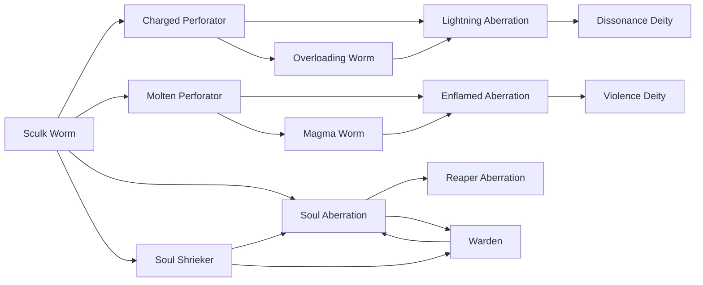

# Sculk Worm

<small>[Tensura: Mysticism](../index.md) &rsaquo; [Races](index.md)</small>

| | |
|---|---|
| **ID** | `mysticism:sculk_worm` |
| **Stage** | Starting |
| **Difficulty** | Extreme |
| **Alignment** | Majin |
| **Aura** | 100 - 250 |
| **Magicule** | 800 - 1,200 |
| **Health bonus** | -12 |
| **Spiritual health bonus** | -4 |
| **Attack damage bonus** | -0.5 |
| **Movement speed bonus** | 0.01 |

> An ancient family of sculk inhabitants, where evolution has given them permanent darkness. Starts off weak, but grows to become a monstrosity.

## Evolution

- **Evolves into:** [Soul Shrieker](soul-shrieker.md), [Molten Perforator](molten-perforator.md), [Charged Perforator](charged-perforator.md)
- **Default evolution:** [Soul Shrieker](soul-shrieker.md)
- **On awakening (True Demon Lord / True Hero):** [Soul Aberration](soul-aberration.md)
- **During the Harvest Festival:** [Soul Shrieker](soul-shrieker.md)

### Evolution tree

## Attribute modifiers

| Attribute | Amount | Operation |
|---|---|---|
| Scale | -0.5 | add |
| Max Health | -12 | add |
| Max Spiritual Health | -4 | add |
| Attack Damage | -0.5 | add |
| Attack Speed | 3.5 | add |
| Knockback Resistance | 0 | add |
| Movement Speed | 0.01 | add |
| Swim Speed Multiplier | 0 | add |

## Stats (config defaults)

Set in [`config/mysticism/race/sculk_config.toml`](../configs/config-mysticism-race-sculk-config.md).

| Option | Default | Description |
|---|---|---|
| `SculkWorm.minAura` | 100 | Minimal aura. |
| `SculkWorm.maxAura` | 250 | Maximum aura. |
| `SculkWorm.minMagicule` | 800 | Minimal magicule. |
| `SculkWorm.maxMagicule` | 1,200 | Maximum magicule. |
| `SculkWorm.size` | -0.5 | Bonus Size. |
| `SculkWorm.maxHealth` | -12 | Bonus Max Health. |
| `SculkWorm.maxSpiritualHealth` | -4 | Bonus Max Spiritual Health. |
| `SculkWorm.attack` | -0.5 | Bonus Attack Damage. |
| `SculkWorm.attackSpeed` | 3.5 | Bonus Attack Speed. |
| `SculkWorm.knockbackResistance` | 0 | Bonus Knockback Resistance. |
| `SculkWorm.movementSpeed` | 0.01 | Bonus Movement Speed. |
| `SculkWorm.swimSpeed` | 0 | Bonus Swimming Speed Multiplier. |
| `SculkWorm.intrinsicSkills` | "tensura:sense_soundwave" | The list of intrinsic skills that the race gets. |
