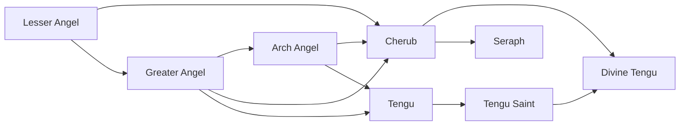

# Seraph

<small>[Tensura: Mysticism](../index.md) &rsaquo; [Races](index.md)</small>

| | |
|---|---|
| **ID** | `mysticism:seraph` |
| **Difficulty** | Easy |
| **Alignment** | Holy |
| **Aura** | 1,000,000 - 1,000,000 |
| **Magicule** | 1,000,000 - 1,000,000 |
| **Health bonus** | 1,060 |
| **Spiritual health bonus** | 6,300 |
| **Attack damage bonus** | 4 |
| **Movement speed bonus** | 0.08 |
| **EP to evolve into** | 140,000 |

> Only the most powerful pure Angels with the most developed ego can attain Divinity.

## Evolution

- **Evolves from:** [Cherub](cherub.md)

### Requirements to evolve into Seraph

Each requirement adds its weight to the evolution progress bar; you can evolve at 100%.

| Requirement | Weight |
|---|---|
| Awaken [True Demon Lord./True Hero.] | 50% |
| Be named | 25% |
| Have a physical body | 25% |

### Evolution tree

## Traits

- Divine
- Has creative-style flight

## Attribute modifiers

| Attribute | Amount | Operation |
|---|---|---|
| Scale | 0 | add |
| Max Health | 1,060 | add |
| Max Spiritual Health | 6,300 | add |
| Attack Damage | 4 | add |
| Attack Speed | 0.7 | add |
| Knockback Resistance | 0.8 | add |
| Movement Speed | 0.08 | add |
| Swim Speed Multiplier | 0.8 | add |

## Stats (config defaults)

Set in [`config/mysticism/race/angel_config.toml`](../configs/config-mysticism-race-angel-config.md).

| Option | Default | Description |
|---|---|---|
| `Seraph.minAura` | 1,000,000 | Minimal aura. |
| `Seraph.maxAura` | 1,000,000 | Maximum aura. |
| `Seraph.minMagicule` | 1,000,000 | Minimal magicule. |
| `Seraph.maxMagicule` | 1,000,000 | Maximum magicule. |
| `Seraph.size` | 0 | Bonus Size. |
| `Seraph.maxHealth` | 1,060 | Bonus Max Health. |
| `Seraph.maxSpiritualHealth` | 6,300 | Bonus Max Spiritual Health. |
| `Seraph.attack` | 4 | Bonus Attack Damage. |
| `Seraph.attackSpeed` | 0.7 | Bonus Attack Speed. |
| `Seraph.knockbackResistance` | 0.8 | Bonus Knockback Resistance. |
| `Seraph.movementSpeed` | 0.08 | Bonus Movement Speed. |
| `Seraph.swimSpeed` | 0.8 | Bonus Swimming Speed Multiplier. |
| `Seraph.intrinsicSkills` | "tensura:magic_resistance", "tensura:possession", "mysticism:light_manipulation", "tensura:physical_attack_resistance", "tensura:holy_attack_resistance", "tensura:divine_ki_release", "mysticism:light_domination" | The list of intrinsic skills that the race gets. |
| `Cherub.minAura` | 205,000 | Minimal aura. |
| `Cherub.maxAura` | 215,000 | Maximum aura. |
| `Cherub.minMagicule` | 175,000 | Minimal magicule. |
| `Cherub.maxMagicule` | 180,000 | Maximum magicule. |
| `Cherub.size` | 0 | Bonus Size. |
| `Cherub.maxHealth` | 620 | Bonus Max Health. |
| `Cherub.maxSpiritualHealth` | 3,702 | Bonus Max Spiritual Health. |
| `Cherub.attack` | 3 | Bonus Attack Damage. |
| `Cherub.attackSpeed` | 0.5 | Bonus Attack Speed. |
| `Cherub.knockbackResistance` | 0.6 | Bonus Knockback Resistance. |
| `Cherub.movementSpeed` | 0.04 | Bonus Movement Speed. |
| `Cherub.swimSpeed` | 0.4 | Bonus Swimming Speed Multiplier. |
| `Cherub.intrinsicSkills` | "tensura:magic_resistance", "tensura:possession", "mysticism:light_manipulation", "tensura:physical_attack_resistance", "tensura:holy_attack_resistance" | The list of intrinsic skills that the race gets. |
| `ArchAngel.epRequirement` | 140,000 | EP requirement to evolve into an Arch Angel. |
| `ArchAngel.minAura` | 100,000 | Minimal aura. |
| `ArchAngel.maxAura` | 105,000 | Maximum aura. |
| `ArchAngel.minMagicule` | 40,000 | Minimal magicule. |
| `ArchAngel.maxMagicule` | 45,000 | Maximum magicule. |
| `ArchAngel.size` | 0 | Bonus Size. |
| `ArchAngel.maxHealth` | 100 | Bonus Max Health. |
| `ArchAngel.maxSpiritualHealth` | 580 | Bonus Max Spiritual Health. |
| `ArchAngel.attack` | 2 | Bonus Attack Damage. |
| `ArchAngel.attackSpeed` | 0.2 | Bonus Attack Speed. |
| `ArchAngel.knockbackResistance` | 0.4 | Bonus Knockback Resistance. |
| `ArchAngel.movementSpeed` | 0.01 | Bonus Movement Speed. |
| `ArchAngel.swimSpeed` | 0.1 | Bonus Swimming Speed Multiplier. |
| `ArchAngel.intrinsicSkills` | "tensura:magic_resistance", "tensura:possession", "mysticism:light_manipulation", "tensura:physical_attack_resistance" | The list of intrinsic skills that the race gets. |
| `GreaterAngel.epRequirement` | 20,000 | EP requirement to evolve into a Greater Angel. |
| `GreaterAngel.minAura` | 35,000 | Minimal aura. |
| `GreaterAngel.maxAura` | 45,000 | Maximum aura. |
| `GreaterAngel.minMagicule` | 15,000 | Minimal magicule. |
| `GreaterAngel.maxMagicule` | 25,000 | Maximum magicule. |
| `GreaterAngel.size` | 0 | Bonus Size. |
| `GreaterAngel.maxHealth` | 60 | Bonus Max Health. |
| `GreaterAngel.maxSpiritualHealth` | 200 | Bonus Max Spiritual Health. |
| `GreaterAngel.attack` | 1 | Bonus Attack Damage. |
| `GreaterAngel.attackSpeed` | 0 | Bonus Attack Speed. |
| `GreaterAngel.knockbackResistance` | 0.2 | Bonus Knockback Resistance. |
| `GreaterAngel.movementSpeed` | 0.02 | Bonus Movement Speed. |
| `GreaterAngel.swimSpeed` | 0.2 | Bonus Swimming Speed Multiplier. |
| `GreaterAngel.intrinsicSkills` | "tensura:magic_resistance", "tensura:possession", "mysticism:light_manipulation" | The list of intrinsic skills that the race gets. |
| `LesserAngel.minAura` | 5,500 | Minimal aura. |
| `LesserAngel.maxAura` | 6,500 | Maximum aura. |
| `LesserAngel.minMagicule` | 1,500 | Minimal magicule. |
| `LesserAngel.maxMagicule` | 3,500 | Maximum magicule. |
| `LesserAngel.size` | 0 | Bonus Size. |
| `LesserAngel.maxHealth` | 20 | Bonus Max Health. |
| `LesserAngel.maxSpiritualHealth` | 90 | Bonus Max Spiritual Health. |
| `LesserAngel.attack` | 0.4 | Bonus Attack Damage. |
| `LesserAngel.attackSpeed` | 0 | Bonus Attack Speed. |
| `LesserAngel.knockbackResistance` | 0.1 | Bonus Knockback Resistance. |
| `LesserAngel.movementSpeed` | 0.01 | Bonus Movement Speed. |
| `LesserAngel.swimSpeed` | 0 | Bonus Swimming Speed Multiplier. |
| `LesserAngel.intrinsicSkills` | "tensura:magic_resistance", "tensura:possession", "mysticism:light_manipulation" | The list of intrinsic skills that the race gets. |

## Tags

`tensura:races/divine`, `tensura:races/has_creative_flight`
