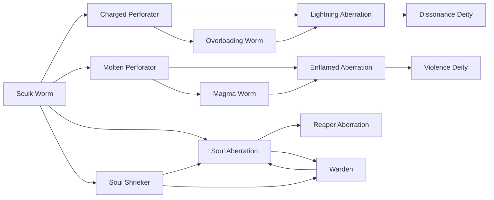

# Soul Shrieker

<small>[Tensura: Mysticism](../index.md) &rsaquo; [Races](index.md)</small>

| | |
|---|---|
| **ID** | `mysticism:soul_shrieker` |
| **Stage** | In-between |
| **Difficulty** | Extreme |
| **Alignment** | Majin |
| **Aura** | 1,500 - 1,500 |
| **Magicule** | 2,500 - 2,500 |
| **Health bonus** | 4 |
| **Spiritual health bonus** | 28 |
| **Attack damage bonus** | 1 |
| **Movement speed bonus** | 0.02 |
| **EP to evolve into** | 4,000 |

> A sculk worm has tapped into their inner potential as a sculk inhabitant, and learned how to utilize its sound-based organs to fire projectiles.

## Evolution

- **Evolves from:** [Sculk Worm](sculk-worm.md)
- **Evolves into:** [Warden](warden.md)
- **Default evolution:** [Warden](warden.md)
- **On awakening (True Demon Lord / True Hero):** [Soul Aberration](soul-aberration.md)
- **During the Harvest Festival:** [Warden](warden.md)

### Requirements to evolve into Soul Shrieker

Each requirement adds its weight to the evolution progress bar; you can evolve at 100%.

| Requirement | Weight |
|---|---|
| Reach Existence Points of 4,000 | 100% |

### Evolution tree

## Attribute modifiers

| Attribute | Amount | Operation |
|---|---|---|
| Scale | -0.25 | add |
| Max Health | 4 | add |
| Max Spiritual Health | 28 | add |
| Attack Damage | 1 | add |
| Attack Speed | 3.5 | add |
| Knockback Resistance | 0.2 | add |
| Movement Speed | 0.02 | add |
| Swim Speed Multiplier | 0.2 | add |

## Stats (config defaults)

Set in [`config/mysticism/race/sculk_config.toml`](../configs/config-mysticism-race-sculk-config.md).

| Option | Default | Description |
|---|---|---|
| `SoulShrieker.epRequirement` | 4,000 | EP requirement to evolve into a Soul Shrieker. |
| `SoulShrieker.minAura` | 1,500 | Minimal aura. |
| `SoulShrieker.maxAura` | 1,500 | Maximum aura. |
| `SoulShrieker.minMagicule` | 2,500 | Minimal magicule. |
| `SoulShrieker.maxMagicule` | 2,500 | Maximum magicule. |
| `SoulShrieker.size` | -0.25 | Bonus Size. |
| `SoulShrieker.maxHealth` | 4 | Bonus Max Health. |
| `SoulShrieker.maxSpiritualHealth` | 28 | Bonus Max Spiritual Health. |
| `SoulShrieker.attack` | 1 | Bonus Attack Damage. |
| `SoulShrieker.attackSpeed` | 3.5 | Bonus Attack Speed. |
| `SoulShrieker.knockbackResistance` | 0.2 | Bonus Knockback Resistance. |
| `SoulShrieker.movementSpeed` | 0.02 | Bonus Movement Speed. |
| `SoulShrieker.swimSpeed` | 0.2 | Bonus Swimming Speed Multiplier. |
| `SoulShrieker.intrinsicSkills` | "tensura:sense_soundwave", "tensura:pain_resistance", "tensura:ultrasonic_waves" | The list of intrinsic skills that the race gets. |
| `SculkWorm.minAura` | 100 | Minimal aura. |
| `SculkWorm.maxAura` | 250 | Maximum aura. |
| `SculkWorm.minMagicule` | 800 | Minimal magicule. |
| `SculkWorm.maxMagicule` | 1,200 | Maximum magicule. |
| `SculkWorm.size` | -0.5 | Bonus Size. |
| `SculkWorm.maxHealth` | -12 | Bonus Max Health. |
| `SculkWorm.maxSpiritualHealth` | -4 | Bonus Max Spiritual Health. |
| `SculkWorm.attack` | -0.5 | Bonus Attack Damage. |
| `SculkWorm.attackSpeed` | 3.5 | Bonus Attack Speed. |
| `SculkWorm.knockbackResistance` | 0 | Bonus Knockback Resistance. |
| `SculkWorm.movementSpeed` | 0.01 | Bonus Movement Speed. |
| `SculkWorm.swimSpeed` | 0 | Bonus Swimming Speed Multiplier. |
| `SculkWorm.intrinsicSkills` | "tensura:sense_soundwave" | The list of intrinsic skills that the race gets. |
