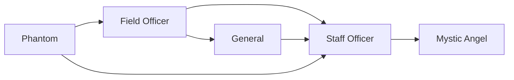

# Staff Officer

<small>[Tensura: Mysticism](../index.md) &rsaquo; [Races](index.md)</small>

| | |
|---|---|
| **ID** | `mysticism:staff_officer` |
| **Difficulty** | Hard |
| **Alignment** | Chaos |
| **Aura** | 455,000 - 460,000 |
| **Magicule** | 505,000 - 510,000 |
| **Health bonus** | 600 |
| **Spiritual health bonus** | 3,650 |
| **Attack damage bonus** | 3 |
| **Movement speed bonus** | 0.04 |
| **EP to evolve into** | 800,000 |

> A high graded officer of the Phantom army.

## Evolution

- **Evolves from:** [General](general.md), [Phantom](phantom.md), [Field Officer](field-officer.md)
- **Evolves into:** [Mystic Angel](mystic-angel.md)
- **Default evolution:** [Mystic Angel](mystic-angel.md)
- **On awakening (True Demon Lord / True Hero):** [Mystic Angel](mystic-angel.md)

### Requirements to evolve into Staff Officer

Each requirement adds its weight to the evolution progress bar; you can evolve at 100%.

| Requirement | Weight |
|---|---|
| Reach Existence Points of 800,000 | 100% |

### Evolution tree

## Traits

- Has creative-style flight
- Spiritual lifeform

## Attribute modifiers

| Attribute | Amount | Operation |
|---|---|---|
| Scale | 0 | add |
| Max Health | 600 | add |
| Max Spiritual Health | 3,650 | add |
| Attack Damage | 3 | add |
| Attack Speed | 0.5 | add |
| Knockback Resistance | 0.6 | add |
| Movement Speed | 0.04 | add |
| Swim Speed Multiplier | 0.4 | add |

## Stats (config defaults)

Set in [`config/mysticism/race/phantom_config.toml`](../configs/config-mysticism-race-phantom-config.md).

| Option | Default | Description |
|---|---|---|
| `StaffOfficer.essenceRequired` | 7 | Quantity of cryptid essence required to become a staff officer as a cherub. |
| `StaffOfficer.epRequirement` | 800,000 | EP requirement to evolve into a Staff Officer. |
| `StaffOfficer.minAura` | 455,000 | Minimal aura. |
| `StaffOfficer.maxAura` | 460,000 | Maximum aura. |
| `StaffOfficer.minMagicule` | 505,000 | Minimal magicule. |
| `StaffOfficer.maxMagicule` | 510,000 | Maximum magicule. |
| `StaffOfficer.size` | 0 | Bonus Size. |
| `StaffOfficer.maxHealth` | 600 | Bonus Max Health. |
| `StaffOfficer.maxSpiritualHealth` | 3,650 | Bonus Max Spiritual Health. |
| `StaffOfficer.attack` | 3 | Bonus Attack Damage. |
| `StaffOfficer.attackSpeed` | 0.5 | Bonus Attack Speed. |
| `StaffOfficer.knockbackResistance` | 0.6 | Bonus Knockback Resistance. |
| `StaffOfficer.movementSpeed` | 0.04 | Bonus Movement Speed. |
| `StaffOfficer.swimSpeed` | 0.4 | Bonus Swimming Speed Multiplier. |
| `StaffOfficer.intrinsicSkills` | "tensura:magic_resistance", "tensura:possession", "tensura:physical_attack_resistance" | The list of intrinsic skills that the race gets. |
| `General.essenceRequired` | 5 | Quantity of cryptid essence required to become a general as an arch angel. |
| `General.epRequirement` | 160,000 | EP requirement to evolve into a General. |
| `General.minAura` | 80,000 | Minimal aura. |
| `General.maxAura` | 85,000 | Maximum aura. |
| `General.minMagicule` | 155,000 | Minimal magicule. |
| `General.maxMagicule` | 160,000 | Maximum magicule. |
| `General.size` | 0 | Bonus Size. |
| `General.maxHealth` | 80 | Bonus Max Health. |
| `General.maxSpiritualHealth` | 540 | Bonus Max Spiritual Health. |
| `General.attack` | 2 | Bonus Attack Damage. |
| `General.attackSpeed` | 0.2 | Bonus Attack Speed. |
| `General.knockbackResistance` | 0.4 | Bonus Knockback Resistance. |
| `General.movementSpeed` | 0.01 | Bonus Movement Speed. |
| `General.swimSpeed` | 0.1 | Bonus Swimming Speed Multiplier. |
| `General.intrinsicSkills` | "tensura:magic_resistance", "tensura:possession", "tensura:physical_attack_resistance" | The list of intrinsic skills that the race gets. |
| `FieldOfficer.essenceRequired` | 3 | Quantity of cryptid essence required to become a field officer as a greater angel. |
| `FieldOfficer.epRequirement` | 20,000 | EP requirement to evolve into a field officer. |
| `FieldOfficer.minAura` | 15,000 | Minimal aura. |
| `FieldOfficer.maxAura` | 25,000 | Maximum aura. |
| `FieldOfficer.minMagicule` | 25,000 | Minimal magicule. |
| `FieldOfficer.maxMagicule` | 30,000 | Maximum magicule. |
| `FieldOfficer.size` | 0 | Bonus Size. |
| `FieldOfficer.maxHealth` | 50 | Bonus Max Health. |
| `FieldOfficer.maxSpiritualHealth` | 150 | Bonus Max Spiritual Health. |
| `FieldOfficer.attack` | 1 | Bonus Attack Damage. |
| `FieldOfficer.attackSpeed` | 0 | Bonus Attack Speed. |
| `FieldOfficer.knockbackResistance` | 0.2 | Bonus Knockback Resistance. |
| `FieldOfficer.movementSpeed` | 0.02 | Bonus Movement Speed. |
| `FieldOfficer.swimSpeed` | 0.2 | Bonus Swimming Speed Multiplier. |
| `FieldOfficer.intrinsicSkills` | "tensura:magic_resistance", "tensura:possession" | The list of intrinsic skills that the race gets. |
| `Phantom.essenceRequired` | 1 | Quantity of cryptid essence required to become a phantom as a lesser angel. |
| `Phantom.minAura` | 2,500 | Minimal aura. |
| `Phantom.maxAura` | 3,500 | Maximum aura. |
| `Phantom.minMagicule` | 5,500 | Minimal magicule. |
| `Phantom.maxMagicule` | 6,500 | Maximum magicule. |
| `Phantom.size` | 0 | Bonus Size. |
| `Phantom.maxHealth` | 15 | Bonus Max Health. |
| `Phantom.maxSpiritualHealth` | 70 | Bonus Max Spiritual Health. |
| `Phantom.attack` | 0.3 | Bonus Attack Damage. |
| `Phantom.attackSpeed` | 0 | Bonus Attack Speed. |
| `Phantom.knockbackResistance` | 0.1 | Bonus Knockback Resistance. |
| `Phantom.movementSpeed` | 0.01 | Bonus Movement Speed. |
| `Phantom.swimSpeed` | 0 | Bonus Swimming Speed Multiplier. |
| `Phantom.intrinsicSkills` | "tensura:magic_resistance", "tensura:possession" | The list of intrinsic skills that the race gets. |

## Tags

`tensura:races/has_creative_flight`, `tensura:races/spiritual`
