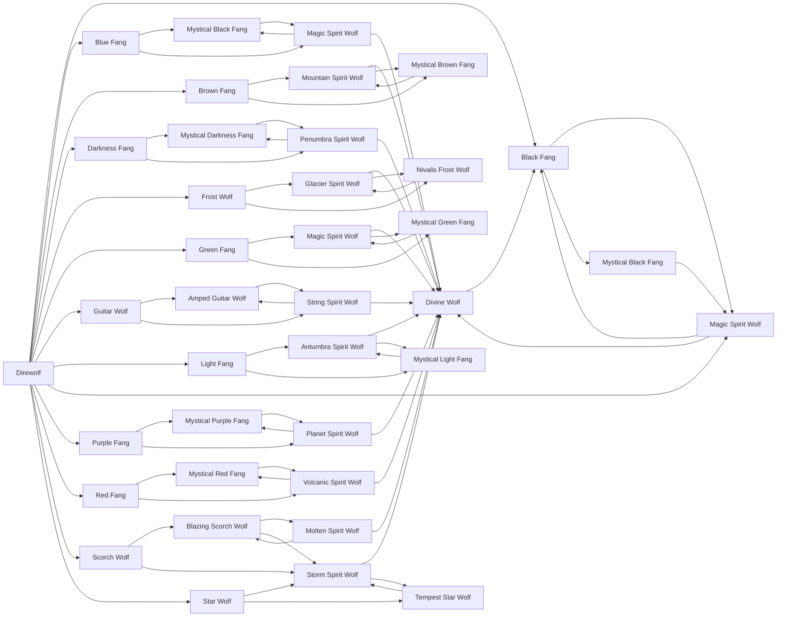

# Tempest Star Wolf

<small>[Tensura: Mysticism](../index.md) &rsaquo; [Races](index.md)</small>

| | |
|---|---|
| **ID** | `mysticism:tempest_star_wolf` |
| **Difficulty** | Easy |
| **Alignment** | Majin |
| **Aura** | 125,000 - 125,000 |
| **Magicule** | 125,000 - 125,000 |
| **Health bonus** | 380 |
| **Spiritual health bonus** | 2,320 |
| **Attack damage bonus** | 3 |
| **Movement speed bonus** | 0.03 |
| **EP to evolve into** | 200,000 |

> An evolved Star Wolf that has a deep connection to storms. It can create storms without a care, typically being a highly-feared and regarded monster.

## Evolution

- **Evolves from:** [Star Wolf](star-wolf.md), [Storm Spirit Wolf](storm-spirit-wolf.md)
- **Evolves into:** [Storm Spirit Wolf](storm-spirit-wolf.md)
- **Default evolution:** [Storm Spirit Wolf](storm-spirit-wolf.md)
- **On awakening (True Demon Lord / True Hero):** [Storm Spirit Wolf](storm-spirit-wolf.md)

### Requirements to evolve into Tempest Star Wolf

Each requirement adds its weight to the evolution progress bar; you can evolve at 100%.

| Requirement | Weight |
|---|---|
| Reach Existence Points of 200,000 | 25% |
| Master [Water Manipulation](../../tensura-reincarnated/abilities/extra-skills/water-manipulation.md) | 25% |
| Master [Wind Manipulation](../../tensura-reincarnated/abilities/extra-skills/wind-manipulation.md) | 25% |
| Master [Spatial Manipulation](../../tensura-reincarnated/abilities/extra-skills/spatial-manipulation.md) | 25% |

### Evolution tree

## Attribute modifiers

| Attribute | Amount | Operation |
|---|---|---|
| Step Height | 0.5 | add |
| Scale | 0 | add |
| Max Health | 380 | add |
| Max Spiritual Health | 2,320 | add |
| Attack Damage | 3 | add |
| Attack Speed | 0 | add |
| Knockback Resistance | 0.1 | add |
| Movement Speed | 0.03 | add |
| Swim Speed Multiplier | 0.3 | add |

## Stats (config defaults)

Set in [`config/mysticism/race/direwolf/special_direwolf_config.toml`](../configs/config-mysticism-race-direwolf-special-direwolf-config.md).

| Option | Default | Description |
|---|---|---|
| `TempestStarWolf.epRequirement` | 200,000 | EP requirement to evolve into Tempest Star Wolf. |
| `TempestStarWolf.abilityRequirement1` | "tensura:water_manipulation" | The first ability that needs to be mastered to evolve into Tempest Star Wolf. |
| `TempestStarWolf.abilityMasteryRequirement1` | true | Does the first ability need to be mastered? (true/false) |
| `TempestStarWolf.abilityRequirement2` | "tensura:wind_manipulation" | The second ability that needs to be mastered to evolve into Tempest Star Wolf. |
| `TempestStarWolf.abilityMasteryRequirement2` | true | Does the second ability need to be mastered? (true/false) |
| `TempestStarWolf.abilityRequirement3` | "tensura:spatial_manipulation" | The third ability that needs to be mastered to evolve into Tempest Star Wolf. |
| `TempestStarWolf.abilityMasteryRequirement3` | true | Does the third ability need to be mastered? (true/false) |
| `TempestStarWolf.minAura` | 125,000 | Minimal aura. |
| `TempestStarWolf.maxAura` | 125,000 | Maximum aura. |
| `TempestStarWolf.minMagicule` | 125,000 | Minimal magicule. |
| `TempestStarWolf.maxMagicule` | 125,000 | Maximum magicule. |
| `TempestStarWolf.size` | 0 | Bonus Size. |
| `TempestStarWolf.maxHealth` | 380 | Bonus Max Health. |
| `TempestStarWolf.maxSpiritualHealth` | 2,320 | Bonus Max Spiritual Health. |
| `TempestStarWolf.attack` | 3 | Bonus Attack Damage. |
| `TempestStarWolf.attackSpeed` | 0 | Bonus Attack Speed. |
| `TempestStarWolf.knockbackResistance` | 0.1 | Bonus Knockback Resistance. |
| `TempestStarWolf.movementSpeed` | 0.03 | Bonus Movement Speed. |
| `TempestStarWolf.swimSpeed` | 0.3 | Bonus Swimming Speed Multiplier. |
| `TempestStarWolf.stepHeight` | 0.5 | Bonus Step Height. |
| `TempestStarWolf.intrinsicSkills` | "tensura:thought_communication", "tensura:shadow_motion", "tensura:coercion", "tensura:water_manipulation", "tensura:wind_manipulation", "tensura:spatial_manipulation", "tensura:godwolf_sense", "tensura:ultra_instinct", "tensura:black_lightning", "tensura:lightning_manipulation" | The list of intrinsic skills that the race gets. |
| `StarWolf.epRequirement` | 10,000 | EP requirement to evolve into Star Wolf. |
| `StarWolf.abilityRequirement1` | "tensura:water_manipulation" | The first ability that needs to be mastered to evolve into Star Wolf. |
| `StarWolf.abilityMasteryRequirement1` | false | Does the first ability need to be mastered? (true/false) |
| `StarWolf.abilityRequirement2` | "tensura:wind_manipulation" | The second ability that needs to be mastered to evolve into Star Wolf. |
| `StarWolf.abilityMasteryRequirement2` | false | Does the second ability need to be mastered? (true/false) |
| `StarWolf.abilityRequirement3` | "tensura:spatial_manipulation" | The third ability that needs to be mastered to evolve into Star Wolf. |
| `StarWolf.abilityMasteryRequirement3` | false | Does the third ability need to be mastered? (true/false) |
| `StarWolf.heightRequirement` | 120 | The height requirement to evolve into Star Wolf. |
| `StarWolf.minAura` | 5,250 | Minimal aura. |
| `StarWolf.maxAura` | 5,250 | Maximum aura. |
| `StarWolf.minMagicule` | 5,250 | Minimal magicule. |
| `StarWolf.maxMagicule` | 5,250 | Maximum magicule. |
| `StarWolf.size` | 0 | Bonus Size. |
| `StarWolf.maxHealth` | 25 | Bonus Max Health. |
| `StarWolf.maxSpiritualHealth` | 265 | Bonus Max Spiritual Health. |
| `StarWolf.attack` | 3 | Bonus Attack Damage. |
| `StarWolf.attackSpeed` | 0.1 | Bonus Attack Speed. |
| `StarWolf.knockbackResistance` | 0 | Bonus Knockback Resistance. |
| `StarWolf.movementSpeed` | 0.0275 | Bonus Movement Speed. |
| `StarWolf.swimSpeed` | 0.1 | Bonus Swimming Speed Multiplier. |
| `StarWolf.stepHeight` | 0.5 | Bonus Step Height. |
| `StarWolf.intrinsicSkills` | "tensura:thought_communication", "tensura:shadow_motion", "tensura:coercion", "tensura:water_manipulation", "tensura:wind_manipulation", "tensura:spatial_manipulation" | The list of intrinsic skills that the race gets. |

Set in [`config/mysticism/race/direwolf/direwolf_config.toml`](../configs/config-mysticism-race-direwolf-direwolf-config.md).

| Option | Default | Description |
|---|---|---|
| `Direwolf.minAura` | 1,834 | Minimal aura. |
| `Direwolf.maxAura` | 2,166 | Maximum aura. |
| `Direwolf.minMagicule` | 1,833 | Minimal magicule. |
| `Direwolf.maxMagicule` | 2,167 | Maximum magicule. |
| `Direwolf.size` | -0.25 | Bonus Size. |
| `Direwolf.maxHealth` | 6 | Bonus Max Health. |
| `Direwolf.maxSpiritualHealth` | 35 | Bonus Max Spiritual Health. |
| `Direwolf.attack` | 3 | Bonus Attack Damage. |
| `Direwolf.attackSpeed` | 0 | Bonus Attack Speed. |
| `Direwolf.knockbackResistance` | 0 | Bonus Knockback Resistance. |
| `Direwolf.movementSpeed` | 0.025 | Bonus Movement Speed. |
| `Direwolf.swimSpeed` | 0.1 | Bonus Swimming Speed Multiplier. |
| `Direwolf.stepHeight` | 0.5 | Bonus Step Height. |
| `Direwolf.intrinsicSkills` | "tensura:thought_communication", "tensura:shadow_motion", "tensura:coercion" | The list of intrinsic skills that the race gets. |
