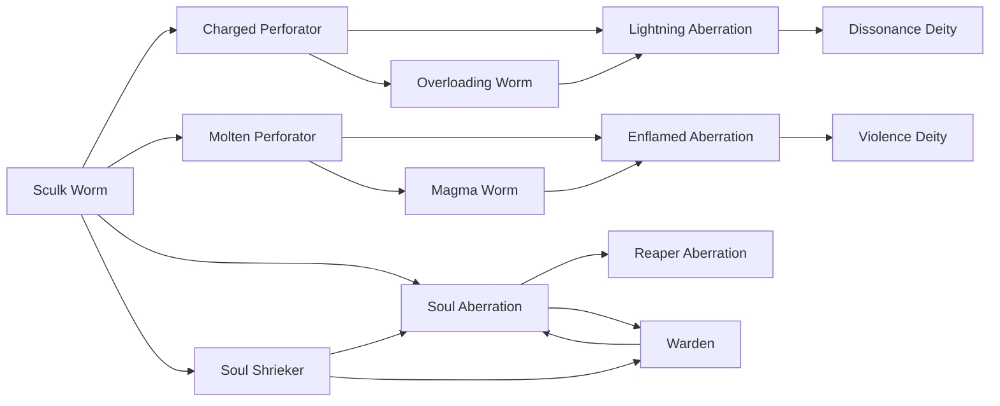

# Violence Deity

<small>[Tensura: Mysticism](../index.md) &rsaquo; [Races](index.md)</small>

| | |
|---|---|
| **ID** | `mysticism:violence_deity` |
| **Stage** | Final |
| **Difficulty** | Extreme |
| **Alignment** | Majin |
| **Aura** | 1,000,000 - 1,000,000 |
| **Magicule** | 1,000,000 - 1,000,000 |
| **Health bonus** | 980 |
| **Spiritual health bonus** | 6,800 |
| **Attack damage bonus** | 3 |
| **Movement speed bonus** | 0.035 |
| **EP to evolve into** | 2,000,000 |

> What was once a sculk worm has truly disappeared. This is a monstrosity and there is no going back. It has achieved divinity, possessing an immortal physical body that will never age.

## Evolution

- **Evolves from:** [Enflamed Aberration](enflamed-aberration.md)

### Requirements to evolve into Violence Deity

Each requirement adds its weight to the evolution progress bar; you can evolve at 100%.

| Requirement | Weight |
|---|---|
| Reach Existence Points of 2,000,000 | 50% |
| Consume 30 of [Flame Essence](../items/materials/flame-essence.md) | 50% |

### Evolution tree

## Traits

- Divine
- Spiritual lifeform

## Attribute modifiers

| Attribute | Amount | Operation |
|---|---|---|
| Scale | 0.5 | add |
| Max Health | 980 | add |
| Max Spiritual Health | 6,800 | add |
| Attack Damage | 3 | add |
| Attack Speed | 0.5 | add |
| Knockback Resistance | 1 | add |
| Movement Speed | 0.035 | add |
| Swim Speed Multiplier | 0.4 | add |

## Stats (config defaults)

Set in [`config/mysticism/race/sculk_config.toml`](../configs/config-mysticism-race-sculk-config.md).

| Option | Default | Description |
|---|---|---|
| `ViolenceDeity.essenceRequired` | 30 | Quantity of Flame Essence required to become a Violence Deity as an Enflamed Aberration. |
| `ViolenceDeity.epRequirement` | 2,000,000 | EP requirement to evolve into a Violence Deity. |
| `ViolenceDeity.minAura` | 1,000,000 | Minimal aura. |
| `ViolenceDeity.maxAura` | 1,000,000 | Maximum aura. |
| `ViolenceDeity.minMagicule` | 1,000,000 | Minimal magicule. |
| `ViolenceDeity.maxMagicule` | 1,000,000 | Maximum magicule. |
| `ViolenceDeity.size` | 0.5 | Bonus Size. |
| `ViolenceDeity.maxHealth` | 980 | Bonus Max Health. |
| `ViolenceDeity.maxSpiritualHealth` | 6,800 | Bonus Max Spiritual Health. |
| `ViolenceDeity.attack` | 3 | Bonus Attack Damage. |
| `ViolenceDeity.attackSpeed` | 0.5 | Bonus Attack Speed. |
| `ViolenceDeity.knockbackResistance` | 1 | Bonus Knockback Resistance. |
| `ViolenceDeity.movementSpeed` | 0.035 | Bonus Movement Speed. |
| `ViolenceDeity.swimSpeed` | 0.4 | Bonus Swimming Speed Multiplier. |
| `ViolenceDeity.intrinsicSkills` | "tensura:sense_soundwave", "tensura:heat_resistance", "tensura:flame_breath", "tensura:heat_wave", "mysticism:hell_hall", "tensura:divine_ki_release" | The list of intrinsic skills that the race gets. |
| `EnflamedAberration.essenceRequired` | 20 | Quantity of Flame Essence required to become a Enflamed Aberration as a Magma Worm. |
| `EnflamedAberration.epRequirement` | 400,000 | EP requirement to evolve into an Enflamed Aberration. |
| `EnflamedAberration.minAura` | 400,000 | Minimal aura. |
| `EnflamedAberration.maxAura` | 400,000 | Maximum aura. |
| `EnflamedAberration.minMagicule` | 400,000 | Minimal magicule. |
| `EnflamedAberration.maxMagicule` | 400,000 | Maximum magicule. |
| `EnflamedAberration.size` | 0.5 | Bonus Size. |
| `EnflamedAberration.maxHealth` | 580 | Bonus Max Health. |
| `EnflamedAberration.maxSpiritualHealth` | 580 | Bonus Max Spiritual Health. |
| `EnflamedAberration.attack` | 4 | Bonus Attack Damage. |
| `EnflamedAberration.attackSpeed` | 0.2 | Bonus Attack Speed. |
| `EnflamedAberration.knockbackResistance` | 0.6 | Bonus Knockback Resistance. |
| `EnflamedAberration.movementSpeed` | 0.025 | Bonus Movement Speed. |
| `EnflamedAberration.swimSpeed` | 0.25 | Bonus Swimming Speed Multiplier. |
| `EnflamedAberration.intrinsicSkills` | "tensura:sense_soundwave", "tensura:heat_resistance", "tensura:flame_breath", "tensura:heat_wave", "mysticism:hell_hall" | The list of intrinsic skills that the race gets. |
| `MagmaWorm.essenceRequired` | 10 | Quantity of Flame Essence required to become a Magma Worm as a Molten Perforator. |
| `MagmaWorm.epRequirement` | 100,000 | EP requirement to evolve into Magma Worm. |
| `MagmaWorm.minAura` | 75,000 | Minimal aura. |
| `MagmaWorm.maxAura` | 75,000 | Maximum aura. |
| `MagmaWorm.minMagicule` | 75,000 | Minimal magicule. |
| `MagmaWorm.maxMagicule` | 75,000 | Maximum magicule. |
| `MagmaWorm.size` | 0.5 | Bonus Size. |
| `MagmaWorm.maxHealth` | 100 | Bonus Max Health. |
| `MagmaWorm.maxSpiritualHealth` | 300 | Bonus Max Spiritual Health. |
| `MagmaWorm.attack` | 2 | Bonus Attack Damage. |
| `MagmaWorm.attackSpeed` | 0 | Bonus Attack Speed. |
| `MagmaWorm.knockbackResistance` | 0.4 | Bonus Knockback Resistance. |
| `MagmaWorm.movementSpeed` | 0.02 | Bonus Movement Speed. |
| `MagmaWorm.swimSpeed` | 0.2 | Bonus Swimming Speed Multiplier. |
| `MagmaWorm.intrinsicSkills` | "tensura:sense_soundwave", "tensura:heat_resistance", "tensura:flame_breath" | The list of intrinsic skills that the race gets. |
| `MoltenPerforator.essenceRequired` | 3 | Quantity of Flame Essence required to become a Molten Perforator as a Sculk Worm. |
| `MoltenPerforator.epRequirement` | 4,000 | EP requirement to evolve into Magma Worm. |
| `MoltenPerforator.minAura` | 4,500 | Minimal aura. |
| `MoltenPerforator.maxAura` | 5,500 | Maximum aura. |
| `MoltenPerforator.minMagicule` | 5,500 | Minimal magicule. |
| `MoltenPerforator.maxMagicule` | 7,500 | Maximum magicule. |
| `MoltenPerforator.size` | 0 | Bonus Size. |
| `MoltenPerforator.maxHealth` | 30 | Bonus Max Health. |
| `MoltenPerforator.maxSpiritualHealth` | 90 | Bonus Max Spiritual Health. |
| `MoltenPerforator.attack` | 0.4 | Bonus Attack Damage. |
| `MoltenPerforator.attackSpeed` | 0 | Bonus Attack Speed. |
| `MoltenPerforator.knockbackResistance` | 0.1 | Bonus Knockback Resistance. |
| `MoltenPerforator.movementSpeed` | 0.005 | Bonus Movement Speed. |
| `MoltenPerforator.swimSpeed` | 0 | Bonus Swimming Speed Multiplier. |
| `MoltenPerforator.intrinsicSkills` | "tensura:sense_soundwave", "tensura:heat_resistance", "tensura:flame_breath" | The list of intrinsic skills that the race gets. |
| `SculkWorm.minAura` | 100 | Minimal aura. |
| `SculkWorm.maxAura` | 250 | Maximum aura. |
| `SculkWorm.minMagicule` | 800 | Minimal magicule. |
| `SculkWorm.maxMagicule` | 1,200 | Maximum magicule. |
| `SculkWorm.size` | -0.5 | Bonus Size. |
| `SculkWorm.maxHealth` | -12 | Bonus Max Health. |
| `SculkWorm.maxSpiritualHealth` | -4 | Bonus Max Spiritual Health. |
| `SculkWorm.attack` | -0.5 | Bonus Attack Damage. |
| `SculkWorm.attackSpeed` | 3.5 | Bonus Attack Speed. |
| `SculkWorm.knockbackResistance` | 0 | Bonus Knockback Resistance. |
| `SculkWorm.movementSpeed` | 0.01 | Bonus Movement Speed. |
| `SculkWorm.swimSpeed` | 0 | Bonus Swimming Speed Multiplier. |
| `SculkWorm.intrinsicSkills` | "tensura:sense_soundwave" | The list of intrinsic skills that the race gets. |

## Tags

`tensura:races/divine`, `tensura:races/spiritual`
