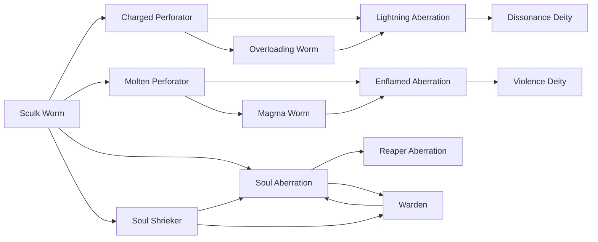

# Warden

<small>[Tensura: Mysticism](../index.md) &rsaquo; [Races](index.md)</small>

| | |
|---|---|
| **ID** | `mysticism:warden` |
| **Difficulty** | Extreme |
| **Alignment** | Majin |
| **Aura** | 35,000 - 35,000 |
| **Magicule** | 65,000 - 65,000 |
| **Health bonus** | 480 |
| **Spiritual health bonus** | 980 |
| **Attack damage bonus** | 7 |
| **Movement speed bonus** | 0.025 |
| **EP to evolve into** | 50,000 |

> Wardens are terrible creatures that inhabit the Deep Dark, always waiting and always ready to strike.

## Evolution

- **Evolves from:** [Soul Shrieker](soul-shrieker.md), [Soul Aberration](soul-aberration.md)
- **Evolves into:** [Soul Aberration](soul-aberration.md)
- **Default evolution:** [Soul Aberration](soul-aberration.md)
- **On awakening (True Demon Lord / True Hero):** [Soul Aberration](soul-aberration.md)

### Requirements to evolve into Warden

Each requirement adds its weight to the evolution progress bar; you can evolve at 100%.

| Requirement | Weight |
|---|---|
| Reach Existence Points of 50,000 | 100% |

### Evolution tree

## Attribute modifiers

| Attribute | Amount | Operation |
|---|---|---|
| Scale | 0.5 | add |
| Max Health | 480 | add |
| Max Spiritual Health | 980 | add |
| Attack Damage | 7 | add |
| Attack Speed | 2.5 | add |
| Knockback Resistance | 0.5 | add |
| Movement Speed | 0.025 | add |
| Swim Speed Multiplier | 0.1 | add |

## Stats (config defaults)

Set in [`config/mysticism/race/sculk_config.toml`](../configs/config-mysticism-race-sculk-config.md).

| Option | Default | Description |
|---|---|---|
| `Warden.epRequirement` | 50,000 | EP requirement to evolve into a Warden. |
| `Warden.minAura` | 35,000 | Minimal aura. |
| `Warden.maxAura` | 35,000 | Maximum aura. |
| `Warden.minMagicule` | 65,000 | Minimal magicule. |
| `Warden.maxMagicule` | 65,000 | Maximum magicule. |
| `Warden.size` | 0.5 | Bonus Size. |
| `Warden.maxHealth` | 480 | Bonus Max Health. |
| `Warden.maxSpiritualHealth` | 980 | Bonus Max Spiritual Health. |
| `Warden.attack` | 7 | Bonus Attack Damage. |
| `Warden.attackSpeed` | 2.5 | Bonus Attack Speed. |
| `Warden.knockbackResistance` | 0.5 | Bonus Knockback Resistance. |
| `Warden.movementSpeed` | 0.025 | Bonus Movement Speed. |
| `Warden.swimSpeed` | 0.1 | Bonus Swimming Speed Multiplier. |
| `Warden.intrinsicSkills` | "tensura:sense_soundwave", "tensura:pain_resistance", "tensura:ultrasonic_waves" | The list of intrinsic skills that the race gets. |
| `SoulShrieker.epRequirement` | 4,000 | EP requirement to evolve into a Soul Shrieker. |
| `SoulShrieker.minAura` | 1,500 | Minimal aura. |
| `SoulShrieker.maxAura` | 1,500 | Maximum aura. |
| `SoulShrieker.minMagicule` | 2,500 | Minimal magicule. |
| `SoulShrieker.maxMagicule` | 2,500 | Maximum magicule. |
| `SoulShrieker.size` | -0.25 | Bonus Size. |
| `SoulShrieker.maxHealth` | 4 | Bonus Max Health. |
| `SoulShrieker.maxSpiritualHealth` | 28 | Bonus Max Spiritual Health. |
| `SoulShrieker.attack` | 1 | Bonus Attack Damage. |
| `SoulShrieker.attackSpeed` | 3.5 | Bonus Attack Speed. |
| `SoulShrieker.knockbackResistance` | 0.2 | Bonus Knockback Resistance. |
| `SoulShrieker.movementSpeed` | 0.02 | Bonus Movement Speed. |
| `SoulShrieker.swimSpeed` | 0.2 | Bonus Swimming Speed Multiplier. |
| `SoulShrieker.intrinsicSkills` | "tensura:sense_soundwave", "tensura:pain_resistance", "tensura:ultrasonic_waves" | The list of intrinsic skills that the race gets. |
| `SculkWorm.minAura` | 100 | Minimal aura. |
| `SculkWorm.maxAura` | 250 | Maximum aura. |
| `SculkWorm.minMagicule` | 800 | Minimal magicule. |
| `SculkWorm.maxMagicule` | 1,200 | Maximum magicule. |
| `SculkWorm.size` | -0.5 | Bonus Size. |
| `SculkWorm.maxHealth` | -12 | Bonus Max Health. |
| `SculkWorm.maxSpiritualHealth` | -4 | Bonus Max Spiritual Health. |
| `SculkWorm.attack` | -0.5 | Bonus Attack Damage. |
| `SculkWorm.attackSpeed` | 3.5 | Bonus Attack Speed. |
| `SculkWorm.knockbackResistance` | 0 | Bonus Knockback Resistance. |
| `SculkWorm.movementSpeed` | 0.01 | Bonus Movement Speed. |
| `SculkWorm.swimSpeed` | 0 | Bonus Swimming Speed Multiplier. |
| `SculkWorm.intrinsicSkills` | "tensura:sense_soundwave" | The list of intrinsic skills that the race gets. |
