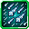

# Icicle Rain

<small>[Tensura: Reincarnated](../../index.md) &rsaquo; [Abilities](../index.md) &rsaquo; [Aspectual Magic](index.md)</small>

| | |
|---|---|
| **Type** | Aspectual Magic |
| **ID** | `tensura:icicle_rain` |
| **Element** | Ice |
| **Modes** | 2 |
| **Max mastery** | 700 |
| **Cooldowns (s)** | casting time(120, false) ÷ 20, 1 mastered, 3 otherwise |
| **Activation** | Press, Hold |

> Strike targets with a barrage of icicle lances from the sky.

## Modes

| # | Mode |
|---|---|
| 1 | Mode 1 |
| 2 | Mode 2 |

## Costs

| When | Magicule (MP) | Aura (AP) |
|---|---|---|
| Always | 10,000 or 15,000 |  |

## How it works

- Activated by pressing the skill key
- Charged or channelled by holding the skill key
- Triggers when the held key is released

## Obtaining

- Sold by dwarf traders (medium upgraded tome)
- Can appear in uncommon tomes in frozen wizard towers
- Listed in the `learnableMagics` config option (config/tensura/race/daemon_config.toml): List of Magics that players automatically get as learnable.
- Listed in the `grantedSkillIds` config option (config/tensuramoreskills-grand.toml): Skill registry IDs automatically granted with Albis Vina.

## Related

- **Related skills:** [Icicle Lance](icicle-lance.md)
- **Summons / entities:** Ice Lance

## Stats (config defaults)

Set in [`config/tensura/ability/magic/aspectual_config.toml`](../../configs/config-tensura-ability-magic-aspectual-config.md).

| Option | Default | Description |
|---|---|---|
| `IcicleRain.castTime` | 120 | Cast time in tick. |
| `IcicleRain.castTimeRepeat` | 100 | Repeat cast time in tick when mastered. |
| `IcicleRain.magiculeCost` | 15,000 | Magicule Cost to cast. |
| `IcicleRain.magiculeCostRepeat` | 10,000 | Magicule Cost to repeat cast when mastered. |
| `IcicleRain.lanceNumber` | 30 | The number of icicle lances to shoot each usage. |
| `IcicleRain.magicDamage` | 60 | The magic damage of each icicle lance. |
| `IcicleRain.radius` | 15 | The radius of the attack's area. |
| `IcicleRain.maxTimeRepeat` | 3 | The maximum number of times that repeat shoots lances after the initial shot. |
| `IcicleRain.cooldown` | 3 | The cooldown in second of the magic in the default mode. |
| `IcicleRain.cooldownMastered` | 1 | The cooldown in second of the magic in the default mode when mastered. |

Set in [`config/tensura/ability/magic_config.toml`](../../configs/config-tensura-ability-magic-config.md).

| Option | Default | Description |
|---|---|---|
| `AspectualMagic.masteryHigh` | 700 | The max amount of mastery point for High Aspectual Magic. |
| `AspectualMagic.masterySummoning` | 200 | The max amount of mastery point for Summoning Magic. |
| `AspectualMagic.masteryLow` | 100 | The max amount of mastery point for Low Aspectual Magic. |
| `AspectualMagic.masteryMedium` | 300 | The max amount of mastery point for Medium Aspectual Magic. |
| `AspectualMagic.masteryHigh` | 700 | The max amount of mastery point for High Aspectual Magic. |
| `AspectualMagic.masteryGreat` | 1,500 | The max amount of mastery point for Great Aspectual Magic. |

Set in [`config/tensura/ability/ability_config.toml`](../../configs/config-tensura-ability-ability-config.md).

| Option | Default | Description |
|---|---|---|
| `Learning.learningFailCooldown` | 3 | The number of seconds of cooldown when a new ability fails to gain a learning point. |
| `Learning.learningPoint` | 1 | The base value of how many learning points the player gains when learning an ability. |
| `Learning.minBonus` | 0 | The min bonus learning points the player can gain when learning an ability. |
| `Learning.maxBonus` | 4 | The max bonus learning points the player can gain when learning an ability. |
| `Learning.learningCostMultiplier` | 5 | The multiplier of energy cost compared to normal cost when learning a new ability. |
| `Learning.learningPointRequirement` | 100 | The number of learning points a new ability need to get to become fully learnt. |
| `Learning.learningCooldown` | 10 | The number of seconds of cooldown when a new ability gains a learning point. |
| `Learning.learningFailCooldown` | 3 | The number of seconds of cooldown when a new ability fails to gain a learning point. |
| `Learning.failingPenaltyChance` | 0.1 | The chance to the failing penalty to apply. |
| `Learning.failingPenaltyLevel` | 1 | The level of the misfire status effect when failing penalty applies. |
| `Learning.failingPenaltyDuration` | 200 | The duration in ticks of the misfire status effect when failing penalty applies. |
| `Learning.failingPenaltyMin` | 1 | The min learning points the player can lose when failing to learn an ability. |
| `Learning.failingPenaltyMax` | 3 | The max learning points the player can lose when failing to learn an ability. |
| `battlewillManualList` | "tensura:aura_slash", "tensura:aura_sword", "tensura:earthshatter_kick", "tensura:ogre_sword_guillotine", "tensura:roaring_lion_punch", "tensura:dark_eight_palms", "tensura:elephant_stampede", "tensura:magic_bullet", "tensura:ogre_flame", "tensura:air_flight", "tensura:aura_shield", "tensura:battlewill", "tensura:diamond_path", "tensura:formhide", "tensura:instant_move", "tensura:violent_break" | List of Battlewills that can be randomly obtained from using the Battlewill Manual. |

## Tags

`tensura:skills/aspectual_magic`, `tensura:skills/medium_upgraded_tome_dwarf_trade`, `tensura:skills/uncommon_tome_frozen_wizard_tower`
