# Aspectual Magic

<small>[Tensura: Reincarnated](../../index.md) &rsaquo; [Abilities](../index.md)</small>

Elemental magic cast with magicules through chants.

| | Ability | Description |
|---|---|---|
| 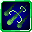 | [Acid Shell](acid-shell.md) | Shoots a ball of corrosive acid toward targets. |
|  | [Agility](agility.md) | Greatly enhance the caster's movement speed. |
| 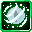 | [Airflow Shut](airflow-shut.md) | Drain out all the air surrounding the targets and suffocate them. |
|  | [Analyze](analyze.md) | Analyze targets' status and power. |
|  | [Anti-Magic Area](anti-magic-area.md) | Creates a zone around the user that limits all Aspectual and Summoning Magics. |
|  | [Anti-Shock Area](anti-shock-area.md) | Creates a zone around the user that limits all physical damage taken. |
| 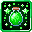 | [Antidote](antidote.md) | Recover a living being from nausea, poison and weakness. |
|  | [Barrier](barrier.md) | Coat the caster with a Physical Barrier with the strength based on Health. |
|  | [Burden](burden.md) | Shoot energy projectiles that increase the target's gravity. |
| 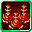 | [Chain Explosion](chain-explosion.md) | Summon a sequence of explosion that detonates in a chain around targets. |
|  | [Clairvoyance](clairvoyance.md) | Increase the caster's eye sight. |
|  | [Confusion](confusion.md) | Apply vision confusion to surrounding targets. |
| 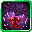 | [Demon Dominate](demon-dominate.md) | Dominate over any targets up to the Calamity level. |
| 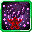 | [Demon Marionette](demon-marionette.md) | Dominate over any targets even at the Disaster level. |
|  | [Dimension Cutter](dimension-cutter.md) | Tear space to send forward a blade of dimension rift. |
|  | [Dominate](dominate.md) | Dominate over any low-leveled targets. |
| 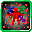 | [Doppelganger](doppelganger.md) | Use percentages of the user's magical power to create identical clones around them. |
|  | [Drainage](drainage.md) | Drain the water around the caster. |
|  | [Earth Lock](earth-lock.md) | Solidify the earth where the caster desires. |
| 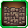 | [Earth Wall](earth-wall.md) | Call forth giant earth walls from the ground. |
| 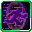 | [Escape](escape.md) | Connect two points in space to create a escape route. |
| 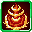 | [Explosion](explosion.md) | Summon a single beam of light, that detonates at the target, creating a devastating blast of pure magical power. |
|  | [Fire](fire-aspectual.md) | Shoot magic fiery projectiles. |
|  | [Fire Ball](fire-ball.md) | Shoot concentrated balls of fire. |
| 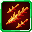 | [Fire Lance](fire-lance.md) | Shoot fiery lances of magic. |
| 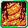 | [Fire Storm](fire-storm.md) | Call forth fiery surges of flame to incinerate targets. |
| 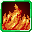 | [Fire Wall](fire-wall.md) | Create a wall of fire to keep targets away. |
| 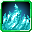 | [Flame Wall](flame-wall.md) | Create a wall of illusional fire to keep targets away. |
|  | [Flight](flight.md) | Propel the caster forward in the air. |
|  | [Float](float.md) | Decrease the caster's gravity to float. |
|  | [Freeze](freeze.md) | Solidify water sources into ice. |
|  | [Full Recovery](full-recovery.md) | Recover a living being's health and food points to the maximum as well as Absorption. |
|  | [Healing](healing.md) | Heal a living being on a low level. |
|  | [Healing Rain](healing-rain.md) | Call forth a rain of healing in a wide radius. |
|  | [Healthcare](healthcare.md) | Boost the caster's health and saturation. |
|  | [Hypnos](hypnos.md) | Put even the strongest entities into sleep. |
|  | [Ice Blizzard](ice-blizzard.md) | Create a powerful storm of snow to freeze your enemies. |
| 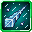 | [Ice Breaker](ice-breaker.md) | Shoot a giant icicle spear toward targets. |
|  | [Ice Wall](ice-wall.md) | Call forth walls of ice upon targets. |
| 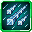 | [Icicle Lance](icicle-lance.md) | Shoot frozen icicles toward targets. |
|  | [Icicle Rain](icicle-rain.md) | Strike targets with a barrage of icicle lances from the sky. |
| 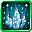 | [Icicle Spear](icicle-spear.md) | Strike targets with a giant icicle spike from the ground. |
|  | [Invisible](invisible.md) | Turn the caster invisible to hide from targets. |
|  | [Lighten](lighten.md) | Lighten the caster's gravity for greater speed and jump power. |
| 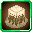 | [Liquidize](liquidize.md) | Liquidize the earth where the caster desires to turn into deadly traps. |
|  | [Magic Barrier](magic-barrier.md) | Coat the caster with a Magic Barrier with the strength based on Health. |
| 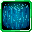 | [Magic Wall](magic-wall.md) | Generate a magic wall to protect the caster. |
| 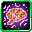 | [Mental Crush](mental-crush.md) | Crush the mind of targets. |
|  | [Mirage](mirage.md) | Create illusionary clones around the caster. |
|  | [Mud Hand](mud-hand.md) | Bind targets with several hands of mud. |
| 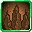 | [Mud Spears](mud-spears.md) | Raise mud spikes from the ground to pierce through your enemies. |
|  | [Possession](possession-magic.md) | Possess a weakened material body to gain a new powers from that body. |
|  | [Protection](protection.md) | Greatly enhance the caster's defence. |
|  | [Recovery](recovery.md) | Greatly recover a living being's health as well as food points. |
|  | [Reincarnation](reincarnation.md) | Sacrifice a portion of the caster's power to reincarnate. |
|  | [Reinforced Barrier](reinforced-barrier.md) | Coat the caster with reinforced Barriers with the strength based on Health. |
|  | [Reinforcement](reinforcement.md) | Greatly enhance the caster's gears durability. |
|  | [Search Enemy](search-enemy.md) | Highlight hostile mobs around the caster. |
| 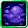 | [Sleep Mist](sleep-mist.md) | Release a wide area of sleeping mist to paralyze targets. |
| 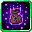 | [Spatial Storage](spatial-storage.md) | Rift space to create a small pocket dimension to store items. |
|  | [Stone Shot](stone-shot.md) | Shoot rock spikes toward targets. |
|  | [Strength](strength-aspectual.md) | Greatly enhance the caster's strength power. |
| 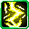 | [Thunder](thunder.md) | Strike powerful thunder where the caster looks. |
| 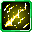 | [Thunder Lance](thunder-lance.md) | Strike powerful thunder lances of magic. |
| 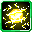 | [Thunder Orb](thunder-orb.md) | Call forth a sphere of thunder that strikes any enemy get by. |
| 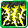 | [Thunder Rain](thunder-rain.md) | Call forth a wide area of thunder clouds that strike all enemies. |
|  | [Tornado Blade](tornado-blade.md) | Fire a concentrated sphere of wind toward targets. |
| 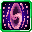 | [Warp Portal](warp-portal.md) | Tear space asunder connecting two points in space. |
|  | [Water](water-aspectual.md) | Call forth small amounts of water. |
|  | [Water Cutter](water-cutter-aspectual.md) | Fire concentrated blades of water toward targets. |
| 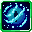 | [Water Jail](water-jail.md) | Surround targets with flows of water. |
|  | [Wind Cutter](wind-cutter.md) | Fire concentrated blades of wind toward targets. |
|  | [Wind Gust](wind-gust.md) | Release strong currents of winds to create gusts or wind charges toward targets. |
|  | [Wind Protection](wind-protection.md) | Call forth flows of wind to coat the caster with speed and protection. |
