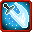

# Heavy Slash

<small>[Tensura: Reincarnated](../../index.md) &rsaquo; [Abilities](../index.md) &rsaquo; [Battlewill](index.md)</small>

| | |
|---|---|
| **Type** | Battlewill |
| **ID** | `tensura:heavy_slash` |
| **Kind** | Melee |
| **Activation** | Press |

> Channel your aura into your arms and bring down a mountain-splitting slash.

## Costs

| When | Magicule (MP) | Aura (AP) |
|---|---|---|
| Always |  | 80 |

## How it works

- Activated by pressing the skill key

## Related

- **Summons / entities:** [Aura Slash](aura-slash.md)
- **Referenced by:** [Aura Slash](aura-slash.md), [Phainon, The Deliverer](../../../tensura-more-skills/abilities/ultimate-skills/phainon.md)

## Stats (config defaults)

Set in [`config/tensura/ability/battlewill_config.toml`](../../configs/config-tensura-ability-battlewill-config.md).

| Option | Default | Description |
|---|---|---|
| `HeavySlash.auraCost` | 80 | Aura Cost to activate. |
| `HeavySlash.maxDistance` | 5 | The max distance from the target that the melee attack can be activated (doubled when mastered). |
| `HeavySlash.meleeDamageMultiplier` | 1.5 | The Damage multiplier compared to the user's attack damage for the melee attack. |
| `HeavySlash.projectileDamageMultiplier` | 0.5 | The Damage multiplier compared to the user's attack damage for the projectile attack. |

## Tags

`tensura:skills/battlewill`
