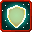
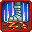
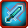

# Battlewill

<small>[Tensura: Reincarnated](../../index.md) &rsaquo; [Abilities](../index.md)</small>

Martial arts powered by aura (AP) instead of magicules.

| | Ability | Description |
|---|---|---|
|  | [Air Flight](air-flight.md) | Use your aura to propel you forward, and hover in air. |
|  | [Aura Shield](aura-shield.md) | Create a shield of condensed aura to block attacks. |
|  | [Aura Slash](aura-slash.md) | Condense your aura along your blade and release ranged slash. |
|  | [Aura Sword](aura-sword.md) | Coat your weapon in aura enhancing its blows. |
|  | [Battlewill](battlewill.md) | Channel your will, converting magicules into aura. |
|  | [Dark Eight Palms](dark-eight-palms.md) | Launch up to eight devastating aura blasts at foes. |
|  | [Death March Dance](death-march-dance.md) | Gather your aura into a ring of devastating aura spheres that come crashing down. |
|  | [Diamond Path](diamond-path.md) | Harden your aura around you to block incoming attacks. |
|  | [Earthshatter Kick](earthshatter-kick.md) | Stomp your foot down upheaving the land around you. |
|  | [Eight Petals Flash](eight-petals-flash.md) | Dash and attack the target's eyes, throat, heart, kidneys, lungs, and groin with eight consecutive and near instant slashes. |
|  | [Elephant Stampede](elephant-stampede.md) | Throw a ring of aura spheres around you. |
|  | [Five Petals Thrust](five-petals-thrust.md) | Dash and pierce the opponent in five of ten vital points and uses the other five as feints. |
|  | [Formhide](formhide.md) | Match your aura to the surroundings, which makes you imperceptible. |
|  | [Haze](haze.md) | Wrap yourself in a cloak of aura concealing yourself from even the most heightened of senses. |
|  | [Heavy Slash](heavy-slash.md) | Channel your aura into your arms and bring down a mountain-splitting slash. |
|  | [Instant-move](instant-move.md) | Gather your aura at your feet to travel faster than the eye can see. |
|  | [Magic Bullet](magic-bullet.md) | Gather your aura into a powerful blast. |
|  | [Maximum Magic Bullet](maximum-magic-bullet.md) | Gather your aura into a gargantuan blast obliterating all who dare oppose you. |
|  | [Ogre Flame](ogre-flame.md) | Use your aura to create a pillar of fire. |
|  | [Ogre-sword Cannon](ogre-sword-cannon.md) | Condense your aura into a blade projectile. |
|  | [Ogre-sword Guillotine](ogre-sword-guillotine.md) | Coat your weapon in aura enhancing its blows. |
|  | [Roaring Lion Punch](roaring-lion-punch.md) | Focus your aura into a fearsome blow with the regalness of a lion. |
|  | [Violent Break](violent-break.md) | Channel your aura, recklessly enhancing your strength and cleansing you of any negative effects. |
