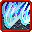

# Ogre-sword Cannon

<small>[Tensura: Reincarnated](../../index.md) &rsaquo; [Abilities](../index.md) &rsaquo; [Battlewill](index.md)</small>

| | |
|---|---|
| **Type** | Battlewill |
| **ID** | `tensura:ogre_sword_cannon` |
| **Kind** | Projectile |
| **Activation** | Press, Hold |

> Condense your aura into a blade projectile.

## Costs

| When | Magicule (MP) | Aura (AP) |
|---|---|---|
| Always |  | 200 |

## How it works

- Activated by pressing the skill key
- Charged or channelled by holding the skill key
- Triggers when the held key is released

## Obtaining

- Acquisition checks: [Ogre-sword Guillotine](ogre-sword-guillotine.md)

## Related

- **Related skills:** [Ogre-sword Guillotine](ogre-sword-guillotine.md)
- **Referenced by:** [Ogre-sword Guillotine](ogre-sword-guillotine.md)

## Stats (config defaults)

Set in [`config/tensura/ability/battlewill_config.toml`](../../configs/config-tensura-ability-battlewill-config.md).

| Option | Default | Description |
|---|---|---|
| `OgreSwordCannon.auraCost` | 200 | Base Aura Cost to activate. |
| `OgreSwordCannon.maxMultiplier` | 5 | The Max Multiplier of the Attack Power. |
| `OgreSwordCannon.maxMultiplierMastered` | 10 | The Max Multiplier of the Attack Power when Mastered. |
| `OgreSwordCannon.holdTime` | 40 | The Time the user need to hold down to increase 1 Power level. |
| `OgreSwordCannon.holdTimeMastered` | 20 | The Time the user need to hold down to increase 1 Power level with Mastery. |
| `OgreSwordCannon.baseMultiplier` | 1.5 | The Base Damage multiplier compared to the user's attack damage. |
| `OgreSwordCannon.bonusMultiplier` | 0.5 | The Bonus Damage multiplier compared to the user's attack damage each Power Level. |

## Tags

`tensura:skills/battlewill`
