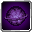

# Gravity Field

<small>[Tensura: Reincarnated](../../index.md) &rsaquo; [Abilities](../index.md) &rsaquo; [Common Skills](index.md)</small>

| | |
|---|---|
| **Type** | Common Skill |
| **ID** | `tensura:gravity_field` |
| **Modes** | 3 |
| **Cooldowns (s)** | 5 |
| **Activation** | Press |

> Weaken gravity around yourself to make movement easier or create a variously sized sphere granting previous effects while debuffing enemies.

## Modes

| # | Mode |
|---|---|
| 1 | Self-radius |
| 2 | 10x10 Field |
| 3 | 20x20 Field |

## Costs

| When | Magicule (MP) | Aura (AP) |
|---|---|---|
| Always | 50 |  |

## How it works

- Activated by pressing the skill key

## Obtaining

- Innate to mobs: [War Gnome](../../mobs/war-gnome.md)
- Listed in the `allowedSkills` config option (config/nightmare/ability/skill/nightmare_unique.toml): List of skills Handler is allowed to upgrade. (is every skill it can by default)

## Related

- **Summons / entities:** [Gravity Field](gravity-field.md)

## Stats (config defaults)

Set in [`config/tensura/ability/skill/common_config.toml`](../../configs/config-tensura-ability-skill-common-config.md).

| Option | Default | Description |
|---|---|---|
| `GravityField.epAcquirement` | 20,000 | EP Requirement for Learning. |
| `GravityField.magiculeCost` | 50 | Magicule Cost to activate. |
| `GravityField.cooldown` | 5 | The Cooldown in second after activation. |
| `GravityField.fieldDuration` | 1,200 | The duration in tick of the Gravity Field. |
| `GravityField.fieldRadius` | 6 | The radius of the Gravity Field. |
| `GravityField.fieldRadiusMastered` | 10 | The radius of the Gravity Field when mastered. |
| `GravityField.speedLevel` | 2 | The level of the speed/slowness effect when applied. |
| `GravityField.slowFallLevel` | 1 | The level of the slow-fall/burden effect when applied. |

## Tags

`tensura:skills/common_skills`, `tensura:skills/gravity_skills`
