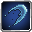

# Common Skills

<small>[Tensura: Reincarnated](../../index.md) &rsaquo; [Abilities](../index.md)</small>

Basic skills anyone can pick up, often from mobs.

| | Ability | Description |
|---|---|---|
|  | [Coercion](coercion.md) | Shoot a blast of roar in front of you scaring any afflicted entities. |
|  | [Corrosion](corrosion.md) | Empower your attacks with the deadly effect of Corrosion, toggleable when mastered. |
|  | [Farsight](farsight.md) | Focus your eyes and become able to see things far away. |
|  | [Gravity Field](gravity-field.md) | Weaken gravity around yourself to make movement easier or create a variously sized sphere granting previous effects while debuffing enemies. |
|  | [Gravity Flight](gravity-flight.md) | Manipulate gravity to allow flight, your momentum from before will be continued. |
|  | [Hydraulic Propulsion](hydraulic-propulsion.md) | Propel yourself at high speeds underwater. |
|  | [Paralysis](paralysis.md) | Empower your attacks with the effect of Paralysis, toggleable when mastered. |
|  | [Poison](poison.md) | Empower your attacks with the effect of Poison, toggleable when mastered. |
|  | [Ranged Barrier](ranged-barrier.md) | Place down differently sized barriers which block enemies in or out. Strong attacks can still destroy them. |
|  | [Self-Regeneration](self-regeneration.md) | Speed up your body’s natural regeneration to increase your survivability. |
|  | [Strength](strength.md) | Use magicule to strengthen your muscles. |
|  | [Telepathy](telepathy.md) | Give orders to tames when looking at them through commands. |
|  | [Thought Communication](thought-communication.md) | Send commands to nearby allies and become able to instruct them to attack players. |
|  | [Voice Cannon](voice-cannon.md) | Fire powerful blasts of concentrated sound waves by producing loud vocal sounds atomizing weaker targets. |
|  | [Water Blade](water-blade.md) | Shoot out a blade of water which flies in a straight line. |
|  | [Water Current Control](water-current-control.md) | Manipulate water around you to propel yourself in any direction. |
