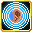

# Sense Soundwave

<small>[Tensura: Reincarnated](../../index.md) &rsaquo; [Abilities](../index.md) &rsaquo; [Extra Skills](index.md)</small>

| | |
|---|---|
| **Type** | Extra Skill |
| **ID** | `tensura:sense_soundwave` |
| **Activation** | Toggle |

> Empower your ears to precisely locate any nearby entities.

## Costs

| When | Magicule (MP) | Aura (AP) |
|---|---|---|
| Always | 0 |  |

## How it works

- Can be toggled on and off
- Has a continuous (per-tick) effect
- Does something when first learned

## Obtaining

- Listed in the `intrinsicSkills` config option (config/mysticism/race/sculk_config.toml): The list of intrinsic skills that the race gets.

## Related

- **Related skills:** [Sense Heat Source](sense-heat-source.md), [Magic Sense](magic-sense.md), [Universal Perception](universal-perception.md)
- **Summons / entities:** Tensura
- **Referenced by:** [Danger Sense](danger-sense.md), [Magic Sense](magic-sense.md), [Sense Heat Source](sense-heat-source.md)

## Stats (config defaults)

Set in [`config/tensura/ability/ability_config.toml`](../../configs/config-tensura-ability-ability-config.md).

| Option | Default | Description |
|---|---|---|
| `Mastery.masteryActivateTime` | 10 | How many time the user need to activate some passive abilities (tick/on attack) to gain a mastery point for holding abilities. |
| `Mastery.masteryPoint` | 1 | The base value of how many mastery points the player gains when using an ability - Only applies for new players when changed cus this is an attribute. |
| `Mastery.masteryHitMultiplier` | 2 | The multiplier of mastery point the player gains when the ability hit a target. |
| `Mastery.masteryKillMultiplier` | 2 | The multiplier of mastery point the player gains when the ability kills a target. |
| `Mastery.masteryHoldTick` | 60 | How long in tick the user need to hold down an ability to gain a mastery point for holding abilities. |
| `Mastery.masteryActivateTime` | 10 | How many time the user need to activate some passive abilities (tick/on attack) to gain a mastery point for holding abilities. |

## Tags

`tensura:skills/extra_skills`, `tensura:skills/sound_skills`
