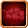
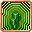
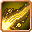
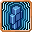

# Intrinsic Skills

<small>[Tensura: Reincarnated](../../index.md) &rsaquo; [Abilities](../index.md)</small>

Skills that come with a race.

| | Ability | Description |
|---|---|---|
|  | [Absorb &amp; Dissolve](absorb-and-dissolve.md) | Dissolve specific items to instantly consume them. |
|  | [Beast Transformation](beast-transformation.md) | Transform into a beast to restore your vitality and boost your physical body. The transformation will grant great physical prowess but leave a toll on your... |
|  | [Blood Mist](blood-mist.md) | Spill your own blood to summon a mist which steals the vitality of your enemies and can be blown up to harm any nearby entities or shoot a powerful blood beam. |
|  | [Body Armor](body-armor.md) | Protect yourself from harm by summoning armorsaurus scales around your body. |
|  | [Charm](charm.md) | Use your inherent power to turn your opponents neutral or to temporarily dominate weak opponents. |
|  | [Darkness Transform](darkness-transform.md) | Channel your inner darkness to burn and blind nearby opponents. |
|  | [Divine Ki Release](divine-ki-release.md) | Use your Divine Ki to amplify your battlewill to deal more damage and destroy weaker equipment. |
|  | [Dragon Ear](dragon-ear.md) | Use your sensitive hearing to precisely pin the location of any nearby mobs which make sound. |
|  | [Dragon Eye](dragon-eye.md) | Use your powerful sight to access the power of any entities and see in the far distance. |
|  | [Dragon Mode](dragon-mode.md) | Once a day, draw out your monstrous potential to double your EP and to boost your physical prowess. Doing this will leave a temporary toll on your body. |
|  | [Dragon Skin](dragon-skin.md) | Transform your skin into scales which become tougher as you gain more EP. |
|  | [Drain](drain.md) | Steal the vitality of your opponent and temporarily transform this skill into one of theirs to potentially turn the tables. |
|  | [Earth Transform](earth-transform.md) | Channel the powers of the earth to deal increased damage and increase local gravity around you. |
|  | [Eye of Truth](eye-of-truth.md) | By obtaining the mythical Hero Egg, the veil of deception is torn apart. No illusion or concealment can deceive your sight, and your vision becomes perfect. |
|  | [Flame Breath](flame-breath.md) | Spew fire to burn away enemies and set fire to the land. |
|  | [Flame Transform](flame-transform.md) | Channel the powers of fire to burn all nearby foes. |
|  | [Giantification](giantification.md) | Grow beyond your normal size to gain increased strength and reach. |
|  | [Ice Breath](ice-breath.md) | Spew icy breath to freeze enemies. |
|  | [Light Transform](light-transform.md) | Channel your inner light to deal light damage and nauseate all nearby entities. |
|  | [Ogre Berserker](ogre-berserker.md) | Allow rage to consume you to massively improve your physical powers for a time before the aftereffects set in. |
|  | [Paralysing Breath](paralysing-breath.md) | Spew a horrifying breath to paralyze your prey. |
|  | [Poisonous Breath](poisonous-breath.md) | Use your disgusting breath to corrode and nauseate your targets. |
|  | [Possession](possession.md) | Possess a weakened material body to gain access to a whole new world. |
|  | [Scale Armor](scale-armor.md) | Like the lizardmen, move through water and mud with no penalties while receiving a slight defense buff. |
|  | [Space Transform](space-transform.md) | Channel the powers of space to weaken and damage all nearby entities. |
|  | [Thunder Breath](thunder-breath.md) | Release thunder from your mouth to damage foes in front of you. |
|  | [Titanification](titanification.md) | Grow into a towering titan to massively increase your strength, defense, and reach while gaining immunity to magic from weaker foes. |
|  | [Ultrasonic Waves](ultrasonic-waves.md) | Shoot out a screech of sound which damages physical bodies or use echolocation to highlight nearby entities. |
|  | [Unpredictability](unpredictability.md) | In the hands of a True Hero, unpredictability reigns supreme. The Hero sees all, becoming able to ignore dodge and even read the movements of their opponent... |
|  | [Water Breathing](water-breathing.md) | Remove the requirement of air underwater. |
|  | [Water Transform](water-transform.md) | Channel the powers of water to damage and poison all nearby foes. |
|  | [Wind Transform](wind-transform.md) | Channel the powers of wind to paralyze and damage all nearby entities. |
