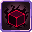

# Dark Cube

<small>[Tensura: Reincarnated](../../index.md) &rsaquo; [Abilities](../index.md) &rsaquo; [Spiritual Magic](index.md)</small>

| | |
|---|---|
| **Type** | Spiritual Magic |
| **ID** | `tensura:dark_cube` |
| **Element** | Darkness |
| **Max mastery** | 100 / 500 / 1,000 / 10,000 |
| **Cooldowns (s)** | 2 mastered, 4 otherwise |
| **Activation** | Press, Hold |

> Create a cube of darkness that slows movement and deals constant damage.

## Costs

| When | Magicule (MP) | Aura (AP) |
|---|---|---|
| Always | 2,000 |  |

## How it works

- Activated by pressing the skill key
- Charged or channelled by holding the skill key
- Triggers when the held key is released

## Obtaining

- Removed and re-rolled when you change race

## Related

- **Referenced by:** [True Darkness](true-darkness.md), [Witch of Envy, Satella](../../../tensura-more-skills/abilities/ultimate-skills/witch-of-envy-satella.md), [Satella](../../../tensura-more-skills/abilities/unique-skills/satella.md)

## Stats (config defaults)

Set in [`config/tensura/ability/magic/spiritual_config.toml`](../../configs/config-tensura-ability-magic-spiritual-config.md).

| Option | Default | Description |
|---|---|---|
| `DarkCube.castTime` | 60 | Cast time in tick. |
| `DarkCube.castTimeMastered` | 60 | Cast time in tick when mastered. |
| `DarkCube.magiculeCost` | 2,000 | Magicule Cost to cast. |
| `DarkCube.range` | 15 | The range in block of the magic. |
| `DarkCube.rangeMastered` | 20 | The range in block of the magic when mastered. |
| `DarkCube.cubeRadius` | 5 | The radius in block of the cube. |
| `DarkCube.cubeDamage` | 10 | The damage each 10 ticks of the cube. |
| `DarkCube.cubeDamageMastered` | 20 | The damage each 10 ticks of the cube when mastered. |
| `DarkCube.cubeSpeed` | 5 | The level of Movement Interference effect (-10% speed each) when applied by the cube. |
| `DarkCube.cubeDuration` | 600 | The duration in tick of the cube when casted. |
| `DarkCube.cooldown` | 4 | The cooldown in second of the magic. |
| `DarkCube.cooldownMastered` | 2 | The cooldown in second of the magic when mastered. |

Set in [`config/tensura/ability/magic_config.toml`](../../configs/config-tensura-ability-magic-config.md).

| Option | Default | Description |
|---|---|---|
| `SpiritualMagic.masteryLesser` | 100 | The max amount of mastery point for Lesser Spiritual Magic. |
| `SpiritualMagic.masteryLesser` | 100 | The max amount of mastery point for Lesser Spiritual Magic. |
| `SpiritualMagic.masteryMedium` | 500 | The max amount of mastery point for Medium Spiritual Magic. |
| `SpiritualMagic.masteryGreater` | 1,000 | The max amount of mastery point for Greater Spiritual Magic. |
| `SpiritualMagic.masteryLord` | 10,000 | The max amount of mastery point for Lord Spiritual Magic. |

## Tags

`tensura:skills/reset_with_race`, `tensura:skills/spiritual_magic`
